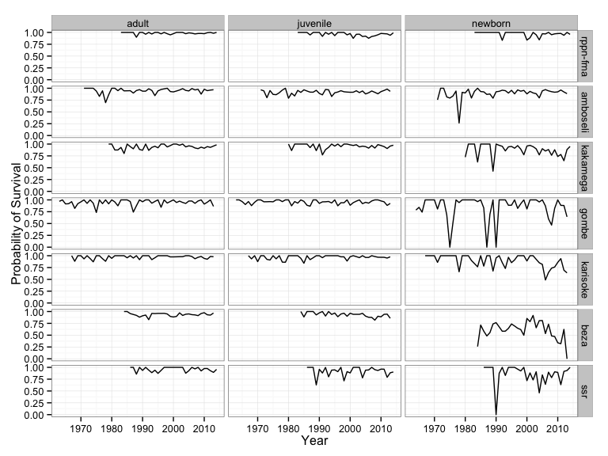

[Back to Respository](https://github.com/camposfa/plhdbR)

Functions for calculating vital rates
=====================================

Prepare workspace and read biography and fertility data
-------------------------------------------------------

``` r
  Sys.setenv(TZ = 'UTC')

  library(plhdbR)
  load_plhdb_packages()

  lh <- read_bio_table("../data/biography_2015_03_17.csv")
  fert <- read_fert_table("../data/fertility_2015_03_17.csv")
  
  # Need to fix a presumed error in the beza data before calculating vital rates
  lh[lh$Animal.Id == "247" & lh$Study.Id == "beza", ]$Entry.Date <- ymd("1984-07-15")
```

It's a good idea to [error-check](ErrorChecking.md) the data extensively before running the fuctions below.

Median age at first reproduction
--------------------------------

The function `median_age_first_rep` uses the biography data to calculate the median age at first reproduction for each study species.

``` r
  median_age_first_rep(lh)
#> Source: local data frame [7 x 4]
#> 
#>   Study.Id median_age_days median_age_years n_first_births
#> 1 rppn-fma          3210.5         8.789870             58
#> 2 amboseli          2181.0         5.971253            193
#> 3 kakamega          2665.0         7.296372            117
#> 4    gombe          5544.5        15.180014             54
#> 5 karisoke          3601.0         9.859001             55
#> 6     beza          2191.0         5.998631             80
#> 7      ssr          2363.5         6.470910             32
```

Age-specific fertility
----------------------

The function `age_specific_fertility` uses the biography and fertility tables to calculate age-specific fertility separately for each study species using discrete age-classes. The procedure follows the instructions provided by Bill Morris in the "Methods for calculating vital rates" Word file available on the PLHDB Wiki.

*Warning: this function takes ~1 minute to run.*

``` r
  asf <- age_specific_fertility(lh, fert)
  asf
#> Source: local data frame [266 x 5]
#> Groups: Study.Id
#> 
#>    Study.Id Discrete.Age.Class n_animals female_years         f
#> 1  rppn-fma                  0        83     79.77687 0.0000000
#> 2  rppn-fma                  1        90     77.35181 0.0000000
#> 3  rppn-fma                  2        75     67.61123 0.0000000
#> 4  rppn-fma                  3        62     59.33812 0.0000000
#> 5  rppn-fma                  4        61     57.40315 0.0000000
#> 6  rppn-fma                  5        83     59.59343 0.0000000
#> 7  rppn-fma                  6        68     46.35866 0.0000000
#> 8  rppn-fma                  7        42     37.68857 0.2122659
#> 9  rppn-fma                  8        38     36.10267 0.3593069
#> 10 rppn-fma                  9        35     34.04107 0.2350103
#> ..      ...                ...       ...          ...       ...
```

Stage-specific fertility between censuses
-----------------------------------------

The function `stage_specific_fertility` uses the biography and fertility tables to calculate stage-specific fertility separately for each study species. The function uses pseudo-census dates on January 1 of each year of the study. The life-history stages include (following Morris et al. 2011):

-   Newborns: individuals born between the pseudo-census dates in each interval
-   Juveniles: individuals alive but younger than the median age at first reproduction at the first pseudo-census date in each interval
-   Adults: individuals that are older than the median age at first reproduction at the first pseudo-census date in each interval

The optional logical argument `annual` determines whether fertilities are calculated for each year separately (the default is TRUE).

*Warning: this function takes ~5 minutes to run.*

``` r
  ssf <- stage_specific_fertility(lh, fert, annual = TRUE)
#> Warning in filter_impl(.data, dots): Incompatible methods ("Ops.Date",
#> "Ops.POSIXt") for ">="
#> Warning in filter_impl(.data, dots): Incompatible methods ("Ops.Date",
#> "Ops.POSIXt") for "<="
#> Warning: Incompatible methods ("Ops.Date", "Ops.POSIXt") for ">="
#> Warning: Incompatible methods ("Ops.Date", "Ops.POSIXt") for "<="
#> Warning in filter_impl(.data, dots): Incompatible methods ("Ops.POSIXt",
#> "Ops.Date") for ">="
#> Warning in filter_impl(.data, dots): Incompatible methods ("Ops.POSIXt",
#> "Ops.Date") for "<"
#> Warning: Incompatible methods ("Ops.Date", "Ops.POSIXt") for ">="
#> Warning: Incompatible methods ("Ops.Date", "Ops.POSIXt") for "<="
#> Warning in filter_impl(.data, dots): Incompatible methods ("Ops.POSIXt",
#> "Ops.Date") for ">="
#> Warning in filter_impl(.data, dots): Incompatible methods ("Ops.POSIXt",
#> "Ops.Date") for "<"
#> Warning: Incompatible methods ("Ops.Date", "Ops.POSIXt") for ">="
#> Warning: Incompatible methods ("Ops.Date", "Ops.POSIXt") for "<="
#> Warning in filter_impl(.data, dots): Incompatible methods ("Ops.POSIXt",
#> "Ops.Date") for ">="
#> Warning in filter_impl(.data, dots): Incompatible methods ("Ops.POSIXt",
#> "Ops.Date") for "<"
#> Warning: Incompatible methods ("Ops.Date", "Ops.POSIXt") for ">="
#> Warning: Incompatible methods ("Ops.Date", "Ops.POSIXt") for "<="
#> Warning in filter_impl(.data, dots): Incompatible methods ("Ops.POSIXt",
#> "Ops.Date") for ">="
#> Warning in filter_impl(.data, dots): Incompatible methods ("Ops.POSIXt",
#> "Ops.Date") for "<"
#> Warning: Incompatible methods ("Ops.Date", "Ops.POSIXt") for ">="
#> Warning: Incompatible methods ("Ops.Date", "Ops.POSIXt") for "<="
#> Warning in filter_impl(.data, dots): Incompatible methods ("Ops.POSIXt",
#> "Ops.Date") for ">="
#> Warning in filter_impl(.data, dots): Incompatible methods ("Ops.POSIXt",
#> "Ops.Date") for "<"
#> Warning: Incompatible methods ("Ops.Date", "Ops.POSIXt") for ">="
#> Warning: Incompatible methods ("Ops.Date", "Ops.POSIXt") for "<="
#> Warning in filter_impl(.data, dots): Incompatible methods ("Ops.POSIXt",
#> "Ops.Date") for ">="
#> Warning in filter_impl(.data, dots): Incompatible methods ("Ops.POSIXt",
#> "Ops.Date") for "<"
#> Warning: Incompatible methods ("Ops.Date", "Ops.POSIXt") for ">="
#> Warning: Incompatible methods ("Ops.Date", "Ops.POSIXt") for "<="
#> Warning in filter_impl(.data, dots): Incompatible methods ("Ops.POSIXt",
#> "Ops.Date") for ">="
#> Warning in filter_impl(.data, dots): Incompatible methods ("Ops.POSIXt",
#> "Ops.Date") for "<"
#> Warning: Incompatible methods ("Ops.Date", "Ops.POSIXt") for ">="
#> Warning: Incompatible methods ("Ops.Date", "Ops.POSIXt") for "<="
#> Warning in filter_impl(.data, dots): Incompatible methods ("Ops.POSIXt",
#> "Ops.Date") for ">="
#> Warning in filter_impl(.data, dots): Incompatible methods ("Ops.POSIXt",
#> "Ops.Date") for "<"
#> Warning: Incompatible methods ("Ops.Date", "Ops.POSIXt") for ">="
#> Warning: Incompatible methods ("Ops.Date", "Ops.POSIXt") for "<="
#> Warning in filter_impl(.data, dots): Incompatible methods ("Ops.POSIXt",
#> "Ops.Date") for ">="
#> Warning in filter_impl(.data, dots): Incompatible methods ("Ops.POSIXt",
#> "Ops.Date") for "<"
#> Warning: Incompatible methods ("Ops.Date", "Ops.POSIXt") for ">="
#> Warning: Incompatible methods ("Ops.Date", "Ops.POSIXt") for "<="
#> Warning in filter_impl(.data, dots): Incompatible methods ("Ops.POSIXt",
#> "Ops.Date") for ">="
#> Warning in filter_impl(.data, dots): Incompatible methods ("Ops.POSIXt",
#> "Ops.Date") for "<"
#> Warning: Incompatible methods ("Ops.Date", "Ops.POSIXt") for ">="
#> Warning: Incompatible methods ("Ops.Date", "Ops.POSIXt") for "<="
#> Warning in filter_impl(.data, dots): Incompatible methods ("Ops.POSIXt",
#> "Ops.Date") for ">="
#> Warning in filter_impl(.data, dots): Incompatible methods ("Ops.POSIXt",
#> "Ops.Date") for "<"
#> Warning: Incompatible methods ("Ops.Date", "Ops.POSIXt") for ">="
#> Warning: Incompatible methods ("Ops.Date", "Ops.POSIXt") for "<="
#> Warning in filter_impl(.data, dots): Incompatible methods ("Ops.POSIXt",
#> "Ops.Date") for ">="
#> Warning in filter_impl(.data, dots): Incompatible methods ("Ops.POSIXt",
#> "Ops.Date") for "<"
#> Warning: Incompatible methods ("Ops.Date", "Ops.POSIXt") for ">="
#> Warning: Incompatible methods ("Ops.Date", "Ops.POSIXt") for "<="
#> Warning in filter_impl(.data, dots): Incompatible methods ("Ops.POSIXt",
#> "Ops.Date") for ">="
#> Warning in filter_impl(.data, dots): Incompatible methods ("Ops.POSIXt",
#> "Ops.Date") for "<"
#> Warning: Incompatible methods ("Ops.Date", "Ops.POSIXt") for ">="
#> Warning: Incompatible methods ("Ops.Date", "Ops.POSIXt") for "<="
#> Warning in filter_impl(.data, dots): Incompatible methods ("Ops.POSIXt",
#> "Ops.Date") for ">="
#> Warning in filter_impl(.data, dots): Incompatible methods ("Ops.POSIXt",
#> "Ops.Date") for "<"
#> Warning: Incompatible methods ("Ops.Date", "Ops.POSIXt") for ">="
#> Warning: Incompatible methods ("Ops.Date", "Ops.POSIXt") for "<="
#> Warning in filter_impl(.data, dots): Incompatible methods ("Ops.POSIXt",
#> "Ops.Date") for ">="
#> Warning in filter_impl(.data, dots): Incompatible methods ("Ops.POSIXt",
#> "Ops.Date") for "<"
#> Warning: Incompatible methods ("Ops.Date", "Ops.POSIXt") for ">="
#> Warning: Incompatible methods ("Ops.Date", "Ops.POSIXt") for "<="
#> Warning in filter_impl(.data, dots): Incompatible methods ("Ops.POSIXt",
#> "Ops.Date") for ">="
#> Warning in filter_impl(.data, dots): Incompatible methods ("Ops.POSIXt",
#> "Ops.Date") for "<"
#> Warning: Incompatible methods ("Ops.Date", "Ops.POSIXt") for ">="
#> Warning: Incompatible methods ("Ops.Date", "Ops.POSIXt") for "<="
#> Warning in filter_impl(.data, dots): Incompatible methods ("Ops.POSIXt",
#> "Ops.Date") for ">="
#> Warning in filter_impl(.data, dots): Incompatible methods ("Ops.POSIXt",
#> "Ops.Date") for "<"
#> Warning: Incompatible methods ("Ops.Date", "Ops.POSIXt") for ">="
#> Warning: Incompatible methods ("Ops.Date", "Ops.POSIXt") for "<="
#> Warning in filter_impl(.data, dots): Incompatible methods ("Ops.POSIXt",
#> "Ops.Date") for ">="
#> Warning in filter_impl(.data, dots): Incompatible methods ("Ops.POSIXt",
#> "Ops.Date") for "<"
#> Warning: Incompatible methods ("Ops.Date", "Ops.POSIXt") for ">="
#> Warning: Incompatible methods ("Ops.Date", "Ops.POSIXt") for "<="
#> Warning in filter_impl(.data, dots): Incompatible methods ("Ops.POSIXt",
#> "Ops.Date") for ">="
#> Warning in filter_impl(.data, dots): Incompatible methods ("Ops.POSIXt",
#> "Ops.Date") for "<"
#> Warning: Incompatible methods ("Ops.Date", "Ops.POSIXt") for ">="
#> Warning: Incompatible methods ("Ops.Date", "Ops.POSIXt") for "<="
#> Warning in filter_impl(.data, dots): Incompatible methods ("Ops.POSIXt",
#> "Ops.Date") for ">="
#> Warning in filter_impl(.data, dots): Incompatible methods ("Ops.POSIXt",
#> "Ops.Date") for "<"
#> Warning: Incompatible methods ("Ops.Date", "Ops.POSIXt") for ">="
#> Warning: Incompatible methods ("Ops.Date", "Ops.POSIXt") for "<="
#> Warning in filter_impl(.data, dots): Incompatible methods ("Ops.POSIXt",
#> "Ops.Date") for ">="
#> Warning in filter_impl(.data, dots): Incompatible methods ("Ops.POSIXt",
#> "Ops.Date") for "<"
#> Warning: Incompatible methods ("Ops.Date", "Ops.POSIXt") for ">="
#> Warning: Incompatible methods ("Ops.Date", "Ops.POSIXt") for "<="
#> Warning in filter_impl(.data, dots): Incompatible methods ("Ops.POSIXt",
#> "Ops.Date") for ">="
#> Warning in filter_impl(.data, dots): Incompatible methods ("Ops.POSIXt",
#> "Ops.Date") for "<"
#> Warning: Incompatible methods ("Ops.Date", "Ops.POSIXt") for ">="
#> Warning: Incompatible methods ("Ops.Date", "Ops.POSIXt") for "<="
#> Warning in filter_impl(.data, dots): Incompatible methods ("Ops.POSIXt",
#> "Ops.Date") for ">="
#> Warning in filter_impl(.data, dots): Incompatible methods ("Ops.POSIXt",
#> "Ops.Date") for "<"
#> Warning: Incompatible methods ("Ops.Date", "Ops.POSIXt") for ">="
#> Warning: Incompatible methods ("Ops.Date", "Ops.POSIXt") for "<="
#> Warning in filter_impl(.data, dots): Incompatible methods ("Ops.POSIXt",
#> "Ops.Date") for ">="
#> Warning in filter_impl(.data, dots): Incompatible methods ("Ops.POSIXt",
#> "Ops.Date") for "<"
#> Warning: Incompatible methods ("Ops.Date", "Ops.POSIXt") for ">="
#> Warning: Incompatible methods ("Ops.Date", "Ops.POSIXt") for "<="
#> Warning in filter_impl(.data, dots): Incompatible methods ("Ops.POSIXt",
#> "Ops.Date") for ">="
#> Warning in filter_impl(.data, dots): Incompatible methods ("Ops.POSIXt",
#> "Ops.Date") for "<"
#> Warning: Incompatible methods ("Ops.Date", "Ops.POSIXt") for ">="
#> Warning: Incompatible methods ("Ops.Date", "Ops.POSIXt") for "<="
#> Warning in filter_impl(.data, dots): Incompatible methods ("Ops.POSIXt",
#> "Ops.Date") for ">="
#> Warning in filter_impl(.data, dots): Incompatible methods ("Ops.POSIXt",
#> "Ops.Date") for "<"
#> Warning: Incompatible methods ("Ops.Date", "Ops.POSIXt") for ">="
#> Warning: Incompatible methods ("Ops.Date", "Ops.POSIXt") for "<="
#> Warning in filter_impl(.data, dots): Incompatible methods ("Ops.POSIXt",
#> "Ops.Date") for ">="
#> Warning in filter_impl(.data, dots): Incompatible methods ("Ops.POSIXt",
#> "Ops.Date") for "<"
#> Warning: Incompatible methods ("Ops.Date", "Ops.POSIXt") for ">="
#> Warning: Incompatible methods ("Ops.Date", "Ops.POSIXt") for "<="
#> Warning in filter_impl(.data, dots): Incompatible methods ("Ops.POSIXt",
#> "Ops.Date") for ">="
#> Warning in filter_impl(.data, dots): Incompatible methods ("Ops.POSIXt",
#> "Ops.Date") for "<"
#> Warning: Incompatible methods ("Ops.Date", "Ops.POSIXt") for ">="
#> Warning: Incompatible methods ("Ops.Date", "Ops.POSIXt") for "<="
#> Warning in filter_impl(.data, dots): Incompatible methods ("Ops.POSIXt",
#> "Ops.Date") for ">="
#> Warning in filter_impl(.data, dots): Incompatible methods ("Ops.POSIXt",
#> "Ops.Date") for "<"
#> Warning: Incompatible methods ("Ops.Date", "Ops.POSIXt") for ">="
#> Warning: Incompatible methods ("Ops.Date", "Ops.POSIXt") for "<="
#> Warning in filter_impl(.data, dots): Incompatible methods ("Ops.POSIXt",
#> "Ops.Date") for ">="
#> Warning in filter_impl(.data, dots): Incompatible methods ("Ops.POSIXt",
#> "Ops.Date") for "<"
#> Warning: Incompatible methods ("Ops.Date", "Ops.POSIXt") for ">="
#> Warning: Incompatible methods ("Ops.Date", "Ops.POSIXt") for "<="
#> Warning in filter_impl(.data, dots): Incompatible methods ("Ops.POSIXt",
#> "Ops.Date") for ">="
#> Warning in filter_impl(.data, dots): Incompatible methods ("Ops.POSIXt",
#> "Ops.Date") for "<"
#> Warning: Incompatible methods ("Ops.Date", "Ops.POSIXt") for ">="
#> Warning: Incompatible methods ("Ops.Date", "Ops.POSIXt") for "<="
#> Warning in filter_impl(.data, dots): Incompatible methods ("Ops.POSIXt",
#> "Ops.Date") for ">="
#> Warning in filter_impl(.data, dots): Incompatible methods ("Ops.POSIXt",
#> "Ops.Date") for "<"
#> Warning: Incompatible methods ("Ops.Date", "Ops.POSIXt") for ">="
#> Warning: Incompatible methods ("Ops.Date", "Ops.POSIXt") for "<="
#> Warning in filter_impl(.data, dots): Incompatible methods ("Ops.POSIXt",
#> "Ops.Date") for ">="
#> Warning in filter_impl(.data, dots): Incompatible methods ("Ops.POSIXt",
#> "Ops.Date") for "<"
#> Warning: Incompatible methods ("Ops.Date", "Ops.POSIXt") for ">="
#> Warning: Incompatible methods ("Ops.Date", "Ops.POSIXt") for "<="
#> Warning in filter_impl(.data, dots): Incompatible methods ("Ops.POSIXt",
#> "Ops.Date") for ">="
#> Warning in filter_impl(.data, dots): Incompatible methods ("Ops.POSIXt",
#> "Ops.Date") for "<"
#> Warning: Incompatible methods ("Ops.Date", "Ops.POSIXt") for ">="
#> Warning: Incompatible methods ("Ops.Date", "Ops.POSIXt") for "<="
#> Warning in filter_impl(.data, dots): Incompatible methods ("Ops.POSIXt",
#> "Ops.Date") for ">="
#> Warning in filter_impl(.data, dots): Incompatible methods ("Ops.POSIXt",
#> "Ops.Date") for "<"
#> Warning: Incompatible methods ("Ops.Date", "Ops.POSIXt") for ">="
#> Warning: Incompatible methods ("Ops.Date", "Ops.POSIXt") for "<="
#> Warning in filter_impl(.data, dots): Incompatible methods ("Ops.POSIXt",
#> "Ops.Date") for ">="
#> Warning in filter_impl(.data, dots): Incompatible methods ("Ops.POSIXt",
#> "Ops.Date") for "<"
#> Warning: Incompatible methods ("Ops.Date", "Ops.POSIXt") for ">="
#> Warning: Incompatible methods ("Ops.Date", "Ops.POSIXt") for "<="
#> Warning in filter_impl(.data, dots): Incompatible methods ("Ops.POSIXt",
#> "Ops.Date") for ">="
#> Warning in filter_impl(.data, dots): Incompatible methods ("Ops.POSIXt",
#> "Ops.Date") for "<"
#> Warning: Incompatible methods ("Ops.Date", "Ops.POSIXt") for ">="
#> Warning: Incompatible methods ("Ops.Date", "Ops.POSIXt") for "<="
#> Warning in filter_impl(.data, dots): Incompatible methods ("Ops.POSIXt",
#> "Ops.Date") for ">="
#> Warning in filter_impl(.data, dots): Incompatible methods ("Ops.POSIXt",
#> "Ops.Date") for "<"
#> Warning: Incompatible methods ("Ops.Date", "Ops.POSIXt") for ">="
#> Warning: Incompatible methods ("Ops.Date", "Ops.POSIXt") for "<="
#> Warning in filter_impl(.data, dots): Incompatible methods ("Ops.POSIXt",
#> "Ops.Date") for ">="
#> Warning in filter_impl(.data, dots): Incompatible methods ("Ops.POSIXt",
#> "Ops.Date") for "<"
#> Warning: Incompatible methods ("Ops.Date", "Ops.POSIXt") for ">="
#> Warning: Incompatible methods ("Ops.Date", "Ops.POSIXt") for "<="
#> Warning in filter_impl(.data, dots): Incompatible methods ("Ops.POSIXt",
#> "Ops.Date") for ">="
#> Warning in filter_impl(.data, dots): Incompatible methods ("Ops.POSIXt",
#> "Ops.Date") for "<"
#> Warning: Incompatible methods ("Ops.Date", "Ops.POSIXt") for ">="
#> Warning: Incompatible methods ("Ops.Date", "Ops.POSIXt") for "<="
#> Warning in filter_impl(.data, dots): Incompatible methods ("Ops.POSIXt",
#> "Ops.Date") for ">="
#> Warning in filter_impl(.data, dots): Incompatible methods ("Ops.POSIXt",
#> "Ops.Date") for "<"
#> Warning: Incompatible methods ("Ops.Date", "Ops.POSIXt") for ">="
#> Warning: Incompatible methods ("Ops.Date", "Ops.POSIXt") for "<="
#> Warning in filter_impl(.data, dots): Incompatible methods ("Ops.POSIXt",
#> "Ops.Date") for ">="
#> Warning in filter_impl(.data, dots): Incompatible methods ("Ops.POSIXt",
#> "Ops.Date") for "<"
#> Warning: Incompatible methods ("Ops.Date", "Ops.POSIXt") for ">="
#> Warning: Incompatible methods ("Ops.Date", "Ops.POSIXt") for "<="
#> Warning in filter_impl(.data, dots): Incompatible methods ("Ops.POSIXt",
#> "Ops.Date") for ">="
#> Warning in filter_impl(.data, dots): Incompatible methods ("Ops.POSIXt",
#> "Ops.Date") for "<"
#> Warning: Incompatible methods ("Ops.Date", "Ops.POSIXt") for ">="
#> Warning: Incompatible methods ("Ops.Date", "Ops.POSIXt") for "<="
#> Warning in filter_impl(.data, dots): Incompatible methods ("Ops.POSIXt",
#> "Ops.Date") for ">="
#> Warning in filter_impl(.data, dots): Incompatible methods ("Ops.POSIXt",
#> "Ops.Date") for "<"
#> Warning: Incompatible methods ("Ops.Date", "Ops.POSIXt") for ">="
#> Warning: Incompatible methods ("Ops.Date", "Ops.POSIXt") for "<="
#> Warning in filter_impl(.data, dots): Incompatible methods ("Ops.POSIXt",
#> "Ops.Date") for ">="
#> Warning in filter_impl(.data, dots): Incompatible methods ("Ops.POSIXt",
#> "Ops.Date") for "<"
#> Warning: Incompatible methods ("Ops.Date", "Ops.POSIXt") for ">="
#> Warning: Incompatible methods ("Ops.Date", "Ops.POSIXt") for "<="
#> Warning in filter_impl(.data, dots): Incompatible methods ("Ops.POSIXt",
#> "Ops.Date") for ">="
#> Warning in filter_impl(.data, dots): Incompatible methods ("Ops.POSIXt",
#> "Ops.Date") for "<"
#> Warning: Incompatible methods ("Ops.Date", "Ops.POSIXt") for ">="
#> Warning: Incompatible methods ("Ops.Date", "Ops.POSIXt") for "<="
#> Warning in filter_impl(.data, dots): Incompatible methods ("Ops.POSIXt",
#> "Ops.Date") for ">="
#> Warning in filter_impl(.data, dots): Incompatible methods ("Ops.POSIXt",
#> "Ops.Date") for "<"
#> Warning: Incompatible methods ("Ops.Date", "Ops.POSIXt") for ">="
#> Warning: Incompatible methods ("Ops.Date", "Ops.POSIXt") for "<="
#> Warning in filter_impl(.data, dots): Incompatible methods ("Ops.POSIXt",
#> "Ops.Date") for ">="
#> Warning in filter_impl(.data, dots): Incompatible methods ("Ops.POSIXt",
#> "Ops.Date") for "<"
#> Warning: Incompatible methods ("Ops.Date", "Ops.POSIXt") for ">="
#> Warning: Incompatible methods ("Ops.Date", "Ops.POSIXt") for "<="
#> Warning in filter_impl(.data, dots): Incompatible methods ("Ops.POSIXt",
#> "Ops.Date") for ">="
#> Warning in filter_impl(.data, dots): Incompatible methods ("Ops.POSIXt",
#> "Ops.Date") for "<"
#> Warning: Incompatible methods ("Ops.Date", "Ops.POSIXt") for ">="
#> Warning: Incompatible methods ("Ops.Date", "Ops.POSIXt") for "<="
#> Warning in filter_impl(.data, dots): Incompatible methods ("Ops.POSIXt",
#> "Ops.Date") for ">="
#> Warning in filter_impl(.data, dots): Incompatible methods ("Ops.POSIXt",
#> "Ops.Date") for "<"
#> Warning: Incompatible methods ("Ops.Date", "Ops.POSIXt") for ">="
#> Warning: Incompatible methods ("Ops.Date", "Ops.POSIXt") for "<="
#> Warning in filter_impl(.data, dots): Incompatible methods ("Ops.POSIXt",
#> "Ops.Date") for ">="
#> Warning in filter_impl(.data, dots): Incompatible methods ("Ops.POSIXt",
#> "Ops.Date") for "<"
#> Warning: Incompatible methods ("Ops.Date", "Ops.POSIXt") for ">="
#> Warning: Incompatible methods ("Ops.Date", "Ops.POSIXt") for "<="
#> Warning in filter_impl(.data, dots): Incompatible methods ("Ops.POSIXt",
#> "Ops.Date") for ">="
#> Warning in filter_impl(.data, dots): Incompatible methods ("Ops.POSIXt",
#> "Ops.Date") for "<"
#> Warning: Incompatible methods ("Ops.Date", "Ops.POSIXt") for ">="
#> Warning: Incompatible methods ("Ops.Date", "Ops.POSIXt") for "<="
#> Warning in filter_impl(.data, dots): Incompatible methods ("Ops.POSIXt",
#> "Ops.Date") for ">="
#> Warning in filter_impl(.data, dots): Incompatible methods ("Ops.POSIXt",
#> "Ops.Date") for "<"
#> Warning: Incompatible methods ("Ops.Date", "Ops.POSIXt") for ">="
#> Warning: Incompatible methods ("Ops.Date", "Ops.POSIXt") for "<="
#> Warning in filter_impl(.data, dots): Incompatible methods ("Ops.POSIXt",
#> "Ops.Date") for ">="
#> Warning in filter_impl(.data, dots): Incompatible methods ("Ops.POSIXt",
#> "Ops.Date") for "<"
#> Warning: Incompatible methods ("Ops.Date", "Ops.POSIXt") for ">="
#> Warning: Incompatible methods ("Ops.Date", "Ops.POSIXt") for "<="
#> Warning in filter_impl(.data, dots): Incompatible methods ("Ops.POSIXt",
#> "Ops.Date") for ">="
#> Warning in filter_impl(.data, dots): Incompatible methods ("Ops.POSIXt",
#> "Ops.Date") for "<"
#> Warning: Incompatible methods ("Ops.Date", "Ops.POSIXt") for ">="
#> Warning: Incompatible methods ("Ops.Date", "Ops.POSIXt") for "<="
#> Warning in filter_impl(.data, dots): Incompatible methods ("Ops.POSIXt",
#> "Ops.Date") for ">="
#> Warning in filter_impl(.data, dots): Incompatible methods ("Ops.POSIXt",
#> "Ops.Date") for "<"
#> Warning: Incompatible methods ("Ops.Date", "Ops.POSIXt") for ">="
#> Warning: Incompatible methods ("Ops.Date", "Ops.POSIXt") for "<="
#> Warning in filter_impl(.data, dots): Incompatible methods ("Ops.POSIXt",
#> "Ops.Date") for ">="
#> Warning in filter_impl(.data, dots): Incompatible methods ("Ops.POSIXt",
#> "Ops.Date") for "<"
#> Warning: Incompatible methods ("Ops.Date", "Ops.POSIXt") for ">="
#> Warning: Incompatible methods ("Ops.Date", "Ops.POSIXt") for "<="
#> Warning in filter_impl(.data, dots): Incompatible methods ("Ops.POSIXt",
#> "Ops.Date") for ">="
#> Warning in filter_impl(.data, dots): Incompatible methods ("Ops.POSIXt",
#> "Ops.Date") for "<"
#> Warning: Incompatible methods ("Ops.Date", "Ops.POSIXt") for ">="
#> Warning: Incompatible methods ("Ops.Date", "Ops.POSIXt") for "<="
#> Warning in filter_impl(.data, dots): Incompatible methods ("Ops.POSIXt",
#> "Ops.Date") for ">="
#> Warning in filter_impl(.data, dots): Incompatible methods ("Ops.POSIXt",
#> "Ops.Date") for "<"
#> Warning: Incompatible methods ("Ops.Date", "Ops.POSIXt") for ">="
#> Warning: Incompatible methods ("Ops.Date", "Ops.POSIXt") for "<="
#> Warning in filter_impl(.data, dots): Incompatible methods ("Ops.POSIXt",
#> "Ops.Date") for ">="
#> Warning in filter_impl(.data, dots): Incompatible methods ("Ops.POSIXt",
#> "Ops.Date") for "<"
#> Warning: Incompatible methods ("Ops.Date", "Ops.POSIXt") for ">="
#> Warning: Incompatible methods ("Ops.Date", "Ops.POSIXt") for "<="
#> Warning in filter_impl(.data, dots): Incompatible methods ("Ops.POSIXt",
#> "Ops.Date") for ">="
#> Warning in filter_impl(.data, dots): Incompatible methods ("Ops.POSIXt",
#> "Ops.Date") for "<"
#> Warning: Incompatible methods ("Ops.Date", "Ops.POSIXt") for ">="
#> Warning: Incompatible methods ("Ops.Date", "Ops.POSIXt") for "<="
#> Warning in filter_impl(.data, dots): Incompatible methods ("Ops.POSIXt",
#> "Ops.Date") for ">="
#> Warning in filter_impl(.data, dots): Incompatible methods ("Ops.POSIXt",
#> "Ops.Date") for "<"
#> Warning: Incompatible methods ("Ops.Date", "Ops.POSIXt") for ">="
#> Warning: Incompatible methods ("Ops.Date", "Ops.POSIXt") for "<="
#> Warning in filter_impl(.data, dots): Incompatible methods ("Ops.POSIXt",
#> "Ops.Date") for ">="
#> Warning in filter_impl(.data, dots): Incompatible methods ("Ops.POSIXt",
#> "Ops.Date") for "<"
#> Warning: Incompatible methods ("Ops.Date", "Ops.POSIXt") for ">="
#> Warning: Incompatible methods ("Ops.Date", "Ops.POSIXt") for "<="
#> Warning in filter_impl(.data, dots): Incompatible methods ("Ops.POSIXt",
#> "Ops.Date") for ">="
#> Warning in filter_impl(.data, dots): Incompatible methods ("Ops.POSIXt",
#> "Ops.Date") for "<"
#> Warning: Incompatible methods ("Ops.Date", "Ops.POSIXt") for ">="
#> Warning: Incompatible methods ("Ops.Date", "Ops.POSIXt") for "<="
#> Warning in filter_impl(.data, dots): Incompatible methods ("Ops.POSIXt",
#> "Ops.Date") for ">="
#> Warning in filter_impl(.data, dots): Incompatible methods ("Ops.POSIXt",
#> "Ops.Date") for "<"
#> Warning: Incompatible methods ("Ops.Date", "Ops.POSIXt") for ">="
#> Warning: Incompatible methods ("Ops.Date", "Ops.POSIXt") for "<="
#> Warning in filter_impl(.data, dots): Incompatible methods ("Ops.POSIXt",
#> "Ops.Date") for ">="
#> Warning in filter_impl(.data, dots): Incompatible methods ("Ops.POSIXt",
#> "Ops.Date") for "<"
#> Warning: Incompatible methods ("Ops.Date", "Ops.POSIXt") for ">="
#> Warning: Incompatible methods ("Ops.Date", "Ops.POSIXt") for "<="
#> Warning in filter_impl(.data, dots): Incompatible methods ("Ops.POSIXt",
#> "Ops.Date") for ">="
#> Warning in filter_impl(.data, dots): Incompatible methods ("Ops.POSIXt",
#> "Ops.Date") for "<"
#> Warning: Incompatible methods ("Ops.Date", "Ops.POSIXt") for ">="
#> Warning: Incompatible methods ("Ops.Date", "Ops.POSIXt") for "<="
#> Warning in filter_impl(.data, dots): Incompatible methods ("Ops.POSIXt",
#> "Ops.Date") for ">="
#> Warning in filter_impl(.data, dots): Incompatible methods ("Ops.POSIXt",
#> "Ops.Date") for "<"
#> Warning: Incompatible methods ("Ops.Date", "Ops.POSIXt") for ">="
#> Warning: Incompatible methods ("Ops.Date", "Ops.POSIXt") for "<="
#> Warning in filter_impl(.data, dots): Incompatible methods ("Ops.POSIXt",
#> "Ops.Date") for ">="
#> Warning in filter_impl(.data, dots): Incompatible methods ("Ops.POSIXt",
#> "Ops.Date") for "<"
#> Warning: Incompatible methods ("Ops.Date", "Ops.POSIXt") for ">="
#> Warning: Incompatible methods ("Ops.Date", "Ops.POSIXt") for "<="
#> Warning in filter_impl(.data, dots): Incompatible methods ("Ops.POSIXt",
#> "Ops.Date") for ">="
#> Warning in filter_impl(.data, dots): Incompatible methods ("Ops.POSIXt",
#> "Ops.Date") for "<"
#> Warning: Incompatible methods ("Ops.Date", "Ops.POSIXt") for ">="
#> Warning: Incompatible methods ("Ops.Date", "Ops.POSIXt") for "<="
#> Warning in filter_impl(.data, dots): Incompatible methods ("Ops.POSIXt",
#> "Ops.Date") for ">="
#> Warning in filter_impl(.data, dots): Incompatible methods ("Ops.POSIXt",
#> "Ops.Date") for "<"
#> Warning: Incompatible methods ("Ops.Date", "Ops.POSIXt") for ">="
#> Warning: Incompatible methods ("Ops.Date", "Ops.POSIXt") for "<="
#> Warning in filter_impl(.data, dots): Incompatible methods ("Ops.POSIXt",
#> "Ops.Date") for ">="
#> Warning in filter_impl(.data, dots): Incompatible methods ("Ops.POSIXt",
#> "Ops.Date") for "<"
#> Warning: Incompatible methods ("Ops.Date", "Ops.POSIXt") for ">="
#> Warning: Incompatible methods ("Ops.Date", "Ops.POSIXt") for "<="
#> Warning in filter_impl(.data, dots): Incompatible methods ("Ops.POSIXt",
#> "Ops.Date") for ">="
#> Warning in filter_impl(.data, dots): Incompatible methods ("Ops.POSIXt",
#> "Ops.Date") for "<"
#> Warning: Incompatible methods ("Ops.Date", "Ops.POSIXt") for ">="
#> Warning: Incompatible methods ("Ops.Date", "Ops.POSIXt") for "<="
#> Warning in filter_impl(.data, dots): Incompatible methods ("Ops.POSIXt",
#> "Ops.Date") for ">="
#> Warning in filter_impl(.data, dots): Incompatible methods ("Ops.POSIXt",
#> "Ops.Date") for "<"
#> Warning: Incompatible methods ("Ops.Date", "Ops.POSIXt") for ">="
#> Warning: Incompatible methods ("Ops.Date", "Ops.POSIXt") for "<="
#> Warning in filter_impl(.data, dots): Incompatible methods ("Ops.POSIXt",
#> "Ops.Date") for ">="
#> Warning in filter_impl(.data, dots): Incompatible methods ("Ops.POSIXt",
#> "Ops.Date") for "<"
#> Warning: Incompatible methods ("Ops.Date", "Ops.POSIXt") for ">="
#> Warning: Incompatible methods ("Ops.Date", "Ops.POSIXt") for "<="
#> Warning in filter_impl(.data, dots): Incompatible methods ("Ops.POSIXt",
#> "Ops.Date") for ">="
#> Warning in filter_impl(.data, dots): Incompatible methods ("Ops.POSIXt",
#> "Ops.Date") for "<"
#> Warning: Incompatible methods ("Ops.Date", "Ops.POSIXt") for ">="
#> Warning: Incompatible methods ("Ops.Date", "Ops.POSIXt") for "<="
#> Warning in filter_impl(.data, dots): Incompatible methods ("Ops.POSIXt",
#> "Ops.Date") for ">="
#> Warning in filter_impl(.data, dots): Incompatible methods ("Ops.POSIXt",
#> "Ops.Date") for "<"
#> Warning: Incompatible methods ("Ops.Date", "Ops.POSIXt") for ">="
#> Warning: Incompatible methods ("Ops.Date", "Ops.POSIXt") for "<="
#> Warning in filter_impl(.data, dots): Incompatible methods ("Ops.POSIXt",
#> "Ops.Date") for ">="
#> Warning in filter_impl(.data, dots): Incompatible methods ("Ops.POSIXt",
#> "Ops.Date") for "<"
#> Warning: Incompatible methods ("Ops.Date", "Ops.POSIXt") for ">="
#> Warning: Incompatible methods ("Ops.Date", "Ops.POSIXt") for "<="
#> Warning in filter_impl(.data, dots): Incompatible methods ("Ops.POSIXt",
#> "Ops.Date") for ">="
#> Warning in filter_impl(.data, dots): Incompatible methods ("Ops.POSIXt",
#> "Ops.Date") for "<"
#> Warning: Incompatible methods ("Ops.Date", "Ops.POSIXt") for ">="
#> Warning: Incompatible methods ("Ops.Date", "Ops.POSIXt") for "<="
#> Warning in filter_impl(.data, dots): Incompatible methods ("Ops.POSIXt",
#> "Ops.Date") for ">="
#> Warning in filter_impl(.data, dots): Incompatible methods ("Ops.POSIXt",
#> "Ops.Date") for "<"
#> Warning: Incompatible methods ("Ops.Date", "Ops.POSIXt") for ">="
#> Warning: Incompatible methods ("Ops.Date", "Ops.POSIXt") for "<="
#> Warning in filter_impl(.data, dots): Incompatible methods ("Ops.POSIXt",
#> "Ops.Date") for ">="
#> Warning in filter_impl(.data, dots): Incompatible methods ("Ops.POSIXt",
#> "Ops.Date") for "<"
#> Warning: Incompatible methods ("Ops.Date", "Ops.POSIXt") for ">="
#> Warning: Incompatible methods ("Ops.Date", "Ops.POSIXt") for "<="
#> Warning in filter_impl(.data, dots): Incompatible methods ("Ops.POSIXt",
#> "Ops.Date") for ">="
#> Warning in filter_impl(.data, dots): Incompatible methods ("Ops.POSIXt",
#> "Ops.Date") for "<"
#> Warning: Incompatible methods ("Ops.Date", "Ops.POSIXt") for ">="
#> Warning: Incompatible methods ("Ops.Date", "Ops.POSIXt") for "<="
#> Warning in filter_impl(.data, dots): Incompatible methods ("Ops.POSIXt",
#> "Ops.Date") for ">="
#> Warning in filter_impl(.data, dots): Incompatible methods ("Ops.POSIXt",
#> "Ops.Date") for "<"
#> Warning: Incompatible methods ("Ops.Date", "Ops.POSIXt") for ">="
#> Warning: Incompatible methods ("Ops.Date", "Ops.POSIXt") for "<="
#> Warning in filter_impl(.data, dots): Incompatible methods ("Ops.POSIXt",
#> "Ops.Date") for ">="
#> Warning in filter_impl(.data, dots): Incompatible methods ("Ops.POSIXt",
#> "Ops.Date") for "<"
#> Warning: Incompatible methods ("Ops.Date", "Ops.POSIXt") for ">="
#> Warning: Incompatible methods ("Ops.Date", "Ops.POSIXt") for "<="
#> Warning in filter_impl(.data, dots): Incompatible methods ("Ops.POSIXt",
#> "Ops.Date") for ">="
#> Warning in filter_impl(.data, dots): Incompatible methods ("Ops.POSIXt",
#> "Ops.Date") for "<"
#> Warning: Incompatible methods ("Ops.Date", "Ops.POSIXt") for ">="
#> Warning: Incompatible methods ("Ops.Date", "Ops.POSIXt") for "<="
#> Warning in filter_impl(.data, dots): Incompatible methods ("Ops.POSIXt",
#> "Ops.Date") for ">="
#> Warning in filter_impl(.data, dots): Incompatible methods ("Ops.POSIXt",
#> "Ops.Date") for "<"
#> Warning: Incompatible methods ("Ops.Date", "Ops.POSIXt") for ">="
#> Warning: Incompatible methods ("Ops.Date", "Ops.POSIXt") for "<="
#> Warning in filter_impl(.data, dots): Incompatible methods ("Ops.POSIXt",
#> "Ops.Date") for ">="
#> Warning in filter_impl(.data, dots): Incompatible methods ("Ops.POSIXt",
#> "Ops.Date") for "<"
#> Warning: Incompatible methods ("Ops.Date", "Ops.POSIXt") for ">="
#> Warning: Incompatible methods ("Ops.Date", "Ops.POSIXt") for "<="
#> Warning in filter_impl(.data, dots): Incompatible methods ("Ops.POSIXt",
#> "Ops.Date") for ">="
#> Warning in filter_impl(.data, dots): Incompatible methods ("Ops.POSIXt",
#> "Ops.Date") for "<"
#> Warning: Incompatible methods ("Ops.Date", "Ops.POSIXt") for ">="
#> Warning: Incompatible methods ("Ops.Date", "Ops.POSIXt") for "<="
#> Warning in filter_impl(.data, dots): Incompatible methods ("Ops.POSIXt",
#> "Ops.Date") for ">="
#> Warning in filter_impl(.data, dots): Incompatible methods ("Ops.POSIXt",
#> "Ops.Date") for "<"
#> Warning: Incompatible methods ("Ops.Date", "Ops.POSIXt") for ">="
#> Warning: Incompatible methods ("Ops.Date", "Ops.POSIXt") for "<="
#> Warning in filter_impl(.data, dots): Incompatible methods ("Ops.POSIXt",
#> "Ops.Date") for ">="
#> Warning in filter_impl(.data, dots): Incompatible methods ("Ops.POSIXt",
#> "Ops.Date") for "<"
#> Warning: Incompatible methods ("Ops.Date", "Ops.POSIXt") for ">="
#> Warning: Incompatible methods ("Ops.Date", "Ops.POSIXt") for "<="
#> Warning in filter_impl(.data, dots): Incompatible methods ("Ops.POSIXt",
#> "Ops.Date") for ">="
#> Warning in filter_impl(.data, dots): Incompatible methods ("Ops.POSIXt",
#> "Ops.Date") for "<"
#> Warning: Incompatible methods ("Ops.Date", "Ops.POSIXt") for ">="
#> Warning: Incompatible methods ("Ops.Date", "Ops.POSIXt") for "<="
#> Warning in filter_impl(.data, dots): Incompatible methods ("Ops.POSIXt",
#> "Ops.Date") for ">="
#> Warning in filter_impl(.data, dots): Incompatible methods ("Ops.POSIXt",
#> "Ops.Date") for "<"
#> Warning: Incompatible methods ("Ops.Date", "Ops.POSIXt") for ">="
#> Warning: Incompatible methods ("Ops.Date", "Ops.POSIXt") for "<="
#> Warning in filter_impl(.data, dots): Incompatible methods ("Ops.POSIXt",
#> "Ops.Date") for ">="
#> Warning in filter_impl(.data, dots): Incompatible methods ("Ops.POSIXt",
#> "Ops.Date") for "<"
#> Warning: Incompatible methods ("Ops.Date", "Ops.POSIXt") for ">="
#> Warning: Incompatible methods ("Ops.Date", "Ops.POSIXt") for "<="
#> Warning in filter_impl(.data, dots): Incompatible methods ("Ops.POSIXt",
#> "Ops.Date") for ">="
#> Warning in filter_impl(.data, dots): Incompatible methods ("Ops.POSIXt",
#> "Ops.Date") for "<"
#> Warning: Incompatible methods ("Ops.Date", "Ops.POSIXt") for ">="
#> Warning: Incompatible methods ("Ops.Date", "Ops.POSIXt") for "<="
#> Warning in filter_impl(.data, dots): Incompatible methods ("Ops.POSIXt",
#> "Ops.Date") for ">="
#> Warning in filter_impl(.data, dots): Incompatible methods ("Ops.POSIXt",
#> "Ops.Date") for "<"
#> Warning: Incompatible methods ("Ops.Date", "Ops.POSIXt") for ">="
#> Warning: Incompatible methods ("Ops.Date", "Ops.POSIXt") for "<="
#> Warning in filter_impl(.data, dots): Incompatible methods ("Ops.POSIXt",
#> "Ops.Date") for ">="
#> Warning in filter_impl(.data, dots): Incompatible methods ("Ops.POSIXt",
#> "Ops.Date") for "<"
#> Warning: Incompatible methods ("Ops.Date", "Ops.POSIXt") for ">="
#> Warning: Incompatible methods ("Ops.Date", "Ops.POSIXt") for "<="
#> Warning in filter_impl(.data, dots): Incompatible methods ("Ops.POSIXt",
#> "Ops.Date") for ">="
#> Warning in filter_impl(.data, dots): Incompatible methods ("Ops.POSIXt",
#> "Ops.Date") for "<"
#> Warning: Incompatible methods ("Ops.Date", "Ops.POSIXt") for ">="
#> Warning: Incompatible methods ("Ops.Date", "Ops.POSIXt") for "<="
#> Warning in filter_impl(.data, dots): Incompatible methods ("Ops.POSIXt",
#> "Ops.Date") for ">="
#> Warning in filter_impl(.data, dots): Incompatible methods ("Ops.POSIXt",
#> "Ops.Date") for "<"
#> Warning: Incompatible methods ("Ops.Date", "Ops.POSIXt") for ">="
#> Warning: Incompatible methods ("Ops.Date", "Ops.POSIXt") for "<="
#> Warning in filter_impl(.data, dots): Incompatible methods ("Ops.POSIXt",
#> "Ops.Date") for ">="
#> Warning in filter_impl(.data, dots): Incompatible methods ("Ops.POSIXt",
#> "Ops.Date") for "<"
#> Warning: Incompatible methods ("Ops.Date", "Ops.POSIXt") for ">="
#> Warning: Incompatible methods ("Ops.Date", "Ops.POSIXt") for "<="
#> Warning in filter_impl(.data, dots): Incompatible methods ("Ops.POSIXt",
#> "Ops.Date") for ">="
#> Warning in filter_impl(.data, dots): Incompatible methods ("Ops.POSIXt",
#> "Ops.Date") for "<"
#> Warning: Incompatible methods ("Ops.Date", "Ops.POSIXt") for ">="
#> Warning: Incompatible methods ("Ops.Date", "Ops.POSIXt") for "<="
#> Warning in filter_impl(.data, dots): Incompatible methods ("Ops.POSIXt",
#> "Ops.Date") for ">="
#> Warning in filter_impl(.data, dots): Incompatible methods ("Ops.POSIXt",
#> "Ops.Date") for "<"
#> Warning: Incompatible methods ("Ops.Date", "Ops.POSIXt") for ">="
#> Warning: Incompatible methods ("Ops.Date", "Ops.POSIXt") for "<="
#> Warning in filter_impl(.data, dots): Incompatible methods ("Ops.POSIXt",
#> "Ops.Date") for ">="
#> Warning in filter_impl(.data, dots): Incompatible methods ("Ops.POSIXt",
#> "Ops.Date") for "<"
#> Warning: Incompatible methods ("Ops.Date", "Ops.POSIXt") for ">="
#> Warning: Incompatible methods ("Ops.Date", "Ops.POSIXt") for "<="
#> Warning in filter_impl(.data, dots): Incompatible methods ("Ops.POSIXt",
#> "Ops.Date") for ">="
#> Warning in filter_impl(.data, dots): Incompatible methods ("Ops.POSIXt",
#> "Ops.Date") for "<"
#> Warning: Incompatible methods ("Ops.Date", "Ops.POSIXt") for ">="
#> Warning: Incompatible methods ("Ops.Date", "Ops.POSIXt") for "<="
#> Warning in filter_impl(.data, dots): Incompatible methods ("Ops.POSIXt",
#> "Ops.Date") for ">="
#> Warning in filter_impl(.data, dots): Incompatible methods ("Ops.POSIXt",
#> "Ops.Date") for "<"
#> Warning: Incompatible methods ("Ops.Date", "Ops.POSIXt") for ">="
#> Warning: Incompatible methods ("Ops.Date", "Ops.POSIXt") for "<="
#> Warning in filter_impl(.data, dots): Incompatible methods ("Ops.POSIXt",
#> "Ops.Date") for ">="
#> Warning in filter_impl(.data, dots): Incompatible methods ("Ops.POSIXt",
#> "Ops.Date") for "<"
#> Warning: Incompatible methods ("Ops.Date", "Ops.POSIXt") for ">="
#> Warning: Incompatible methods ("Ops.Date", "Ops.POSIXt") for "<="
#> Warning in filter_impl(.data, dots): Incompatible methods ("Ops.POSIXt",
#> "Ops.Date") for ">="
#> Warning in filter_impl(.data, dots): Incompatible methods ("Ops.POSIXt",
#> "Ops.Date") for "<"
#> Warning: Incompatible methods ("Ops.Date", "Ops.POSIXt") for ">="
#> Warning: Incompatible methods ("Ops.Date", "Ops.POSIXt") for "<="
#> Warning in filter_impl(.data, dots): Incompatible methods ("Ops.POSIXt",
#> "Ops.Date") for ">="
#> Warning in filter_impl(.data, dots): Incompatible methods ("Ops.POSIXt",
#> "Ops.Date") for "<"
#> Warning: Incompatible methods ("Ops.Date", "Ops.POSIXt") for ">="
#> Warning: Incompatible methods ("Ops.Date", "Ops.POSIXt") for "<="
#> Warning in filter_impl(.data, dots): Incompatible methods ("Ops.POSIXt",
#> "Ops.Date") for ">="
#> Warning in filter_impl(.data, dots): Incompatible methods ("Ops.POSIXt",
#> "Ops.Date") for "<"
#> Warning: Incompatible methods ("Ops.Date", "Ops.POSIXt") for ">="
#> Warning: Incompatible methods ("Ops.Date", "Ops.POSIXt") for "<="
#> Warning in filter_impl(.data, dots): Incompatible methods ("Ops.POSIXt",
#> "Ops.Date") for ">="
#> Warning in filter_impl(.data, dots): Incompatible methods ("Ops.POSIXt",
#> "Ops.Date") for "<"
#> Warning: Incompatible methods ("Ops.Date", "Ops.POSIXt") for ">="
#> Warning: Incompatible methods ("Ops.Date", "Ops.POSIXt") for "<="
#> Warning in filter_impl(.data, dots): Incompatible methods ("Ops.POSIXt",
#> "Ops.Date") for ">="
#> Warning in filter_impl(.data, dots): Incompatible methods ("Ops.POSIXt",
#> "Ops.Date") for "<"
#> Warning: Incompatible methods ("Ops.Date", "Ops.POSIXt") for ">="
#> Warning: Incompatible methods ("Ops.Date", "Ops.POSIXt") for "<="
#> Warning in filter_impl(.data, dots): Incompatible methods ("Ops.POSIXt",
#> "Ops.Date") for ">="
#> Warning in filter_impl(.data, dots): Incompatible methods ("Ops.POSIXt",
#> "Ops.Date") for "<"
#> Warning: Incompatible methods ("Ops.Date", "Ops.POSIXt") for ">="
#> Warning: Incompatible methods ("Ops.Date", "Ops.POSIXt") for "<="
#> Warning in filter_impl(.data, dots): Incompatible methods ("Ops.POSIXt",
#> "Ops.Date") for ">="
#> Warning in filter_impl(.data, dots): Incompatible methods ("Ops.POSIXt",
#> "Ops.Date") for "<"
#> Warning: Incompatible methods ("Ops.Date", "Ops.POSIXt") for ">="
#> Warning: Incompatible methods ("Ops.Date", "Ops.POSIXt") for "<="
#> Warning in filter_impl(.data, dots): Incompatible methods ("Ops.POSIXt",
#> "Ops.Date") for ">="
#> Warning in filter_impl(.data, dots): Incompatible methods ("Ops.POSIXt",
#> "Ops.Date") for "<"
#> Warning: Incompatible methods ("Ops.Date", "Ops.POSIXt") for ">="
#> Warning: Incompatible methods ("Ops.Date", "Ops.POSIXt") for "<="
#> Warning in filter_impl(.data, dots): Incompatible methods ("Ops.POSIXt",
#> "Ops.Date") for ">="
#> Warning in filter_impl(.data, dots): Incompatible methods ("Ops.POSIXt",
#> "Ops.Date") for "<"
#> Warning: Incompatible methods ("Ops.Date", "Ops.POSIXt") for ">="
#> Warning: Incompatible methods ("Ops.Date", "Ops.POSIXt") for "<="
#> Warning in filter_impl(.data, dots): Incompatible methods ("Ops.POSIXt",
#> "Ops.Date") for ">="
#> Warning in filter_impl(.data, dots): Incompatible methods ("Ops.POSIXt",
#> "Ops.Date") for "<"
#> Warning: Incompatible methods ("Ops.Date", "Ops.POSIXt") for ">="
#> Warning: Incompatible methods ("Ops.Date", "Ops.POSIXt") for "<="
#> Warning in filter_impl(.data, dots): Incompatible methods ("Ops.POSIXt",
#> "Ops.Date") for ">="
#> Warning in filter_impl(.data, dots): Incompatible methods ("Ops.POSIXt",
#> "Ops.Date") for "<"
#> Warning: Incompatible methods ("Ops.Date", "Ops.POSIXt") for ">="
#> Warning: Incompatible methods ("Ops.Date", "Ops.POSIXt") for "<="
#> Warning in filter_impl(.data, dots): Incompatible methods ("Ops.POSIXt",
#> "Ops.Date") for ">="
#> Warning in filter_impl(.data, dots): Incompatible methods ("Ops.POSIXt",
#> "Ops.Date") for "<"
#> Warning: Incompatible methods ("Ops.Date", "Ops.POSIXt") for ">="
#> Warning: Incompatible methods ("Ops.Date", "Ops.POSIXt") for "<="
#> Warning in filter_impl(.data, dots): Incompatible methods ("Ops.POSIXt",
#> "Ops.Date") for ">="
#> Warning in filter_impl(.data, dots): Incompatible methods ("Ops.POSIXt",
#> "Ops.Date") for "<"
#> Warning: Incompatible methods ("Ops.Date", "Ops.POSIXt") for ">="
#> Warning: Incompatible methods ("Ops.Date", "Ops.POSIXt") for "<="
#> Warning in filter_impl(.data, dots): Incompatible methods ("Ops.POSIXt",
#> "Ops.Date") for ">="
#> Warning in filter_impl(.data, dots): Incompatible methods ("Ops.POSIXt",
#> "Ops.Date") for "<"
#> Warning: Incompatible methods ("Ops.Date", "Ops.POSIXt") for ">="
#> Warning: Incompatible methods ("Ops.Date", "Ops.POSIXt") for "<="
#> Warning in filter_impl(.data, dots): Incompatible methods ("Ops.POSIXt",
#> "Ops.Date") for ">="
#> Warning in filter_impl(.data, dots): Incompatible methods ("Ops.POSIXt",
#> "Ops.Date") for "<"
#> Warning: Incompatible methods ("Ops.Date", "Ops.POSIXt") for ">="
#> Warning: Incompatible methods ("Ops.Date", "Ops.POSIXt") for "<="
#> Warning in filter_impl(.data, dots): Incompatible methods ("Ops.POSIXt",
#> "Ops.Date") for ">="
#> Warning in filter_impl(.data, dots): Incompatible methods ("Ops.POSIXt",
#> "Ops.Date") for "<"
#> Warning: Incompatible methods ("Ops.Date", "Ops.POSIXt") for ">="
#> Warning: Incompatible methods ("Ops.Date", "Ops.POSIXt") for "<="
#> Warning in filter_impl(.data, dots): Incompatible methods ("Ops.POSIXt",
#> "Ops.Date") for ">="
#> Warning in filter_impl(.data, dots): Incompatible methods ("Ops.POSIXt",
#> "Ops.Date") for "<"
#> Warning: Incompatible methods ("Ops.Date", "Ops.POSIXt") for ">="
#> Warning: Incompatible methods ("Ops.Date", "Ops.POSIXt") for "<="
#> Warning in filter_impl(.data, dots): Incompatible methods ("Ops.POSIXt",
#> "Ops.Date") for ">="
#> Warning in filter_impl(.data, dots): Incompatible methods ("Ops.POSIXt",
#> "Ops.Date") for "<"
#> Warning: Incompatible methods ("Ops.Date", "Ops.POSIXt") for ">="
#> Warning: Incompatible methods ("Ops.Date", "Ops.POSIXt") for "<="
#> Warning in filter_impl(.data, dots): Incompatible methods ("Ops.POSIXt",
#> "Ops.Date") for ">="
#> Warning in filter_impl(.data, dots): Incompatible methods ("Ops.POSIXt",
#> "Ops.Date") for "<"
#> Warning: Incompatible methods ("Ops.Date", "Ops.POSIXt") for ">="
#> Warning: Incompatible methods ("Ops.Date", "Ops.POSIXt") for "<="
#> Warning in filter_impl(.data, dots): Incompatible methods ("Ops.POSIXt",
#> "Ops.Date") for ">="
#> Warning in filter_impl(.data, dots): Incompatible methods ("Ops.POSIXt",
#> "Ops.Date") for "<"
#> Warning: Incompatible methods ("Ops.Date", "Ops.POSIXt") for ">="
#> Warning: Incompatible methods ("Ops.Date", "Ops.POSIXt") for "<="
#> Warning in filter_impl(.data, dots): Incompatible methods ("Ops.POSIXt",
#> "Ops.Date") for ">="
#> Warning in filter_impl(.data, dots): Incompatible methods ("Ops.POSIXt",
#> "Ops.Date") for "<"
#> Warning: Incompatible methods ("Ops.Date", "Ops.POSIXt") for ">="
#> Warning: Incompatible methods ("Ops.Date", "Ops.POSIXt") for "<="
#> Warning in filter_impl(.data, dots): Incompatible methods ("Ops.POSIXt",
#> "Ops.Date") for ">="
#> Warning in filter_impl(.data, dots): Incompatible methods ("Ops.POSIXt",
#> "Ops.Date") for "<"
#> Warning: Incompatible methods ("Ops.Date", "Ops.POSIXt") for ">="
#> Warning: Incompatible methods ("Ops.Date", "Ops.POSIXt") for "<="
#> Warning in filter_impl(.data, dots): Incompatible methods ("Ops.POSIXt",
#> "Ops.Date") for ">="
#> Warning in filter_impl(.data, dots): Incompatible methods ("Ops.POSIXt",
#> "Ops.Date") for "<"
#> Warning: Incompatible methods ("Ops.Date", "Ops.POSIXt") for ">="
#> Warning: Incompatible methods ("Ops.Date", "Ops.POSIXt") for "<="
#> Warning in filter_impl(.data, dots): Incompatible methods ("Ops.POSIXt",
#> "Ops.Date") for ">="
#> Warning in filter_impl(.data, dots): Incompatible methods ("Ops.POSIXt",
#> "Ops.Date") for "<"
#> Warning: Incompatible methods ("Ops.Date", "Ops.POSIXt") for ">="
#> Warning: Incompatible methods ("Ops.Date", "Ops.POSIXt") for "<="
#> Warning in filter_impl(.data, dots): Incompatible methods ("Ops.POSIXt",
#> "Ops.Date") for ">="
#> Warning in filter_impl(.data, dots): Incompatible methods ("Ops.POSIXt",
#> "Ops.Date") for "<"
#> Warning: Incompatible methods ("Ops.Date", "Ops.POSIXt") for ">="
#> Warning: Incompatible methods ("Ops.Date", "Ops.POSIXt") for "<="
#> Warning in filter_impl(.data, dots): Incompatible methods ("Ops.POSIXt",
#> "Ops.Date") for ">="
#> Warning in filter_impl(.data, dots): Incompatible methods ("Ops.POSIXt",
#> "Ops.Date") for "<"
#> Warning: Incompatible methods ("Ops.Date", "Ops.POSIXt") for ">="
#> Warning: Incompatible methods ("Ops.Date", "Ops.POSIXt") for "<="
#> Warning in filter_impl(.data, dots): Incompatible methods ("Ops.POSIXt",
#> "Ops.Date") for ">="
#> Warning in filter_impl(.data, dots): Incompatible methods ("Ops.POSIXt",
#> "Ops.Date") for "<"
#> Warning: Incompatible methods ("Ops.Date", "Ops.POSIXt") for ">="
#> Warning: Incompatible methods ("Ops.Date", "Ops.POSIXt") for "<="
#> Warning in filter_impl(.data, dots): Incompatible methods ("Ops.POSIXt",
#> "Ops.Date") for ">="
#> Warning in filter_impl(.data, dots): Incompatible methods ("Ops.POSIXt",
#> "Ops.Date") for "<"
#> Warning: Incompatible methods ("Ops.Date", "Ops.POSIXt") for ">="
#> Warning: Incompatible methods ("Ops.Date", "Ops.POSIXt") for "<="
#> Warning in filter_impl(.data, dots): Incompatible methods ("Ops.POSIXt",
#> "Ops.Date") for ">="
#> Warning in filter_impl(.data, dots): Incompatible methods ("Ops.POSIXt",
#> "Ops.Date") for "<"
#> Warning: Incompatible methods ("Ops.Date", "Ops.POSIXt") for ">="
#> Warning: Incompatible methods ("Ops.Date", "Ops.POSIXt") for "<="
#> Warning in filter_impl(.data, dots): Incompatible methods ("Ops.POSIXt",
#> "Ops.Date") for ">="
#> Warning in filter_impl(.data, dots): Incompatible methods ("Ops.POSIXt",
#> "Ops.Date") for "<"
#> Warning: Incompatible methods ("Ops.Date", "Ops.POSIXt") for ">="
#> Warning: Incompatible methods ("Ops.Date", "Ops.POSIXt") for "<="
#> Warning in filter_impl(.data, dots): Incompatible methods ("Ops.POSIXt",
#> "Ops.Date") for ">="
#> Warning in filter_impl(.data, dots): Incompatible methods ("Ops.POSIXt",
#> "Ops.Date") for "<"
#> Warning: Incompatible methods ("Ops.Date", "Ops.POSIXt") for ">="
#> Warning: Incompatible methods ("Ops.Date", "Ops.POSIXt") for "<="
#> Warning in filter_impl(.data, dots): Incompatible methods ("Ops.POSIXt",
#> "Ops.Date") for ">="
#> Warning in filter_impl(.data, dots): Incompatible methods ("Ops.POSIXt",
#> "Ops.Date") for "<"
#> Warning: Incompatible methods ("Ops.Date", "Ops.POSIXt") for ">="
#> Warning: Incompatible methods ("Ops.Date", "Ops.POSIXt") for "<="
#> Warning in filter_impl(.data, dots): Incompatible methods ("Ops.POSIXt",
#> "Ops.Date") for ">="
#> Warning in filter_impl(.data, dots): Incompatible methods ("Ops.POSIXt",
#> "Ops.Date") for "<"
#> Warning: Incompatible methods ("Ops.Date", "Ops.POSIXt") for ">="
#> Warning: Incompatible methods ("Ops.Date", "Ops.POSIXt") for "<="
#> Warning in filter_impl(.data, dots): Incompatible methods ("Ops.POSIXt",
#> "Ops.Date") for ">="
#> Warning in filter_impl(.data, dots): Incompatible methods ("Ops.POSIXt",
#> "Ops.Date") for "<"
#> Warning: Incompatible methods ("Ops.Date", "Ops.POSIXt") for ">="
#> Warning: Incompatible methods ("Ops.Date", "Ops.POSIXt") for "<="
#> Warning in filter_impl(.data, dots): Incompatible methods ("Ops.POSIXt",
#> "Ops.Date") for ">="
#> Warning in filter_impl(.data, dots): Incompatible methods ("Ops.POSIXt",
#> "Ops.Date") for "<"
#> Warning: Incompatible methods ("Ops.Date", "Ops.POSIXt") for ">="
#> Warning: Incompatible methods ("Ops.Date", "Ops.POSIXt") for "<="
#> Warning in filter_impl(.data, dots): Incompatible methods ("Ops.POSIXt",
#> "Ops.Date") for ">="
#> Warning in filter_impl(.data, dots): Incompatible methods ("Ops.POSIXt",
#> "Ops.Date") for "<"
#> Warning: Incompatible methods ("Ops.Date", "Ops.POSIXt") for ">="
#> Warning: Incompatible methods ("Ops.Date", "Ops.POSIXt") for "<="
#> Warning in filter_impl(.data, dots): Incompatible methods ("Ops.POSIXt",
#> "Ops.Date") for ">="
#> Warning in filter_impl(.data, dots): Incompatible methods ("Ops.POSIXt",
#> "Ops.Date") for "<"
#> Warning: Incompatible methods ("Ops.Date", "Ops.POSIXt") for ">="
#> Warning: Incompatible methods ("Ops.Date", "Ops.POSIXt") for "<="
#> Warning in filter_impl(.data, dots): Incompatible methods ("Ops.POSIXt",
#> "Ops.Date") for ">="
#> Warning in filter_impl(.data, dots): Incompatible methods ("Ops.POSIXt",
#> "Ops.Date") for "<"
#> Warning: Incompatible methods ("Ops.Date", "Ops.POSIXt") for ">="
#> Warning: Incompatible methods ("Ops.Date", "Ops.POSIXt") for "<="
#> Warning in filter_impl(.data, dots): Incompatible methods ("Ops.POSIXt",
#> "Ops.Date") for ">="
#> Warning in filter_impl(.data, dots): Incompatible methods ("Ops.POSIXt",
#> "Ops.Date") for "<"
#> Warning: Incompatible methods ("Ops.Date", "Ops.POSIXt") for ">="
#> Warning: Incompatible methods ("Ops.Date", "Ops.POSIXt") for "<="
#> Warning in filter_impl(.data, dots): Incompatible methods ("Ops.POSIXt",
#> "Ops.Date") for ">="
#> Warning in filter_impl(.data, dots): Incompatible methods ("Ops.POSIXt",
#> "Ops.Date") for "<"
#> Warning: Incompatible methods ("Ops.Date", "Ops.POSIXt") for ">="
#> Warning: Incompatible methods ("Ops.Date", "Ops.POSIXt") for "<="
#> Warning in filter_impl(.data, dots): Incompatible methods ("Ops.POSIXt",
#> "Ops.Date") for ">="
#> Warning in filter_impl(.data, dots): Incompatible methods ("Ops.POSIXt",
#> "Ops.Date") for "<"
#> Warning: Incompatible methods ("Ops.Date", "Ops.POSIXt") for ">="
#> Warning: Incompatible methods ("Ops.Date", "Ops.POSIXt") for "<="
#> Warning in filter_impl(.data, dots): Incompatible methods ("Ops.POSIXt",
#> "Ops.Date") for ">="
#> Warning in filter_impl(.data, dots): Incompatible methods ("Ops.POSIXt",
#> "Ops.Date") for "<"
#> Warning: Incompatible methods ("Ops.Date", "Ops.POSIXt") for ">="
#> Warning: Incompatible methods ("Ops.Date", "Ops.POSIXt") for "<="
#> Warning in filter_impl(.data, dots): Incompatible methods ("Ops.POSIXt",
#> "Ops.Date") for ">="
#> Warning in filter_impl(.data, dots): Incompatible methods ("Ops.POSIXt",
#> "Ops.Date") for "<"
#> Warning: Incompatible methods ("Ops.Date", "Ops.POSIXt") for ">="
#> Warning: Incompatible methods ("Ops.Date", "Ops.POSIXt") for "<="
#> Warning in filter_impl(.data, dots): Incompatible methods ("Ops.POSIXt",
#> "Ops.Date") for ">="
#> Warning in filter_impl(.data, dots): Incompatible methods ("Ops.POSIXt",
#> "Ops.Date") for "<"
#> Warning: Incompatible methods ("Ops.Date", "Ops.POSIXt") for ">="
#> Warning: Incompatible methods ("Ops.Date", "Ops.POSIXt") for "<="
#> Warning in filter_impl(.data, dots): Incompatible methods ("Ops.POSIXt",
#> "Ops.Date") for ">="
#> Warning in filter_impl(.data, dots): Incompatible methods ("Ops.POSIXt",
#> "Ops.Date") for "<"
#> Warning: Incompatible methods ("Ops.Date", "Ops.POSIXt") for ">="
#> Warning: Incompatible methods ("Ops.Date", "Ops.POSIXt") for "<="
#> Warning in filter_impl(.data, dots): Incompatible methods ("Ops.POSIXt",
#> "Ops.Date") for ">="
#> Warning in filter_impl(.data, dots): Incompatible methods ("Ops.POSIXt",
#> "Ops.Date") for "<"
#> Warning: Incompatible methods ("Ops.Date", "Ops.POSIXt") for ">="
#> Warning: Incompatible methods ("Ops.Date", "Ops.POSIXt") for "<="
#> Warning in filter_impl(.data, dots): Incompatible methods ("Ops.POSIXt",
#> "Ops.Date") for ">="
#> Warning in filter_impl(.data, dots): Incompatible methods ("Ops.POSIXt",
#> "Ops.Date") for "<"
#> Warning: Incompatible methods ("Ops.Date", "Ops.POSIXt") for ">="
#> Warning: Incompatible methods ("Ops.Date", "Ops.POSIXt") for "<="
#> Warning in filter_impl(.data, dots): Incompatible methods ("Ops.POSIXt",
#> "Ops.Date") for ">="
#> Warning in filter_impl(.data, dots): Incompatible methods ("Ops.POSIXt",
#> "Ops.Date") for "<"
#> Warning: Incompatible methods ("Ops.Date", "Ops.POSIXt") for ">="
#> Warning: Incompatible methods ("Ops.Date", "Ops.POSIXt") for "<="
#> Warning in filter_impl(.data, dots): Incompatible methods ("Ops.POSIXt",
#> "Ops.Date") for ">="
#> Warning in filter_impl(.data, dots): Incompatible methods ("Ops.POSIXt",
#> "Ops.Date") for "<"
#> Warning: Incompatible methods ("Ops.Date", "Ops.POSIXt") for ">="
#> Warning: Incompatible methods ("Ops.Date", "Ops.POSIXt") for "<="
#> Warning in filter_impl(.data, dots): Incompatible methods ("Ops.POSIXt",
#> "Ops.Date") for ">="
#> Warning in filter_impl(.data, dots): Incompatible methods ("Ops.POSIXt",
#> "Ops.Date") for "<"
#> Warning: Incompatible methods ("Ops.Date", "Ops.POSIXt") for ">="
#> Warning: Incompatible methods ("Ops.Date", "Ops.POSIXt") for "<="
#> Warning in filter_impl(.data, dots): Incompatible methods ("Ops.POSIXt",
#> "Ops.Date") for ">="
#> Warning in filter_impl(.data, dots): Incompatible methods ("Ops.POSIXt",
#> "Ops.Date") for "<"
#> Warning: Incompatible methods ("Ops.Date", "Ops.POSIXt") for ">="
#> Warning: Incompatible methods ("Ops.Date", "Ops.POSIXt") for "<="
#> Warning in filter_impl(.data, dots): Incompatible methods ("Ops.POSIXt",
#> "Ops.Date") for ">="
#> Warning in filter_impl(.data, dots): Incompatible methods ("Ops.POSIXt",
#> "Ops.Date") for "<"
#> Warning: Incompatible methods ("Ops.Date", "Ops.POSIXt") for ">="
#> Warning: Incompatible methods ("Ops.Date", "Ops.POSIXt") for "<="
#> Warning in filter_impl(.data, dots): Incompatible methods ("Ops.POSIXt",
#> "Ops.Date") for ">="
#> Warning in filter_impl(.data, dots): Incompatible methods ("Ops.POSIXt",
#> "Ops.Date") for "<"
#> Warning: Incompatible methods ("Ops.Date", "Ops.POSIXt") for ">="
#> Warning: Incompatible methods ("Ops.Date", "Ops.POSIXt") for "<="
#> Warning in filter_impl(.data, dots): Incompatible methods ("Ops.POSIXt",
#> "Ops.Date") for ">="
#> Warning in filter_impl(.data, dots): Incompatible methods ("Ops.POSIXt",
#> "Ops.Date") for "<"
#> Warning: Incompatible methods ("Ops.Date", "Ops.POSIXt") for ">="
#> Warning: Incompatible methods ("Ops.Date", "Ops.POSIXt") for "<="
#> Warning in filter_impl(.data, dots): Incompatible methods ("Ops.POSIXt",
#> "Ops.Date") for ">="
#> Warning in filter_impl(.data, dots): Incompatible methods ("Ops.POSIXt",
#> "Ops.Date") for "<"
#> Warning: Incompatible methods ("Ops.Date", "Ops.POSIXt") for ">="
#> Warning: Incompatible methods ("Ops.Date", "Ops.POSIXt") for "<="
#> Warning in filter_impl(.data, dots): Incompatible methods ("Ops.POSIXt",
#> "Ops.Date") for ">="
#> Warning in filter_impl(.data, dots): Incompatible methods ("Ops.POSIXt",
#> "Ops.Date") for "<"
#> Warning: Incompatible methods ("Ops.Date", "Ops.POSIXt") for ">="
#> Warning: Incompatible methods ("Ops.Date", "Ops.POSIXt") for "<="
#> Warning in filter_impl(.data, dots): Incompatible methods ("Ops.POSIXt",
#> "Ops.Date") for ">="
#> Warning in filter_impl(.data, dots): Incompatible methods ("Ops.POSIXt",
#> "Ops.Date") for "<"
#> Warning: Incompatible methods ("Ops.Date", "Ops.POSIXt") for ">="
#> Warning: Incompatible methods ("Ops.Date", "Ops.POSIXt") for "<="
#> Warning in filter_impl(.data, dots): Incompatible methods ("Ops.POSIXt",
#> "Ops.Date") for ">="
#> Warning in filter_impl(.data, dots): Incompatible methods ("Ops.POSIXt",
#> "Ops.Date") for "<"
#> Warning: Incompatible methods ("Ops.Date", "Ops.POSIXt") for ">="
#> Warning: Incompatible methods ("Ops.Date", "Ops.POSIXt") for "<="
#> Warning in filter_impl(.data, dots): Incompatible methods ("Ops.POSIXt",
#> "Ops.Date") for ">="
#> Warning in filter_impl(.data, dots): Incompatible methods ("Ops.POSIXt",
#> "Ops.Date") for "<"
#> Warning: Incompatible methods ("Ops.Date", "Ops.POSIXt") for ">="
#> Warning: Incompatible methods ("Ops.Date", "Ops.POSIXt") for "<="
#> Warning in filter_impl(.data, dots): Incompatible methods ("Ops.POSIXt",
#> "Ops.Date") for ">="
#> Warning in filter_impl(.data, dots): Incompatible methods ("Ops.POSIXt",
#> "Ops.Date") for "<"
#> Warning: Incompatible methods ("Ops.Date", "Ops.POSIXt") for ">="
#> Warning: Incompatible methods ("Ops.Date", "Ops.POSIXt") for "<="
#> Warning in filter_impl(.data, dots): Incompatible methods ("Ops.POSIXt",
#> "Ops.Date") for ">="
#> Warning in filter_impl(.data, dots): Incompatible methods ("Ops.POSIXt",
#> "Ops.Date") for "<"
#> Warning: Incompatible methods ("Ops.Date", "Ops.POSIXt") for ">="
#> Warning: Incompatible methods ("Ops.Date", "Ops.POSIXt") for "<="
#> Warning in filter_impl(.data, dots): Incompatible methods ("Ops.POSIXt",
#> "Ops.Date") for ">="
#> Warning in filter_impl(.data, dots): Incompatible methods ("Ops.POSIXt",
#> "Ops.Date") for "<"
#> Warning: Incompatible methods ("Ops.Date", "Ops.POSIXt") for ">="
#> Warning: Incompatible methods ("Ops.Date", "Ops.POSIXt") for "<="
#> Warning in filter_impl(.data, dots): Incompatible methods ("Ops.POSIXt",
#> "Ops.Date") for ">="
#> Warning in filter_impl(.data, dots): Incompatible methods ("Ops.POSIXt",
#> "Ops.Date") for "<"
#> Warning: Incompatible methods ("Ops.Date", "Ops.POSIXt") for ">="
#> Warning: Incompatible methods ("Ops.Date", "Ops.POSIXt") for "<="
#> Warning in filter_impl(.data, dots): Incompatible methods ("Ops.POSIXt",
#> "Ops.Date") for ">="
#> Warning in filter_impl(.data, dots): Incompatible methods ("Ops.POSIXt",
#> "Ops.Date") for "<"
#> Warning: Incompatible methods ("Ops.Date", "Ops.POSIXt") for ">="
#> Warning: Incompatible methods ("Ops.Date", "Ops.POSIXt") for "<="
#> Warning in filter_impl(.data, dots): Incompatible methods ("Ops.POSIXt",
#> "Ops.Date") for ">="
#> Warning in filter_impl(.data, dots): Incompatible methods ("Ops.POSIXt",
#> "Ops.Date") for "<"
#> Warning: Incompatible methods ("Ops.Date", "Ops.POSIXt") for ">="
#> Warning: Incompatible methods ("Ops.Date", "Ops.POSIXt") for "<="
#> Warning in filter_impl(.data, dots): Incompatible methods ("Ops.POSIXt",
#> "Ops.Date") for ">="
#> Warning in filter_impl(.data, dots): Incompatible methods ("Ops.POSIXt",
#> "Ops.Date") for "<"
#> Warning: Incompatible methods ("Ops.Date", "Ops.POSIXt") for ">="
#> Warning: Incompatible methods ("Ops.Date", "Ops.POSIXt") for "<="
#> Warning in filter_impl(.data, dots): Incompatible methods ("Ops.POSIXt",
#> "Ops.Date") for ">="
#> Warning in filter_impl(.data, dots): Incompatible methods ("Ops.POSIXt",
#> "Ops.Date") for "<"
#> Warning: Incompatible methods ("Ops.Date", "Ops.POSIXt") for ">="
#> Warning: Incompatible methods ("Ops.Date", "Ops.POSIXt") for "<="
#> Warning in filter_impl(.data, dots): Incompatible methods ("Ops.POSIXt",
#> "Ops.Date") for ">="
#> Warning in filter_impl(.data, dots): Incompatible methods ("Ops.POSIXt",
#> "Ops.Date") for "<"
#> Warning: Incompatible methods ("Ops.Date", "Ops.POSIXt") for ">="
#> Warning: Incompatible methods ("Ops.Date", "Ops.POSIXt") for "<="
#> Warning in filter_impl(.data, dots): Incompatible methods ("Ops.POSIXt",
#> "Ops.Date") for ">="
#> Warning in filter_impl(.data, dots): Incompatible methods ("Ops.POSIXt",
#> "Ops.Date") for "<"
#> Warning: Incompatible methods ("Ops.Date", "Ops.POSIXt") for ">="
#> Warning: Incompatible methods ("Ops.Date", "Ops.POSIXt") for "<="
#> Warning in filter_impl(.data, dots): Incompatible methods ("Ops.POSIXt",
#> "Ops.Date") for ">="
#> Warning in filter_impl(.data, dots): Incompatible methods ("Ops.POSIXt",
#> "Ops.Date") for "<"
#> Warning: Incompatible methods ("Ops.Date", "Ops.POSIXt") for ">="
#> Warning: Incompatible methods ("Ops.Date", "Ops.POSIXt") for "<="
#> Warning in filter_impl(.data, dots): Incompatible methods ("Ops.POSIXt",
#> "Ops.Date") for ">="
#> Warning in filter_impl(.data, dots): Incompatible methods ("Ops.POSIXt",
#> "Ops.Date") for "<"
#> Warning: Incompatible methods ("Ops.Date", "Ops.POSIXt") for ">="
#> Warning: Incompatible methods ("Ops.Date", "Ops.POSIXt") for "<="
#> Warning in filter_impl(.data, dots): Incompatible methods ("Ops.POSIXt",
#> "Ops.Date") for ">="
#> Warning in filter_impl(.data, dots): Incompatible methods ("Ops.POSIXt",
#> "Ops.Date") for "<"
#> Warning: Incompatible methods ("Ops.Date", "Ops.POSIXt") for ">="
#> Warning: Incompatible methods ("Ops.Date", "Ops.POSIXt") for "<="
#> Warning in filter_impl(.data, dots): Incompatible methods ("Ops.POSIXt",
#> "Ops.Date") for ">="
#> Warning in filter_impl(.data, dots): Incompatible methods ("Ops.POSIXt",
#> "Ops.Date") for "<"
#> Warning: Incompatible methods ("Ops.Date", "Ops.POSIXt") for ">="
#> Warning: Incompatible methods ("Ops.Date", "Ops.POSIXt") for "<="
#> Warning in filter_impl(.data, dots): Incompatible methods ("Ops.POSIXt",
#> "Ops.Date") for ">="
#> Warning in filter_impl(.data, dots): Incompatible methods ("Ops.POSIXt",
#> "Ops.Date") for "<"
#> Warning: Incompatible methods ("Ops.Date", "Ops.POSIXt") for ">="
#> Warning: Incompatible methods ("Ops.Date", "Ops.POSIXt") for "<="
#> Warning in filter_impl(.data, dots): Incompatible methods ("Ops.POSIXt",
#> "Ops.Date") for ">="
#> Warning in filter_impl(.data, dots): Incompatible methods ("Ops.POSIXt",
#> "Ops.Date") for "<"
#> Warning: Incompatible methods ("Ops.Date", "Ops.POSIXt") for ">="
#> Warning: Incompatible methods ("Ops.Date", "Ops.POSIXt") for "<="
#> Warning in filter_impl(.data, dots): Incompatible methods ("Ops.POSIXt",
#> "Ops.Date") for ">="
#> Warning in filter_impl(.data, dots): Incompatible methods ("Ops.POSIXt",
#> "Ops.Date") for "<"
#> Warning: Incompatible methods ("Ops.Date", "Ops.POSIXt") for ">="
#> Warning: Incompatible methods ("Ops.Date", "Ops.POSIXt") for "<="
#> Warning in filter_impl(.data, dots): Incompatible methods ("Ops.POSIXt",
#> "Ops.Date") for ">="
#> Warning in filter_impl(.data, dots): Incompatible methods ("Ops.POSIXt",
#> "Ops.Date") for "<"
#> Warning: Incompatible methods ("Ops.Date", "Ops.POSIXt") for ">="
#> Warning: Incompatible methods ("Ops.Date", "Ops.POSIXt") for "<="
#> Warning in filter_impl(.data, dots): Incompatible methods ("Ops.POSIXt",
#> "Ops.Date") for ">="
#> Warning in filter_impl(.data, dots): Incompatible methods ("Ops.POSIXt",
#> "Ops.Date") for "<"
#> Warning: Incompatible methods ("Ops.Date", "Ops.POSIXt") for ">="
#> Warning: Incompatible methods ("Ops.Date", "Ops.POSIXt") for "<="
#> Warning in filter_impl(.data, dots): Incompatible methods ("Ops.POSIXt",
#> "Ops.Date") for ">="
#> Warning in filter_impl(.data, dots): Incompatible methods ("Ops.POSIXt",
#> "Ops.Date") for "<"
#> Warning: Incompatible methods ("Ops.Date", "Ops.POSIXt") for ">="
#> Warning: Incompatible methods ("Ops.Date", "Ops.POSIXt") for "<="
#> Warning in filter_impl(.data, dots): Incompatible methods ("Ops.POSIXt",
#> "Ops.Date") for ">="
#> Warning in filter_impl(.data, dots): Incompatible methods ("Ops.POSIXt",
#> "Ops.Date") for "<"
#> Warning: Incompatible methods ("Ops.Date", "Ops.POSIXt") for ">="
#> Warning: Incompatible methods ("Ops.Date", "Ops.POSIXt") for "<="
#> Warning in filter_impl(.data, dots): Incompatible methods ("Ops.POSIXt",
#> "Ops.Date") for ">="
#> Warning in filter_impl(.data, dots): Incompatible methods ("Ops.POSIXt",
#> "Ops.Date") for "<"
#> Warning: Incompatible methods ("Ops.Date", "Ops.POSIXt") for ">="
#> Warning: Incompatible methods ("Ops.Date", "Ops.POSIXt") for "<="
#> Warning in filter_impl(.data, dots): Incompatible methods ("Ops.POSIXt",
#> "Ops.Date") for ">="
#> Warning in filter_impl(.data, dots): Incompatible methods ("Ops.POSIXt",
#> "Ops.Date") for "<"
#> Warning: Incompatible methods ("Ops.Date", "Ops.POSIXt") for ">="
#> Warning: Incompatible methods ("Ops.Date", "Ops.POSIXt") for "<="
#> Warning in filter_impl(.data, dots): Incompatible methods ("Ops.POSIXt",
#> "Ops.Date") for ">="
#> Warning in filter_impl(.data, dots): Incompatible methods ("Ops.POSIXt",
#> "Ops.Date") for "<"
#> Warning: Incompatible methods ("Ops.Date", "Ops.POSIXt") for ">="
#> Warning: Incompatible methods ("Ops.Date", "Ops.POSIXt") for "<="
#> Warning in filter_impl(.data, dots): Incompatible methods ("Ops.POSIXt",
#> "Ops.Date") for ">="
#> Warning in filter_impl(.data, dots): Incompatible methods ("Ops.POSIXt",
#> "Ops.Date") for "<"
#> Warning: Incompatible methods ("Ops.Date", "Ops.POSIXt") for ">="
#> Warning: Incompatible methods ("Ops.Date", "Ops.POSIXt") for "<="
#> Warning in filter_impl(.data, dots): Incompatible methods ("Ops.POSIXt",
#> "Ops.Date") for ">="
#> Warning in filter_impl(.data, dots): Incompatible methods ("Ops.POSIXt",
#> "Ops.Date") for "<"
#> Warning: Incompatible methods ("Ops.Date", "Ops.POSIXt") for ">="
#> Warning: Incompatible methods ("Ops.Date", "Ops.POSIXt") for "<="
#> Warning in filter_impl(.data, dots): Incompatible methods ("Ops.POSIXt",
#> "Ops.Date") for ">="
#> Warning in filter_impl(.data, dots): Incompatible methods ("Ops.POSIXt",
#> "Ops.Date") for "<"
#> Warning: Incompatible methods ("Ops.Date", "Ops.POSIXt") for ">="
#> Warning: Incompatible methods ("Ops.Date", "Ops.POSIXt") for "<="
#> Warning in filter_impl(.data, dots): Incompatible methods ("Ops.POSIXt",
#> "Ops.Date") for ">="
#> Warning in filter_impl(.data, dots): Incompatible methods ("Ops.POSIXt",
#> "Ops.Date") for "<"
#> Warning: Incompatible methods ("Ops.Date", "Ops.POSIXt") for ">="
#> Warning: Incompatible methods ("Ops.Date", "Ops.POSIXt") for "<="
#> Warning in filter_impl(.data, dots): Incompatible methods ("Ops.POSIXt",
#> "Ops.Date") for ">="
#> Warning in filter_impl(.data, dots): Incompatible methods ("Ops.POSIXt",
#> "Ops.Date") for "<"
#> Warning: Incompatible methods ("Ops.Date", "Ops.POSIXt") for ">="
#> Warning: Incompatible methods ("Ops.Date", "Ops.POSIXt") for "<="
#> Warning in filter_impl(.data, dots): Incompatible methods ("Ops.POSIXt",
#> "Ops.Date") for ">="
#> Warning in filter_impl(.data, dots): Incompatible methods ("Ops.POSIXt",
#> "Ops.Date") for "<"
#> Warning: Incompatible methods ("Ops.Date", "Ops.POSIXt") for ">="
#> Warning: Incompatible methods ("Ops.Date", "Ops.POSIXt") for "<="
#> Warning in filter_impl(.data, dots): Incompatible methods ("Ops.POSIXt",
#> "Ops.Date") for ">="
#> Warning in filter_impl(.data, dots): Incompatible methods ("Ops.POSIXt",
#> "Ops.Date") for "<"
#> Warning: Incompatible methods ("Ops.Date", "Ops.POSIXt") for ">="
#> Warning: Incompatible methods ("Ops.Date", "Ops.POSIXt") for "<="
#> Warning in filter_impl(.data, dots): Incompatible methods ("Ops.POSIXt",
#> "Ops.Date") for ">="
#> Warning in filter_impl(.data, dots): Incompatible methods ("Ops.POSIXt",
#> "Ops.Date") for "<"
#> Warning: Incompatible methods ("Ops.Date", "Ops.POSIXt") for ">="
#> Warning: Incompatible methods ("Ops.Date", "Ops.POSIXt") for "<="
#> Warning in filter_impl(.data, dots): Incompatible methods ("Ops.POSIXt",
#> "Ops.Date") for ">="
#> Warning in filter_impl(.data, dots): Incompatible methods ("Ops.POSIXt",
#> "Ops.Date") for "<"
#> Warning: Incompatible methods ("Ops.Date", "Ops.POSIXt") for ">="
#> Warning: Incompatible methods ("Ops.Date", "Ops.POSIXt") for "<="
#> Warning in filter_impl(.data, dots): Incompatible methods ("Ops.POSIXt",
#> "Ops.Date") for ">="
#> Warning in filter_impl(.data, dots): Incompatible methods ("Ops.POSIXt",
#> "Ops.Date") for "<"
#> Warning: Incompatible methods ("Ops.Date", "Ops.POSIXt") for ">="
#> Warning: Incompatible methods ("Ops.Date", "Ops.POSIXt") for "<="
#> Warning in filter_impl(.data, dots): Incompatible methods ("Ops.POSIXt",
#> "Ops.Date") for ">="
#> Warning in filter_impl(.data, dots): Incompatible methods ("Ops.POSIXt",
#> "Ops.Date") for "<"
#> Warning: Incompatible methods ("Ops.Date", "Ops.POSIXt") for ">="
#> Warning: Incompatible methods ("Ops.Date", "Ops.POSIXt") for "<="
#> Warning in filter_impl(.data, dots): Incompatible methods ("Ops.POSIXt",
#> "Ops.Date") for ">="
#> Warning in filter_impl(.data, dots): Incompatible methods ("Ops.POSIXt",
#> "Ops.Date") for "<"
#> Warning: Incompatible methods ("Ops.Date", "Ops.POSIXt") for ">="
#> Warning: Incompatible methods ("Ops.Date", "Ops.POSIXt") for "<="
#> Warning in filter_impl(.data, dots): Incompatible methods ("Ops.POSIXt",
#> "Ops.Date") for ">="
#> Warning in filter_impl(.data, dots): Incompatible methods ("Ops.POSIXt",
#> "Ops.Date") for "<"
#> Warning: Incompatible methods ("Ops.Date", "Ops.POSIXt") for ">="
#> Warning: Incompatible methods ("Ops.Date", "Ops.POSIXt") for "<="
#> Warning in filter_impl(.data, dots): Incompatible methods ("Ops.POSIXt",
#> "Ops.Date") for ">="
#> Warning in filter_impl(.data, dots): Incompatible methods ("Ops.POSIXt",
#> "Ops.Date") for "<"
#> Warning: Incompatible methods ("Ops.Date", "Ops.POSIXt") for ">="
#> Warning: Incompatible methods ("Ops.Date", "Ops.POSIXt") for "<="
#> Warning in filter_impl(.data, dots): Incompatible methods ("Ops.POSIXt",
#> "Ops.Date") for ">="
#> Warning in filter_impl(.data, dots): Incompatible methods ("Ops.POSIXt",
#> "Ops.Date") for "<"
#> Warning: Incompatible methods ("Ops.Date", "Ops.POSIXt") for ">="
#> Warning: Incompatible methods ("Ops.Date", "Ops.POSIXt") for "<="
#> Warning in filter_impl(.data, dots): Incompatible methods ("Ops.POSIXt",
#> "Ops.Date") for ">="
#> Warning in filter_impl(.data, dots): Incompatible methods ("Ops.POSIXt",
#> "Ops.Date") for "<"
#> Warning: Incompatible methods ("Ops.Date", "Ops.POSIXt") for ">="
#> Warning: Incompatible methods ("Ops.Date", "Ops.POSIXt") for "<="
#> Warning in filter_impl(.data, dots): Incompatible methods ("Ops.POSIXt",
#> "Ops.Date") for ">="
#> Warning in filter_impl(.data, dots): Incompatible methods ("Ops.POSIXt",
#> "Ops.Date") for "<"
#> Warning: Incompatible methods ("Ops.Date", "Ops.POSIXt") for ">="
#> Warning: Incompatible methods ("Ops.Date", "Ops.POSIXt") for "<="
#> Warning in filter_impl(.data, dots): Incompatible methods ("Ops.POSIXt",
#> "Ops.Date") for ">="
#> Warning in filter_impl(.data, dots): Incompatible methods ("Ops.POSIXt",
#> "Ops.Date") for "<"
#> Warning: Incompatible methods ("Ops.Date", "Ops.POSIXt") for ">="
#> Warning: Incompatible methods ("Ops.Date", "Ops.POSIXt") for "<="
#> Warning in filter_impl(.data, dots): Incompatible methods ("Ops.POSIXt",
#> "Ops.Date") for ">="
#> Warning in filter_impl(.data, dots): Incompatible methods ("Ops.POSIXt",
#> "Ops.Date") for "<"
#> Warning: Incompatible methods ("Ops.Date", "Ops.POSIXt") for ">="
#> Warning: Incompatible methods ("Ops.Date", "Ops.POSIXt") for "<="
#> Warning in filter_impl(.data, dots): Incompatible methods ("Ops.POSIXt",
#> "Ops.Date") for ">="
#> Warning in filter_impl(.data, dots): Incompatible methods ("Ops.POSIXt",
#> "Ops.Date") for "<"
#> Warning: Incompatible methods ("Ops.Date", "Ops.POSIXt") for ">="
#> Warning: Incompatible methods ("Ops.Date", "Ops.POSIXt") for "<="
#> Warning in filter_impl(.data, dots): Incompatible methods ("Ops.POSIXt",
#> "Ops.Date") for ">="
#> Warning in filter_impl(.data, dots): Incompatible methods ("Ops.POSIXt",
#> "Ops.Date") for "<"
#> Warning: Incompatible methods ("Ops.Date", "Ops.POSIXt") for ">="
#> Warning: Incompatible methods ("Ops.Date", "Ops.POSIXt") for "<="
#> Warning in filter_impl(.data, dots): Incompatible methods ("Ops.POSIXt",
#> "Ops.Date") for ">="
#> Warning in filter_impl(.data, dots): Incompatible methods ("Ops.POSIXt",
#> "Ops.Date") for "<"
#> Warning: Incompatible methods ("Ops.Date", "Ops.POSIXt") for ">="
#> Warning: Incompatible methods ("Ops.Date", "Ops.POSIXt") for "<="
#> Warning in filter_impl(.data, dots): Incompatible methods ("Ops.POSIXt",
#> "Ops.Date") for ">="
#> Warning in filter_impl(.data, dots): Incompatible methods ("Ops.POSIXt",
#> "Ops.Date") for "<"
#> Warning: Incompatible methods ("Ops.Date", "Ops.POSIXt") for ">="
#> Warning: Incompatible methods ("Ops.Date", "Ops.POSIXt") for "<="
#> Warning in filter_impl(.data, dots): Incompatible methods ("Ops.POSIXt",
#> "Ops.Date") for ">="
#> Warning in filter_impl(.data, dots): Incompatible methods ("Ops.POSIXt",
#> "Ops.Date") for "<"
#> Warning: Incompatible methods ("Ops.Date", "Ops.POSIXt") for ">="
#> Warning: Incompatible methods ("Ops.Date", "Ops.POSIXt") for "<="
#> Warning in filter_impl(.data, dots): Incompatible methods ("Ops.POSIXt",
#> "Ops.Date") for ">="
#> Warning in filter_impl(.data, dots): Incompatible methods ("Ops.POSIXt",
#> "Ops.Date") for "<"
#> Warning: Incompatible methods ("Ops.Date", "Ops.POSIXt") for ">="
#> Warning: Incompatible methods ("Ops.Date", "Ops.POSIXt") for "<="
#> Warning in filter_impl(.data, dots): Incompatible methods ("Ops.POSIXt",
#> "Ops.Date") for ">="
#> Warning in filter_impl(.data, dots): Incompatible methods ("Ops.POSIXt",
#> "Ops.Date") for "<"
#> Warning: Incompatible methods ("Ops.Date", "Ops.POSIXt") for ">="
#> Warning: Incompatible methods ("Ops.Date", "Ops.POSIXt") for "<="
#> Warning in filter_impl(.data, dots): Incompatible methods ("Ops.POSIXt",
#> "Ops.Date") for ">="
#> Warning in filter_impl(.data, dots): Incompatible methods ("Ops.POSIXt",
#> "Ops.Date") for "<"
#> Warning: Incompatible methods ("Ops.Date", "Ops.POSIXt") for ">="
#> Warning: Incompatible methods ("Ops.Date", "Ops.POSIXt") for "<="
#> Warning in filter_impl(.data, dots): Incompatible methods ("Ops.POSIXt",
#> "Ops.Date") for ">="
#> Warning in filter_impl(.data, dots): Incompatible methods ("Ops.POSIXt",
#> "Ops.Date") for "<"
#> Warning: Incompatible methods ("Ops.Date", "Ops.POSIXt") for ">="
#> Warning: Incompatible methods ("Ops.Date", "Ops.POSIXt") for "<="
#> Warning in filter_impl(.data, dots): Incompatible methods ("Ops.POSIXt",
#> "Ops.Date") for ">="
#> Warning in filter_impl(.data, dots): Incompatible methods ("Ops.POSIXt",
#> "Ops.Date") for "<"
#> Warning: Incompatible methods ("Ops.Date", "Ops.POSIXt") for ">="
#> Warning: Incompatible methods ("Ops.Date", "Ops.POSIXt") for "<="
#> Warning in filter_impl(.data, dots): Incompatible methods ("Ops.POSIXt",
#> "Ops.Date") for ">="
#> Warning in filter_impl(.data, dots): Incompatible methods ("Ops.POSIXt",
#> "Ops.Date") for "<"
#> Warning: Incompatible methods ("Ops.Date", "Ops.POSIXt") for ">="
#> Warning: Incompatible methods ("Ops.Date", "Ops.POSIXt") for "<="
#> Warning in filter_impl(.data, dots): Incompatible methods ("Ops.POSIXt",
#> "Ops.Date") for ">="
#> Warning in filter_impl(.data, dots): Incompatible methods ("Ops.POSIXt",
#> "Ops.Date") for "<"
#> Warning: Incompatible methods ("Ops.Date", "Ops.POSIXt") for ">="
#> Warning: Incompatible methods ("Ops.Date", "Ops.POSIXt") for "<="
#> Warning in filter_impl(.data, dots): Incompatible methods ("Ops.POSIXt",
#> "Ops.Date") for ">="
#> Warning in filter_impl(.data, dots): Incompatible methods ("Ops.POSIXt",
#> "Ops.Date") for "<"
#> Warning: Incompatible methods ("Ops.Date", "Ops.POSIXt") for ">="
#> Warning: Incompatible methods ("Ops.Date", "Ops.POSIXt") for "<="
#> Warning in filter_impl(.data, dots): Incompatible methods ("Ops.POSIXt",
#> "Ops.Date") for ">="
#> Warning in filter_impl(.data, dots): Incompatible methods ("Ops.POSIXt",
#> "Ops.Date") for "<"
#> Warning: Incompatible methods ("Ops.Date", "Ops.POSIXt") for ">="
#> Warning: Incompatible methods ("Ops.Date", "Ops.POSIXt") for "<="
#> Warning in filter_impl(.data, dots): Incompatible methods ("Ops.POSIXt",
#> "Ops.Date") for ">="
#> Warning in filter_impl(.data, dots): Incompatible methods ("Ops.POSIXt",
#> "Ops.Date") for "<"
#> Warning: Incompatible methods ("Ops.Date", "Ops.POSIXt") for ">="
#> Warning: Incompatible methods ("Ops.Date", "Ops.POSIXt") for "<="
#> Warning in filter_impl(.data, dots): Incompatible methods ("Ops.POSIXt",
#> "Ops.Date") for ">="
#> Warning in filter_impl(.data, dots): Incompatible methods ("Ops.POSIXt",
#> "Ops.Date") for "<"
#> Warning: Incompatible methods ("Ops.Date", "Ops.POSIXt") for ">="
#> Warning: Incompatible methods ("Ops.Date", "Ops.POSIXt") for "<="
#> Warning in filter_impl(.data, dots): Incompatible methods ("Ops.POSIXt",
#> "Ops.Date") for ">="
#> Warning in filter_impl(.data, dots): Incompatible methods ("Ops.POSIXt",
#> "Ops.Date") for "<"
#> Warning: Incompatible methods ("Ops.Date", "Ops.POSIXt") for ">="
#> Warning: Incompatible methods ("Ops.Date", "Ops.POSIXt") for "<="
#> Warning in filter_impl(.data, dots): Incompatible methods ("Ops.POSIXt",
#> "Ops.Date") for ">="
#> Warning in filter_impl(.data, dots): Incompatible methods ("Ops.POSIXt",
#> "Ops.Date") for "<"
#> Warning: Incompatible methods ("Ops.Date", "Ops.POSIXt") for ">="
#> Warning: Incompatible methods ("Ops.Date", "Ops.POSIXt") for "<="
#> Warning in filter_impl(.data, dots): Incompatible methods ("Ops.POSIXt",
#> "Ops.Date") for ">="
#> Warning in filter_impl(.data, dots): Incompatible methods ("Ops.POSIXt",
#> "Ops.Date") for "<"
#> Warning: Incompatible methods ("Ops.Date", "Ops.POSIXt") for ">="
#> Warning: Incompatible methods ("Ops.Date", "Ops.POSIXt") for "<="
#> Warning in filter_impl(.data, dots): Incompatible methods ("Ops.POSIXt",
#> "Ops.Date") for ">="
#> Warning in filter_impl(.data, dots): Incompatible methods ("Ops.POSIXt",
#> "Ops.Date") for "<"
#> Warning: Incompatible methods ("Ops.Date", "Ops.POSIXt") for ">="
#> Warning: Incompatible methods ("Ops.Date", "Ops.POSIXt") for "<="
#> Warning in filter_impl(.data, dots): Incompatible methods ("Ops.POSIXt",
#> "Ops.Date") for ">="
#> Warning in filter_impl(.data, dots): Incompatible methods ("Ops.POSIXt",
#> "Ops.Date") for "<"
#> Warning: Incompatible methods ("Ops.Date", "Ops.POSIXt") for ">="
#> Warning: Incompatible methods ("Ops.Date", "Ops.POSIXt") for "<="
#> Warning in filter_impl(.data, dots): Incompatible methods ("Ops.POSIXt",
#> "Ops.Date") for ">="
#> Warning in filter_impl(.data, dots): Incompatible methods ("Ops.POSIXt",
#> "Ops.Date") for "<"
#> Warning: Incompatible methods ("Ops.Date", "Ops.POSIXt") for ">="
#> Warning: Incompatible methods ("Ops.Date", "Ops.POSIXt") for "<="
#> Warning in filter_impl(.data, dots): Incompatible methods ("Ops.POSIXt",
#> "Ops.Date") for ">="
#> Warning in filter_impl(.data, dots): Incompatible methods ("Ops.POSIXt",
#> "Ops.Date") for "<"
#> Warning: Incompatible methods ("Ops.Date", "Ops.POSIXt") for ">="
#> Warning: Incompatible methods ("Ops.Date", "Ops.POSIXt") for "<="
#> Warning in filter_impl(.data, dots): Incompatible methods ("Ops.POSIXt",
#> "Ops.Date") for ">="
#> Warning in filter_impl(.data, dots): Incompatible methods ("Ops.POSIXt",
#> "Ops.Date") for "<"
#> Warning: Incompatible methods ("Ops.Date", "Ops.POSIXt") for ">="
#> Warning: Incompatible methods ("Ops.Date", "Ops.POSIXt") for "<="
#> Warning in filter_impl(.data, dots): Incompatible methods ("Ops.POSIXt",
#> "Ops.Date") for ">="
#> Warning in filter_impl(.data, dots): Incompatible methods ("Ops.POSIXt",
#> "Ops.Date") for "<"
#> Warning: Incompatible methods ("Ops.Date", "Ops.POSIXt") for ">="
#> Warning: Incompatible methods ("Ops.Date", "Ops.POSIXt") for "<="
#> Warning in filter_impl(.data, dots): Incompatible methods ("Ops.POSIXt",
#> "Ops.Date") for ">="
#> Warning in filter_impl(.data, dots): Incompatible methods ("Ops.POSIXt",
#> "Ops.Date") for "<"
#> Warning: Incompatible methods ("Ops.Date", "Ops.POSIXt") for ">="
#> Warning: Incompatible methods ("Ops.Date", "Ops.POSIXt") for "<="
#> Warning in filter_impl(.data, dots): Incompatible methods ("Ops.POSIXt",
#> "Ops.Date") for ">="
#> Warning in filter_impl(.data, dots): Incompatible methods ("Ops.POSIXt",
#> "Ops.Date") for "<"
#> Warning: Incompatible methods ("Ops.Date", "Ops.POSIXt") for ">="
#> Warning: Incompatible methods ("Ops.Date", "Ops.POSIXt") for "<="
#> Warning in filter_impl(.data, dots): Incompatible methods ("Ops.POSIXt",
#> "Ops.Date") for ">="
#> Warning in filter_impl(.data, dots): Incompatible methods ("Ops.POSIXt",
#> "Ops.Date") for "<"
#> Warning: Incompatible methods ("Ops.Date", "Ops.POSIXt") for ">="
#> Warning: Incompatible methods ("Ops.Date", "Ops.POSIXt") for "<="
#> Warning in filter_impl(.data, dots): Incompatible methods ("Ops.POSIXt",
#> "Ops.Date") for ">="
#> Warning in filter_impl(.data, dots): Incompatible methods ("Ops.POSIXt",
#> "Ops.Date") for "<"
#> Warning: Incompatible methods ("Ops.Date", "Ops.POSIXt") for ">="
#> Warning: Incompatible methods ("Ops.Date", "Ops.POSIXt") for "<="
#> Warning in filter_impl(.data, dots): Incompatible methods ("Ops.POSIXt",
#> "Ops.Date") for ">="
#> Warning in filter_impl(.data, dots): Incompatible methods ("Ops.POSIXt",
#> "Ops.Date") for "<"
#> Warning: Incompatible methods ("Ops.Date", "Ops.POSIXt") for ">="
#> Warning: Incompatible methods ("Ops.Date", "Ops.POSIXt") for "<="
#> Warning in filter_impl(.data, dots): Incompatible methods ("Ops.POSIXt",
#> "Ops.Date") for ">="
#> Warning in filter_impl(.data, dots): Incompatible methods ("Ops.POSIXt",
#> "Ops.Date") for "<"
#> Warning: Incompatible methods ("Ops.Date", "Ops.POSIXt") for ">="
#> Warning: Incompatible methods ("Ops.Date", "Ops.POSIXt") for "<="
#> Warning in filter_impl(.data, dots): Incompatible methods ("Ops.POSIXt",
#> "Ops.Date") for ">="
#> Warning in filter_impl(.data, dots): Incompatible methods ("Ops.POSIXt",
#> "Ops.Date") for "<"
#> Warning: Incompatible methods ("Ops.Date", "Ops.POSIXt") for ">="
#> Warning: Incompatible methods ("Ops.Date", "Ops.POSIXt") for "<="
#> Warning in filter_impl(.data, dots): Incompatible methods ("Ops.POSIXt",
#> "Ops.Date") for ">="
#> Warning in filter_impl(.data, dots): Incompatible methods ("Ops.POSIXt",
#> "Ops.Date") for "<"
#> Warning: Incompatible methods ("Ops.Date", "Ops.POSIXt") for ">="
#> Warning: Incompatible methods ("Ops.Date", "Ops.POSIXt") for "<="
#> Warning in filter_impl(.data, dots): Incompatible methods ("Ops.POSIXt",
#> "Ops.Date") for ">="
#> Warning in filter_impl(.data, dots): Incompatible methods ("Ops.POSIXt",
#> "Ops.Date") for "<"
#> Warning: Incompatible methods ("Ops.Date", "Ops.POSIXt") for ">="
#> Warning: Incompatible methods ("Ops.Date", "Ops.POSIXt") for "<="
#> Warning in filter_impl(.data, dots): Incompatible methods ("Ops.POSIXt",
#> "Ops.Date") for ">="
#> Warning in filter_impl(.data, dots): Incompatible methods ("Ops.POSIXt",
#> "Ops.Date") for "<"
#> Warning: Incompatible methods ("Ops.Date", "Ops.POSIXt") for ">="
#> Warning: Incompatible methods ("Ops.Date", "Ops.POSIXt") for "<="
#> Warning in filter_impl(.data, dots): Incompatible methods ("Ops.POSIXt",
#> "Ops.Date") for ">="
#> Warning in filter_impl(.data, dots): Incompatible methods ("Ops.POSIXt",
#> "Ops.Date") for "<"
#> Warning: Incompatible methods ("Ops.Date", "Ops.POSIXt") for ">="
#> Warning: Incompatible methods ("Ops.Date", "Ops.POSIXt") for "<="
#> Warning in filter_impl(.data, dots): Incompatible methods ("Ops.POSIXt",
#> "Ops.Date") for ">="
#> Warning in filter_impl(.data, dots): Incompatible methods ("Ops.POSIXt",
#> "Ops.Date") for "<"
#> Warning: Incompatible methods ("Ops.Date", "Ops.POSIXt") for ">="
#> Warning: Incompatible methods ("Ops.Date", "Ops.POSIXt") for "<="
#> Warning in filter_impl(.data, dots): Incompatible methods ("Ops.POSIXt",
#> "Ops.Date") for ">="
#> Warning in filter_impl(.data, dots): Incompatible methods ("Ops.POSIXt",
#> "Ops.Date") for "<"
#> Warning: Incompatible methods ("Ops.Date", "Ops.POSIXt") for ">="
#> Warning: Incompatible methods ("Ops.Date", "Ops.POSIXt") for "<="
#> Warning in filter_impl(.data, dots): Incompatible methods ("Ops.POSIXt",
#> "Ops.Date") for ">="
#> Warning in filter_impl(.data, dots): Incompatible methods ("Ops.POSIXt",
#> "Ops.Date") for "<"
#> Warning: Incompatible methods ("Ops.Date", "Ops.POSIXt") for ">="
#> Warning: Incompatible methods ("Ops.Date", "Ops.POSIXt") for "<="
#> Warning in filter_impl(.data, dots): Incompatible methods ("Ops.POSIXt",
#> "Ops.Date") for ">="
#> Warning in filter_impl(.data, dots): Incompatible methods ("Ops.POSIXt",
#> "Ops.Date") for "<"
#> Warning: Incompatible methods ("Ops.Date", "Ops.POSIXt") for ">="
#> Warning: Incompatible methods ("Ops.Date", "Ops.POSIXt") for "<="
#> Warning in filter_impl(.data, dots): Incompatible methods ("Ops.POSIXt",
#> "Ops.Date") for ">="
#> Warning in filter_impl(.data, dots): Incompatible methods ("Ops.POSIXt",
#> "Ops.Date") for "<"
#> Warning: Incompatible methods ("Ops.Date", "Ops.POSIXt") for ">="
#> Warning: Incompatible methods ("Ops.Date", "Ops.POSIXt") for "<="
#> Warning in filter_impl(.data, dots): Incompatible methods ("Ops.POSIXt",
#> "Ops.Date") for ">="
#> Warning in filter_impl(.data, dots): Incompatible methods ("Ops.POSIXt",
#> "Ops.Date") for "<"
#> Warning: Incompatible methods ("Ops.Date", "Ops.POSIXt") for ">="
#> Warning: Incompatible methods ("Ops.Date", "Ops.POSIXt") for "<="
#> Warning in filter_impl(.data, dots): Incompatible methods ("Ops.POSIXt",
#> "Ops.Date") for ">="
#> Warning in filter_impl(.data, dots): Incompatible methods ("Ops.POSIXt",
#> "Ops.Date") for "<"
#> Warning: Incompatible methods ("Ops.Date", "Ops.POSIXt") for ">="
#> Warning: Incompatible methods ("Ops.Date", "Ops.POSIXt") for "<="
#> Warning in filter_impl(.data, dots): Incompatible methods ("Ops.POSIXt",
#> "Ops.Date") for ">="
#> Warning in filter_impl(.data, dots): Incompatible methods ("Ops.POSIXt",
#> "Ops.Date") for "<"
#> Warning: Incompatible methods ("Ops.Date", "Ops.POSIXt") for ">="
#> Warning: Incompatible methods ("Ops.Date", "Ops.POSIXt") for "<="
#> Warning in filter_impl(.data, dots): Incompatible methods ("Ops.POSIXt",
#> "Ops.Date") for ">="
#> Warning in filter_impl(.data, dots): Incompatible methods ("Ops.POSIXt",
#> "Ops.Date") for "<"
#> Warning: Incompatible methods ("Ops.Date", "Ops.POSIXt") for ">="
#> Warning: Incompatible methods ("Ops.Date", "Ops.POSIXt") for "<="
#> Warning in filter_impl(.data, dots): Incompatible methods ("Ops.POSIXt",
#> "Ops.Date") for ">="
#> Warning in filter_impl(.data, dots): Incompatible methods ("Ops.POSIXt",
#> "Ops.Date") for "<"
#> Warning: Incompatible methods ("Ops.Date", "Ops.POSIXt") for ">="
#> Warning: Incompatible methods ("Ops.Date", "Ops.POSIXt") for "<="
#> Warning in filter_impl(.data, dots): Incompatible methods ("Ops.POSIXt",
#> "Ops.Date") for ">="
#> Warning in filter_impl(.data, dots): Incompatible methods ("Ops.POSIXt",
#> "Ops.Date") for "<"
#> Warning: Incompatible methods ("Ops.Date", "Ops.POSIXt") for ">="
#> Warning: Incompatible methods ("Ops.Date", "Ops.POSIXt") for "<="
#> Warning in filter_impl(.data, dots): Incompatible methods ("Ops.POSIXt",
#> "Ops.Date") for ">="
#> Warning in filter_impl(.data, dots): Incompatible methods ("Ops.POSIXt",
#> "Ops.Date") for "<"
#> Warning: Incompatible methods ("Ops.Date", "Ops.POSIXt") for ">="
#> Warning: Incompatible methods ("Ops.Date", "Ops.POSIXt") for "<="
#> Warning in filter_impl(.data, dots): Incompatible methods ("Ops.POSIXt",
#> "Ops.Date") for ">="
#> Warning in filter_impl(.data, dots): Incompatible methods ("Ops.POSIXt",
#> "Ops.Date") for "<"
#> Warning: Incompatible methods ("Ops.Date", "Ops.POSIXt") for ">="
#> Warning: Incompatible methods ("Ops.Date", "Ops.POSIXt") for "<="
#> Warning in filter_impl(.data, dots): Incompatible methods ("Ops.POSIXt",
#> "Ops.Date") for ">="
#> Warning in filter_impl(.data, dots): Incompatible methods ("Ops.POSIXt",
#> "Ops.Date") for "<"
#> Warning: Incompatible methods ("Ops.Date", "Ops.POSIXt") for ">="
#> Warning: Incompatible methods ("Ops.Date", "Ops.POSIXt") for "<="
#> Warning in filter_impl(.data, dots): Incompatible methods ("Ops.POSIXt",
#> "Ops.Date") for ">="
#> Warning in filter_impl(.data, dots): Incompatible methods ("Ops.POSIXt",
#> "Ops.Date") for "<"
#> Warning: Incompatible methods ("Ops.Date", "Ops.POSIXt") for ">="
#> Warning: Incompatible methods ("Ops.Date", "Ops.POSIXt") for "<="
#> Warning in filter_impl(.data, dots): Incompatible methods ("Ops.POSIXt",
#> "Ops.Date") for ">="
#> Warning in filter_impl(.data, dots): Incompatible methods ("Ops.POSIXt",
#> "Ops.Date") for "<"
#> Warning: Incompatible methods ("Ops.Date", "Ops.POSIXt") for ">="
#> Warning: Incompatible methods ("Ops.Date", "Ops.POSIXt") for "<="
#> Warning in filter_impl(.data, dots): Incompatible methods ("Ops.POSIXt",
#> "Ops.Date") for ">="
#> Warning in filter_impl(.data, dots): Incompatible methods ("Ops.POSIXt",
#> "Ops.Date") for "<"
#> Warning: Incompatible methods ("Ops.Date", "Ops.POSIXt") for ">="
#> Warning: Incompatible methods ("Ops.Date", "Ops.POSIXt") for "<="
#> Warning in filter_impl(.data, dots): Incompatible methods ("Ops.POSIXt",
#> "Ops.Date") for ">="
#> Warning in filter_impl(.data, dots): Incompatible methods ("Ops.POSIXt",
#> "Ops.Date") for "<"
#> Warning: Incompatible methods ("Ops.Date", "Ops.POSIXt") for ">="
#> Warning: Incompatible methods ("Ops.Date", "Ops.POSIXt") for "<="
#> Warning in filter_impl(.data, dots): Incompatible methods ("Ops.POSIXt",
#> "Ops.Date") for ">="
#> Warning in filter_impl(.data, dots): Incompatible methods ("Ops.POSIXt",
#> "Ops.Date") for "<"
#> Warning: Incompatible methods ("Ops.Date", "Ops.POSIXt") for ">="
#> Warning: Incompatible methods ("Ops.Date", "Ops.POSIXt") for "<="
#> Warning in filter_impl(.data, dots): Incompatible methods ("Ops.POSIXt",
#> "Ops.Date") for ">="
#> Warning in filter_impl(.data, dots): Incompatible methods ("Ops.POSIXt",
#> "Ops.Date") for "<"
#> Warning: Incompatible methods ("Ops.Date", "Ops.POSIXt") for ">="
#> Warning: Incompatible methods ("Ops.Date", "Ops.POSIXt") for "<="
#> Warning in filter_impl(.data, dots): Incompatible methods ("Ops.POSIXt",
#> "Ops.Date") for ">="
#> Warning in filter_impl(.data, dots): Incompatible methods ("Ops.POSIXt",
#> "Ops.Date") for "<"
#> Warning: Incompatible methods ("Ops.Date", "Ops.POSIXt") for ">="
#> Warning: Incompatible methods ("Ops.Date", "Ops.POSIXt") for "<="
#> Warning in filter_impl(.data, dots): Incompatible methods ("Ops.POSIXt",
#> "Ops.Date") for ">="
#> Warning in filter_impl(.data, dots): Incompatible methods ("Ops.POSIXt",
#> "Ops.Date") for "<"
#> Warning: Incompatible methods ("Ops.Date", "Ops.POSIXt") for ">="
#> Warning: Incompatible methods ("Ops.Date", "Ops.POSIXt") for "<="
#> Warning in filter_impl(.data, dots): Incompatible methods ("Ops.POSIXt",
#> "Ops.Date") for ">="
#> Warning in filter_impl(.data, dots): Incompatible methods ("Ops.POSIXt",
#> "Ops.Date") for "<"
#> Warning: Incompatible methods ("Ops.Date", "Ops.POSIXt") for ">="
#> Warning: Incompatible methods ("Ops.Date", "Ops.POSIXt") for "<="
#> Warning in filter_impl(.data, dots): Incompatible methods ("Ops.POSIXt",
#> "Ops.Date") for ">="
#> Warning in filter_impl(.data, dots): Incompatible methods ("Ops.POSIXt",
#> "Ops.Date") for "<"
#> Warning: Incompatible methods ("Ops.Date", "Ops.POSIXt") for ">="
#> Warning: Incompatible methods ("Ops.Date", "Ops.POSIXt") for "<="
#> Warning in filter_impl(.data, dots): Incompatible methods ("Ops.POSIXt",
#> "Ops.Date") for ">="
#> Warning in filter_impl(.data, dots): Incompatible methods ("Ops.POSIXt",
#> "Ops.Date") for "<"
#> Warning: Incompatible methods ("Ops.Date", "Ops.POSIXt") for ">="
#> Warning: Incompatible methods ("Ops.Date", "Ops.POSIXt") for "<="
#> Warning in filter_impl(.data, dots): Incompatible methods ("Ops.POSIXt",
#> "Ops.Date") for ">="
#> Warning in filter_impl(.data, dots): Incompatible methods ("Ops.POSIXt",
#> "Ops.Date") for "<"
#> Warning: Incompatible methods ("Ops.Date", "Ops.POSIXt") for ">="
#> Warning: Incompatible methods ("Ops.Date", "Ops.POSIXt") for "<="
#> Warning in filter_impl(.data, dots): Incompatible methods ("Ops.POSIXt",
#> "Ops.Date") for ">="
#> Warning in filter_impl(.data, dots): Incompatible methods ("Ops.POSIXt",
#> "Ops.Date") for "<"
#> Warning: Incompatible methods ("Ops.Date", "Ops.POSIXt") for ">="
#> Warning: Incompatible methods ("Ops.Date", "Ops.POSIXt") for "<="
#> Warning in filter_impl(.data, dots): Incompatible methods ("Ops.POSIXt",
#> "Ops.Date") for ">="
#> Warning in filter_impl(.data, dots): Incompatible methods ("Ops.POSIXt",
#> "Ops.Date") for "<"
#> Warning: Incompatible methods ("Ops.Date", "Ops.POSIXt") for ">="
#> Warning: Incompatible methods ("Ops.Date", "Ops.POSIXt") for "<="
#> Warning in filter_impl(.data, dots): Incompatible methods ("Ops.POSIXt",
#> "Ops.Date") for ">="
#> Warning in filter_impl(.data, dots): Incompatible methods ("Ops.POSIXt",
#> "Ops.Date") for "<"
#> Warning: Incompatible methods ("Ops.Date", "Ops.POSIXt") for ">="
#> Warning: Incompatible methods ("Ops.Date", "Ops.POSIXt") for "<="
#> Warning in filter_impl(.data, dots): Incompatible methods ("Ops.POSIXt",
#> "Ops.Date") for ">="
#> Warning in filter_impl(.data, dots): Incompatible methods ("Ops.POSIXt",
#> "Ops.Date") for "<"
#> Warning: Incompatible methods ("Ops.Date", "Ops.POSIXt") for ">="
#> Warning: Incompatible methods ("Ops.Date", "Ops.POSIXt") for "<="
#> Warning in filter_impl(.data, dots): Incompatible methods ("Ops.POSIXt",
#> "Ops.Date") for ">="
#> Warning in filter_impl(.data, dots): Incompatible methods ("Ops.POSIXt",
#> "Ops.Date") for "<"
#> Warning: Incompatible methods ("Ops.Date", "Ops.POSIXt") for ">="
#> Warning: Incompatible methods ("Ops.Date", "Ops.POSIXt") for "<="
#> Warning in filter_impl(.data, dots): Incompatible methods ("Ops.POSIXt",
#> "Ops.Date") for ">="
#> Warning in filter_impl(.data, dots): Incompatible methods ("Ops.POSIXt",
#> "Ops.Date") for "<"
#> Warning: Incompatible methods ("Ops.Date", "Ops.POSIXt") for ">="
#> Warning: Incompatible methods ("Ops.Date", "Ops.POSIXt") for "<="
#> Warning in filter_impl(.data, dots): Incompatible methods ("Ops.POSIXt",
#> "Ops.Date") for ">="
#> Warning in filter_impl(.data, dots): Incompatible methods ("Ops.POSIXt",
#> "Ops.Date") for "<"
#> Warning: Incompatible methods ("Ops.Date", "Ops.POSIXt") for ">="
#> Warning: Incompatible methods ("Ops.Date", "Ops.POSIXt") for "<="
#> Warning in filter_impl(.data, dots): Incompatible methods ("Ops.POSIXt",
#> "Ops.Date") for ">="
#> Warning in filter_impl(.data, dots): Incompatible methods ("Ops.POSIXt",
#> "Ops.Date") for "<"
#> Warning: Incompatible methods ("Ops.Date", "Ops.POSIXt") for ">="
#> Warning: Incompatible methods ("Ops.Date", "Ops.POSIXt") for "<="
#> Warning in filter_impl(.data, dots): Incompatible methods ("Ops.POSIXt",
#> "Ops.Date") for ">="
#> Warning in filter_impl(.data, dots): Incompatible methods ("Ops.POSIXt",
#> "Ops.Date") for "<"
#> Warning: Incompatible methods ("Ops.Date", "Ops.POSIXt") for ">="
#> Warning: Incompatible methods ("Ops.Date", "Ops.POSIXt") for "<="
#> Warning in filter_impl(.data, dots): Incompatible methods ("Ops.POSIXt",
#> "Ops.Date") for ">="
#> Warning in filter_impl(.data, dots): Incompatible methods ("Ops.POSIXt",
#> "Ops.Date") for "<"
#> Warning: Incompatible methods ("Ops.Date", "Ops.POSIXt") for ">="
#> Warning: Incompatible methods ("Ops.Date", "Ops.POSIXt") for "<="
#> Warning in filter_impl(.data, dots): Incompatible methods ("Ops.POSIXt",
#> "Ops.Date") for ">="
#> Warning in filter_impl(.data, dots): Incompatible methods ("Ops.POSIXt",
#> "Ops.Date") for "<"
#> Warning: Incompatible methods ("Ops.Date", "Ops.POSIXt") for ">="
#> Warning: Incompatible methods ("Ops.Date", "Ops.POSIXt") for "<="
#> Warning in filter_impl(.data, dots): Incompatible methods ("Ops.POSIXt",
#> "Ops.Date") for ">="
#> Warning in filter_impl(.data, dots): Incompatible methods ("Ops.POSIXt",
#> "Ops.Date") for "<"
#> Warning: Incompatible methods ("Ops.Date", "Ops.POSIXt") for ">="
#> Warning: Incompatible methods ("Ops.Date", "Ops.POSIXt") for "<="
#> Warning in filter_impl(.data, dots): Incompatible methods ("Ops.POSIXt",
#> "Ops.Date") for ">="
#> Warning in filter_impl(.data, dots): Incompatible methods ("Ops.POSIXt",
#> "Ops.Date") for "<"
#> Warning: Incompatible methods ("Ops.Date", "Ops.POSIXt") for ">="
#> Warning: Incompatible methods ("Ops.Date", "Ops.POSIXt") for "<="
#> Warning in filter_impl(.data, dots): Incompatible methods ("Ops.POSIXt",
#> "Ops.Date") for ">="
#> Warning in filter_impl(.data, dots): Incompatible methods ("Ops.POSIXt",
#> "Ops.Date") for "<"
#> Warning: Incompatible methods ("Ops.Date", "Ops.POSIXt") for ">="
#> Warning: Incompatible methods ("Ops.Date", "Ops.POSIXt") for "<="
#> Warning in filter_impl(.data, dots): Incompatible methods ("Ops.POSIXt",
#> "Ops.Date") for ">="
#> Warning in filter_impl(.data, dots): Incompatible methods ("Ops.POSIXt",
#> "Ops.Date") for "<"
#> Warning: Incompatible methods ("Ops.Date", "Ops.POSIXt") for ">="
#> Warning: Incompatible methods ("Ops.Date", "Ops.POSIXt") for "<="
#> Warning in filter_impl(.data, dots): Incompatible methods ("Ops.POSIXt",
#> "Ops.Date") for ">="
#> Warning in filter_impl(.data, dots): Incompatible methods ("Ops.POSIXt",
#> "Ops.Date") for "<"
#> Warning: Incompatible methods ("Ops.Date", "Ops.POSIXt") for ">="
#> Warning: Incompatible methods ("Ops.Date", "Ops.POSIXt") for "<="
#> Warning in filter_impl(.data, dots): Incompatible methods ("Ops.POSIXt",
#> "Ops.Date") for ">="
#> Warning in filter_impl(.data, dots): Incompatible methods ("Ops.POSIXt",
#> "Ops.Date") for "<"
#> Warning: Incompatible methods ("Ops.Date", "Ops.POSIXt") for ">="
#> Warning: Incompatible methods ("Ops.Date", "Ops.POSIXt") for "<="
#> Warning in filter_impl(.data, dots): Incompatible methods ("Ops.POSIXt",
#> "Ops.Date") for ">="
#> Warning in filter_impl(.data, dots): Incompatible methods ("Ops.POSIXt",
#> "Ops.Date") for "<"
#> Warning: Incompatible methods ("Ops.Date", "Ops.POSIXt") for ">="
#> Warning: Incompatible methods ("Ops.Date", "Ops.POSIXt") for "<="
#> Warning in filter_impl(.data, dots): Incompatible methods ("Ops.POSIXt",
#> "Ops.Date") for ">="
#> Warning in filter_impl(.data, dots): Incompatible methods ("Ops.POSIXt",
#> "Ops.Date") for "<"
#> Warning: Incompatible methods ("Ops.Date", "Ops.POSIXt") for ">="
#> Warning: Incompatible methods ("Ops.Date", "Ops.POSIXt") for "<="
#> Warning in filter_impl(.data, dots): Incompatible methods ("Ops.POSIXt",
#> "Ops.Date") for ">="
#> Warning in filter_impl(.data, dots): Incompatible methods ("Ops.POSIXt",
#> "Ops.Date") for "<"
#> Warning: Incompatible methods ("Ops.Date", "Ops.POSIXt") for ">="
#> Warning: Incompatible methods ("Ops.Date", "Ops.POSIXt") for "<="
#> Warning in filter_impl(.data, dots): Incompatible methods ("Ops.POSIXt",
#> "Ops.Date") for ">="
#> Warning in filter_impl(.data, dots): Incompatible methods ("Ops.POSIXt",
#> "Ops.Date") for "<"
#> Warning: Incompatible methods ("Ops.Date", "Ops.POSIXt") for ">="
#> Warning: Incompatible methods ("Ops.Date", "Ops.POSIXt") for "<="
#> Warning in filter_impl(.data, dots): Incompatible methods ("Ops.POSIXt",
#> "Ops.Date") for ">="
#> Warning in filter_impl(.data, dots): Incompatible methods ("Ops.POSIXt",
#> "Ops.Date") for "<"
#> Warning: Incompatible methods ("Ops.Date", "Ops.POSIXt") for ">="
#> Warning: Incompatible methods ("Ops.Date", "Ops.POSIXt") for "<="
#> Warning in filter_impl(.data, dots): Incompatible methods ("Ops.POSIXt",
#> "Ops.Date") for ">="
#> Warning in filter_impl(.data, dots): Incompatible methods ("Ops.POSIXt",
#> "Ops.Date") for "<"
#> Warning: Incompatible methods ("Ops.Date", "Ops.POSIXt") for ">="
#> Warning: Incompatible methods ("Ops.Date", "Ops.POSIXt") for "<="
#> Warning in filter_impl(.data, dots): Incompatible methods ("Ops.POSIXt",
#> "Ops.Date") for ">="
#> Warning in filter_impl(.data, dots): Incompatible methods ("Ops.POSIXt",
#> "Ops.Date") for "<"
#> Warning: Incompatible methods ("Ops.Date", "Ops.POSIXt") for ">="
#> Warning: Incompatible methods ("Ops.Date", "Ops.POSIXt") for "<="
#> Warning in filter_impl(.data, dots): Incompatible methods ("Ops.POSIXt",
#> "Ops.Date") for ">="
#> Warning in filter_impl(.data, dots): Incompatible methods ("Ops.POSIXt",
#> "Ops.Date") for "<"
#> Warning: Incompatible methods ("Ops.Date", "Ops.POSIXt") for ">="
#> Warning: Incompatible methods ("Ops.Date", "Ops.POSIXt") for "<="
#> Warning in filter_impl(.data, dots): Incompatible methods ("Ops.POSIXt",
#> "Ops.Date") for ">="
#> Warning in filter_impl(.data, dots): Incompatible methods ("Ops.POSIXt",
#> "Ops.Date") for "<"
#> Warning: Incompatible methods ("Ops.Date", "Ops.POSIXt") for ">="
#> Warning: Incompatible methods ("Ops.Date", "Ops.POSIXt") for "<="
#> Warning in filter_impl(.data, dots): Incompatible methods ("Ops.POSIXt",
#> "Ops.Date") for ">="
#> Warning in filter_impl(.data, dots): Incompatible methods ("Ops.POSIXt",
#> "Ops.Date") for "<"
#> Warning: Incompatible methods ("Ops.Date", "Ops.POSIXt") for ">="
#> Warning: Incompatible methods ("Ops.Date", "Ops.POSIXt") for "<="
#> Warning in filter_impl(.data, dots): Incompatible methods ("Ops.POSIXt",
#> "Ops.Date") for ">="
#> Warning in filter_impl(.data, dots): Incompatible methods ("Ops.POSIXt",
#> "Ops.Date") for "<"
#> Warning: Incompatible methods ("Ops.Date", "Ops.POSIXt") for ">="
#> Warning: Incompatible methods ("Ops.Date", "Ops.POSIXt") for "<="
#> Warning in filter_impl(.data, dots): Incompatible methods ("Ops.POSIXt",
#> "Ops.Date") for ">="
#> Warning in filter_impl(.data, dots): Incompatible methods ("Ops.POSIXt",
#> "Ops.Date") for "<"
#> Warning: Incompatible methods ("Ops.Date", "Ops.POSIXt") for ">="
#> Warning: Incompatible methods ("Ops.Date", "Ops.POSIXt") for "<="
#> Warning in filter_impl(.data, dots): Incompatible methods ("Ops.POSIXt",
#> "Ops.Date") for ">="
#> Warning in filter_impl(.data, dots): Incompatible methods ("Ops.POSIXt",
#> "Ops.Date") for "<"
#> Warning: Incompatible methods ("Ops.Date", "Ops.POSIXt") for ">="
#> Warning: Incompatible methods ("Ops.Date", "Ops.POSIXt") for "<="
#> Warning in filter_impl(.data, dots): Incompatible methods ("Ops.POSIXt",
#> "Ops.Date") for ">="
#> Warning in filter_impl(.data, dots): Incompatible methods ("Ops.POSIXt",
#> "Ops.Date") for "<"
#> Warning: Incompatible methods ("Ops.Date", "Ops.POSIXt") for ">="
#> Warning: Incompatible methods ("Ops.Date", "Ops.POSIXt") for "<="
#> Warning in filter_impl(.data, dots): Incompatible methods ("Ops.POSIXt",
#> "Ops.Date") for ">="
#> Warning in filter_impl(.data, dots): Incompatible methods ("Ops.POSIXt",
#> "Ops.Date") for "<"
#> Warning: Incompatible methods ("Ops.Date", "Ops.POSIXt") for ">="
#> Warning: Incompatible methods ("Ops.Date", "Ops.POSIXt") for "<="
#> Warning in filter_impl(.data, dots): Incompatible methods ("Ops.POSIXt",
#> "Ops.Date") for ">="
#> Warning in filter_impl(.data, dots): Incompatible methods ("Ops.POSIXt",
#> "Ops.Date") for "<"
#> Warning: Incompatible methods ("Ops.Date", "Ops.POSIXt") for ">="
#> Warning: Incompatible methods ("Ops.Date", "Ops.POSIXt") for "<="
#> Warning in filter_impl(.data, dots): Incompatible methods ("Ops.POSIXt",
#> "Ops.Date") for ">="
#> Warning in filter_impl(.data, dots): Incompatible methods ("Ops.POSIXt",
#> "Ops.Date") for "<"
#> Warning: Incompatible methods ("Ops.Date", "Ops.POSIXt") for ">="
#> Warning: Incompatible methods ("Ops.Date", "Ops.POSIXt") for "<="
#> Warning in filter_impl(.data, dots): Incompatible methods ("Ops.POSIXt",
#> "Ops.Date") for ">="
#> Warning in filter_impl(.data, dots): Incompatible methods ("Ops.POSIXt",
#> "Ops.Date") for "<"
#> Warning: Incompatible methods ("Ops.Date", "Ops.POSIXt") for ">="
#> Warning: Incompatible methods ("Ops.Date", "Ops.POSIXt") for "<="
#> Warning in filter_impl(.data, dots): Incompatible methods ("Ops.POSIXt",
#> "Ops.Date") for ">="
#> Warning in filter_impl(.data, dots): Incompatible methods ("Ops.POSIXt",
#> "Ops.Date") for "<"
#> Warning: Incompatible methods ("Ops.Date", "Ops.POSIXt") for ">="
#> Warning: Incompatible methods ("Ops.Date", "Ops.POSIXt") for "<="
#> Warning in filter_impl(.data, dots): Incompatible methods ("Ops.POSIXt",
#> "Ops.Date") for ">="
#> Warning in filter_impl(.data, dots): Incompatible methods ("Ops.POSIXt",
#> "Ops.Date") for "<"
#> Warning: Incompatible methods ("Ops.Date", "Ops.POSIXt") for ">="
#> Warning: Incompatible methods ("Ops.Date", "Ops.POSIXt") for "<="
#> Warning in filter_impl(.data, dots): Incompatible methods ("Ops.POSIXt",
#> "Ops.Date") for ">="
#> Warning in filter_impl(.data, dots): Incompatible methods ("Ops.POSIXt",
#> "Ops.Date") for "<"
#> Warning: Incompatible methods ("Ops.Date", "Ops.POSIXt") for ">="
#> Warning: Incompatible methods ("Ops.Date", "Ops.POSIXt") for "<="
#> Warning in filter_impl(.data, dots): Incompatible methods ("Ops.POSIXt",
#> "Ops.Date") for ">="
#> Warning in filter_impl(.data, dots): Incompatible methods ("Ops.POSIXt",
#> "Ops.Date") for "<"
#> Warning: Incompatible methods ("Ops.Date", "Ops.POSIXt") for ">="
#> Warning: Incompatible methods ("Ops.Date", "Ops.POSIXt") for "<="
#> Warning in filter_impl(.data, dots): Incompatible methods ("Ops.POSIXt",
#> "Ops.Date") for ">="
#> Warning in filter_impl(.data, dots): Incompatible methods ("Ops.POSIXt",
#> "Ops.Date") for "<"
#> Warning: Incompatible methods ("Ops.Date", "Ops.POSIXt") for ">="
#> Warning: Incompatible methods ("Ops.Date", "Ops.POSIXt") for "<="
#> Warning in filter_impl(.data, dots): Incompatible methods ("Ops.POSIXt",
#> "Ops.Date") for ">="
#> Warning in filter_impl(.data, dots): Incompatible methods ("Ops.POSIXt",
#> "Ops.Date") for "<"
#> Warning: Incompatible methods ("Ops.Date", "Ops.POSIXt") for ">="
#> Warning: Incompatible methods ("Ops.Date", "Ops.POSIXt") for "<="
#> Warning in filter_impl(.data, dots): Incompatible methods ("Ops.POSIXt",
#> "Ops.Date") for ">="
#> Warning in filter_impl(.data, dots): Incompatible methods ("Ops.POSIXt",
#> "Ops.Date") for "<"
#> Warning: Incompatible methods ("Ops.Date", "Ops.POSIXt") for ">="
#> Warning: Incompatible methods ("Ops.Date", "Ops.POSIXt") for "<="
#> Warning in filter_impl(.data, dots): Incompatible methods ("Ops.POSIXt",
#> "Ops.Date") for ">="
#> Warning in filter_impl(.data, dots): Incompatible methods ("Ops.POSIXt",
#> "Ops.Date") for "<"
#> Warning: Incompatible methods ("Ops.Date", "Ops.POSIXt") for ">="
#> Warning: Incompatible methods ("Ops.Date", "Ops.POSIXt") for "<="
#> Warning in filter_impl(.data, dots): Incompatible methods ("Ops.POSIXt",
#> "Ops.Date") for ">="
#> Warning in filter_impl(.data, dots): Incompatible methods ("Ops.POSIXt",
#> "Ops.Date") for "<"
#> Warning: Incompatible methods ("Ops.Date", "Ops.POSIXt") for ">="
#> Warning: Incompatible methods ("Ops.Date", "Ops.POSIXt") for "<="
#> Warning in filter_impl(.data, dots): Incompatible methods ("Ops.POSIXt",
#> "Ops.Date") for ">="
#> Warning in filter_impl(.data, dots): Incompatible methods ("Ops.POSIXt",
#> "Ops.Date") for "<"
#> Warning: Incompatible methods ("Ops.Date", "Ops.POSIXt") for ">="
#> Warning: Incompatible methods ("Ops.Date", "Ops.POSIXt") for "<="
#> Warning in filter_impl(.data, dots): Incompatible methods ("Ops.POSIXt",
#> "Ops.Date") for ">="
#> Warning in filter_impl(.data, dots): Incompatible methods ("Ops.POSIXt",
#> "Ops.Date") for "<"
#> Warning: Incompatible methods ("Ops.Date", "Ops.POSIXt") for ">="
#> Warning: Incompatible methods ("Ops.Date", "Ops.POSIXt") for "<="
#> Warning in filter_impl(.data, dots): Incompatible methods ("Ops.POSIXt",
#> "Ops.Date") for ">="
#> Warning in filter_impl(.data, dots): Incompatible methods ("Ops.POSIXt",
#> "Ops.Date") for "<"
#> Warning: Incompatible methods ("Ops.Date", "Ops.POSIXt") for ">="
#> Warning: Incompatible methods ("Ops.Date", "Ops.POSIXt") for "<="
#> Warning in filter_impl(.data, dots): Incompatible methods ("Ops.POSIXt",
#> "Ops.Date") for ">="
#> Warning in filter_impl(.data, dots): Incompatible methods ("Ops.POSIXt",
#> "Ops.Date") for "<"
#> Warning: Incompatible methods ("Ops.Date", "Ops.POSIXt") for ">="
#> Warning: Incompatible methods ("Ops.Date", "Ops.POSIXt") for "<="
#> Warning in filter_impl(.data, dots): Incompatible methods ("Ops.POSIXt",
#> "Ops.Date") for ">="
#> Warning in filter_impl(.data, dots): Incompatible methods ("Ops.POSIXt",
#> "Ops.Date") for "<"
#> Warning: Incompatible methods ("Ops.Date", "Ops.POSIXt") for ">="
#> Warning: Incompatible methods ("Ops.Date", "Ops.POSIXt") for "<="
#> Warning in filter_impl(.data, dots): Incompatible methods ("Ops.POSIXt",
#> "Ops.Date") for ">="
#> Warning in filter_impl(.data, dots): Incompatible methods ("Ops.POSIXt",
#> "Ops.Date") for "<"
#> Warning: Incompatible methods ("Ops.Date", "Ops.POSIXt") for ">="
#> Warning: Incompatible methods ("Ops.Date", "Ops.POSIXt") for "<="
#> Warning in filter_impl(.data, dots): Incompatible methods ("Ops.POSIXt",
#> "Ops.Date") for ">="
#> Warning in filter_impl(.data, dots): Incompatible methods ("Ops.POSIXt",
#> "Ops.Date") for "<"
#> Warning: Incompatible methods ("Ops.Date", "Ops.POSIXt") for ">="
#> Warning: Incompatible methods ("Ops.Date", "Ops.POSIXt") for "<="
#> Warning in filter_impl(.data, dots): Incompatible methods ("Ops.POSIXt",
#> "Ops.Date") for ">="
#> Warning in filter_impl(.data, dots): Incompatible methods ("Ops.POSIXt",
#> "Ops.Date") for "<"
#> Warning: Incompatible methods ("Ops.Date", "Ops.POSIXt") for ">="
#> Warning: Incompatible methods ("Ops.Date", "Ops.POSIXt") for "<="
#> Warning in filter_impl(.data, dots): Incompatible methods ("Ops.POSIXt",
#> "Ops.Date") for ">="
#> Warning in filter_impl(.data, dots): Incompatible methods ("Ops.POSIXt",
#> "Ops.Date") for "<"
#> Warning: Incompatible methods ("Ops.Date", "Ops.POSIXt") for ">="
#> Warning: Incompatible methods ("Ops.Date", "Ops.POSIXt") for "<="
#> Warning in filter_impl(.data, dots): Incompatible methods ("Ops.POSIXt",
#> "Ops.Date") for ">="
#> Warning in filter_impl(.data, dots): Incompatible methods ("Ops.POSIXt",
#> "Ops.Date") for "<"
#> Warning: Incompatible methods ("Ops.Date", "Ops.POSIXt") for ">="
#> Warning: Incompatible methods ("Ops.Date", "Ops.POSIXt") for "<="
#> Warning in filter_impl(.data, dots): Incompatible methods ("Ops.POSIXt",
#> "Ops.Date") for ">="
#> Warning in filter_impl(.data, dots): Incompatible methods ("Ops.POSIXt",
#> "Ops.Date") for "<"
#> Warning: Incompatible methods ("Ops.Date", "Ops.POSIXt") for ">="
#> Warning: Incompatible methods ("Ops.Date", "Ops.POSIXt") for "<="
#> Warning in filter_impl(.data, dots): Incompatible methods ("Ops.POSIXt",
#> "Ops.Date") for ">="
#> Warning in filter_impl(.data, dots): Incompatible methods ("Ops.POSIXt",
#> "Ops.Date") for "<"
#> Warning: Incompatible methods ("Ops.Date", "Ops.POSIXt") for ">="
#> Warning: Incompatible methods ("Ops.Date", "Ops.POSIXt") for "<="
#> Warning in filter_impl(.data, dots): Incompatible methods ("Ops.POSIXt",
#> "Ops.Date") for ">="
#> Warning in filter_impl(.data, dots): Incompatible methods ("Ops.POSIXt",
#> "Ops.Date") for "<"
#> Warning: Incompatible methods ("Ops.Date", "Ops.POSIXt") for ">="
#> Warning: Incompatible methods ("Ops.Date", "Ops.POSIXt") for "<="
#> Warning in filter_impl(.data, dots): Incompatible methods ("Ops.POSIXt",
#> "Ops.Date") for ">="
#> Warning in filter_impl(.data, dots): Incompatible methods ("Ops.POSIXt",
#> "Ops.Date") for "<"
#> Warning: Incompatible methods ("Ops.Date", "Ops.POSIXt") for ">="
#> Warning: Incompatible methods ("Ops.Date", "Ops.POSIXt") for "<="
#> Warning in filter_impl(.data, dots): Incompatible methods ("Ops.POSIXt",
#> "Ops.Date") for ">="
#> Warning in filter_impl(.data, dots): Incompatible methods ("Ops.POSIXt",
#> "Ops.Date") for "<"
#> Warning: Incompatible methods ("Ops.Date", "Ops.POSIXt") for ">="
#> Warning: Incompatible methods ("Ops.Date", "Ops.POSIXt") for "<="
#> Warning in filter_impl(.data, dots): Incompatible methods ("Ops.POSIXt",
#> "Ops.Date") for ">="
#> Warning in filter_impl(.data, dots): Incompatible methods ("Ops.POSIXt",
#> "Ops.Date") for "<"
#> Warning: Incompatible methods ("Ops.Date", "Ops.POSIXt") for ">="
#> Warning: Incompatible methods ("Ops.Date", "Ops.POSIXt") for "<="
#> Warning in filter_impl(.data, dots): Incompatible methods ("Ops.POSIXt",
#> "Ops.Date") for ">="
#> Warning in filter_impl(.data, dots): Incompatible methods ("Ops.POSIXt",
#> "Ops.Date") for "<"
#> Warning: Incompatible methods ("Ops.Date", "Ops.POSIXt") for ">="
#> Warning: Incompatible methods ("Ops.Date", "Ops.POSIXt") for "<="
#> Warning in filter_impl(.data, dots): Incompatible methods ("Ops.POSIXt",
#> "Ops.Date") for ">="
#> Warning in filter_impl(.data, dots): Incompatible methods ("Ops.POSIXt",
#> "Ops.Date") for "<"
#> Warning: Incompatible methods ("Ops.Date", "Ops.POSIXt") for ">="
#> Warning: Incompatible methods ("Ops.Date", "Ops.POSIXt") for "<="
#> Warning in filter_impl(.data, dots): Incompatible methods ("Ops.POSIXt",
#> "Ops.Date") for ">="
#> Warning in filter_impl(.data, dots): Incompatible methods ("Ops.POSIXt",
#> "Ops.Date") for "<"
#> Warning: Incompatible methods ("Ops.Date", "Ops.POSIXt") for ">="
#> Warning: Incompatible methods ("Ops.Date", "Ops.POSIXt") for "<="
#> Warning in filter_impl(.data, dots): Incompatible methods ("Ops.POSIXt",
#> "Ops.Date") for ">="
#> Warning in filter_impl(.data, dots): Incompatible methods ("Ops.POSIXt",
#> "Ops.Date") for "<"
#> Warning: Incompatible methods ("Ops.Date", "Ops.POSIXt") for ">="
#> Warning: Incompatible methods ("Ops.Date", "Ops.POSIXt") for "<="
#> Warning in filter_impl(.data, dots): Incompatible methods ("Ops.POSIXt",
#> "Ops.Date") for ">="
#> Warning in filter_impl(.data, dots): Incompatible methods ("Ops.POSIXt",
#> "Ops.Date") for "<"
#> Warning: Incompatible methods ("Ops.Date", "Ops.POSIXt") for ">="
#> Warning: Incompatible methods ("Ops.Date", "Ops.POSIXt") for "<="
#> Warning in filter_impl(.data, dots): Incompatible methods ("Ops.POSIXt",
#> "Ops.Date") for ">="
#> Warning in filter_impl(.data, dots): Incompatible methods ("Ops.POSIXt",
#> "Ops.Date") for "<"
#> Warning: Incompatible methods ("Ops.Date", "Ops.POSIXt") for ">="
#> Warning: Incompatible methods ("Ops.Date", "Ops.POSIXt") for "<="
#> Warning in filter_impl(.data, dots): Incompatible methods ("Ops.POSIXt",
#> "Ops.Date") for ">="
#> Warning in filter_impl(.data, dots): Incompatible methods ("Ops.POSIXt",
#> "Ops.Date") for "<"
#> Warning: Incompatible methods ("Ops.Date", "Ops.POSIXt") for ">="
#> Warning: Incompatible methods ("Ops.Date", "Ops.POSIXt") for "<="
#> Warning in filter_impl(.data, dots): Incompatible methods ("Ops.POSIXt",
#> "Ops.Date") for ">="
#> Warning in filter_impl(.data, dots): Incompatible methods ("Ops.POSIXt",
#> "Ops.Date") for "<"
#> Warning: Incompatible methods ("Ops.Date", "Ops.POSIXt") for ">="
#> Warning: Incompatible methods ("Ops.Date", "Ops.POSIXt") for "<="
#> Warning in filter_impl(.data, dots): Incompatible methods ("Ops.POSIXt",
#> "Ops.Date") for ">="
#> Warning in filter_impl(.data, dots): Incompatible methods ("Ops.POSIXt",
#> "Ops.Date") for "<"
#> Warning: Incompatible methods ("Ops.Date", "Ops.POSIXt") for ">="
#> Warning: Incompatible methods ("Ops.Date", "Ops.POSIXt") for "<="
#> Warning in filter_impl(.data, dots): Incompatible methods ("Ops.POSIXt",
#> "Ops.Date") for ">="
#> Warning in filter_impl(.data, dots): Incompatible methods ("Ops.POSIXt",
#> "Ops.Date") for "<"
#> Warning: Incompatible methods ("Ops.Date", "Ops.POSIXt") for ">="
#> Warning: Incompatible methods ("Ops.Date", "Ops.POSIXt") for "<="
#> Warning in filter_impl(.data, dots): Incompatible methods ("Ops.POSIXt",
#> "Ops.Date") for ">="
#> Warning in filter_impl(.data, dots): Incompatible methods ("Ops.POSIXt",
#> "Ops.Date") for "<"
#> Warning: Incompatible methods ("Ops.Date", "Ops.POSIXt") for ">="
#> Warning: Incompatible methods ("Ops.Date", "Ops.POSIXt") for "<="
#> Warning in filter_impl(.data, dots): Incompatible methods ("Ops.POSIXt",
#> "Ops.Date") for ">="
#> Warning in filter_impl(.data, dots): Incompatible methods ("Ops.POSIXt",
#> "Ops.Date") for "<"
#> Warning: Incompatible methods ("Ops.Date", "Ops.POSIXt") for ">="
#> Warning: Incompatible methods ("Ops.Date", "Ops.POSIXt") for "<="
#> Warning in filter_impl(.data, dots): Incompatible methods ("Ops.POSIXt",
#> "Ops.Date") for ">="
#> Warning in filter_impl(.data, dots): Incompatible methods ("Ops.POSIXt",
#> "Ops.Date") for "<"
#> Warning: Incompatible methods ("Ops.Date", "Ops.POSIXt") for ">="
#> Warning: Incompatible methods ("Ops.Date", "Ops.POSIXt") for "<="
#> Warning in filter_impl(.data, dots): Incompatible methods ("Ops.POSIXt",
#> "Ops.Date") for ">="
#> Warning in filter_impl(.data, dots): Incompatible methods ("Ops.POSIXt",
#> "Ops.Date") for "<"
#> Warning: Incompatible methods ("Ops.Date", "Ops.POSIXt") for ">="
#> Warning: Incompatible methods ("Ops.Date", "Ops.POSIXt") for "<="
#> Warning in filter_impl(.data, dots): Incompatible methods ("Ops.POSIXt",
#> "Ops.Date") for ">="
#> Warning in filter_impl(.data, dots): Incompatible methods ("Ops.POSIXt",
#> "Ops.Date") for "<"
#> Warning: Incompatible methods ("Ops.Date", "Ops.POSIXt") for ">="
#> Warning: Incompatible methods ("Ops.Date", "Ops.POSIXt") for "<="
#> Warning in filter_impl(.data, dots): Incompatible methods ("Ops.POSIXt",
#> "Ops.Date") for ">="
#> Warning in filter_impl(.data, dots): Incompatible methods ("Ops.POSIXt",
#> "Ops.Date") for "<"
#> Warning: Incompatible methods ("Ops.Date", "Ops.POSIXt") for ">="
#> Warning: Incompatible methods ("Ops.Date", "Ops.POSIXt") for "<="
#> Warning in filter_impl(.data, dots): Incompatible methods ("Ops.POSIXt",
#> "Ops.Date") for ">="
#> Warning in filter_impl(.data, dots): Incompatible methods ("Ops.POSIXt",
#> "Ops.Date") for "<"
#> Warning: Incompatible methods ("Ops.Date", "Ops.POSIXt") for ">="
#> Warning: Incompatible methods ("Ops.Date", "Ops.POSIXt") for "<="
#> Warning in filter_impl(.data, dots): Incompatible methods ("Ops.POSIXt",
#> "Ops.Date") for ">="
#> Warning in filter_impl(.data, dots): Incompatible methods ("Ops.POSIXt",
#> "Ops.Date") for "<"
#> Warning: Incompatible methods ("Ops.Date", "Ops.POSIXt") for ">="
#> Warning: Incompatible methods ("Ops.Date", "Ops.POSIXt") for "<="
#> Warning in filter_impl(.data, dots): Incompatible methods ("Ops.POSIXt",
#> "Ops.Date") for ">="
#> Warning in filter_impl(.data, dots): Incompatible methods ("Ops.POSIXt",
#> "Ops.Date") for "<"
#> Warning: Incompatible methods ("Ops.Date", "Ops.POSIXt") for ">="
#> Warning: Incompatible methods ("Ops.Date", "Ops.POSIXt") for "<="
#> Warning in filter_impl(.data, dots): Incompatible methods ("Ops.POSIXt",
#> "Ops.Date") for ">="
#> Warning in filter_impl(.data, dots): Incompatible methods ("Ops.POSIXt",
#> "Ops.Date") for "<"
#> Warning: Incompatible methods ("Ops.Date", "Ops.POSIXt") for ">="
#> Warning: Incompatible methods ("Ops.Date", "Ops.POSIXt") for "<="
#> Warning in filter_impl(.data, dots): Incompatible methods ("Ops.POSIXt",
#> "Ops.Date") for ">="
#> Warning in filter_impl(.data, dots): Incompatible methods ("Ops.POSIXt",
#> "Ops.Date") for "<"
#> Warning: Incompatible methods ("Ops.Date", "Ops.POSIXt") for ">="
#> Warning: Incompatible methods ("Ops.Date", "Ops.POSIXt") for "<="
#> Warning in filter_impl(.data, dots): Incompatible methods ("Ops.POSIXt",
#> "Ops.Date") for ">="
#> Warning in filter_impl(.data, dots): Incompatible methods ("Ops.POSIXt",
#> "Ops.Date") for "<"
#> Warning: Incompatible methods ("Ops.Date", "Ops.POSIXt") for ">="
#> Warning: Incompatible methods ("Ops.Date", "Ops.POSIXt") for "<="
#> Warning in filter_impl(.data, dots): Incompatible methods ("Ops.POSIXt",
#> "Ops.Date") for ">="
#> Warning in filter_impl(.data, dots): Incompatible methods ("Ops.POSIXt",
#> "Ops.Date") for "<"
#> Warning: Incompatible methods ("Ops.Date", "Ops.POSIXt") for ">="
#> Warning: Incompatible methods ("Ops.Date", "Ops.POSIXt") for "<="
#> Warning in filter_impl(.data, dots): Incompatible methods ("Ops.POSIXt",
#> "Ops.Date") for ">="
#> Warning in filter_impl(.data, dots): Incompatible methods ("Ops.POSIXt",
#> "Ops.Date") for "<"
#> Warning: Incompatible methods ("Ops.Date", "Ops.POSIXt") for ">="
#> Warning: Incompatible methods ("Ops.Date", "Ops.POSIXt") for "<="
#> Warning in filter_impl(.data, dots): Incompatible methods ("Ops.POSIXt",
#> "Ops.Date") for ">="
#> Warning in filter_impl(.data, dots): Incompatible methods ("Ops.POSIXt",
#> "Ops.Date") for "<"
#> Warning: Incompatible methods ("Ops.Date", "Ops.POSIXt") for ">="
#> Warning: Incompatible methods ("Ops.Date", "Ops.POSIXt") for "<="
#> Warning in filter_impl(.data, dots): Incompatible methods ("Ops.POSIXt",
#> "Ops.Date") for ">="
#> Warning in filter_impl(.data, dots): Incompatible methods ("Ops.POSIXt",
#> "Ops.Date") for "<"
#> Warning: Incompatible methods ("Ops.Date", "Ops.POSIXt") for ">="
#> Warning: Incompatible methods ("Ops.Date", "Ops.POSIXt") for "<="
#> Warning in filter_impl(.data, dots): Incompatible methods ("Ops.POSIXt",
#> "Ops.Date") for ">="
#> Warning in filter_impl(.data, dots): Incompatible methods ("Ops.POSIXt",
#> "Ops.Date") for "<"
#> Warning: Incompatible methods ("Ops.Date", "Ops.POSIXt") for ">="
#> Warning: Incompatible methods ("Ops.Date", "Ops.POSIXt") for "<="
#> Warning in filter_impl(.data, dots): Incompatible methods ("Ops.POSIXt",
#> "Ops.Date") for ">="
#> Warning in filter_impl(.data, dots): Incompatible methods ("Ops.POSIXt",
#> "Ops.Date") for "<"
#> Warning: Incompatible methods ("Ops.Date", "Ops.POSIXt") for ">="
#> Warning: Incompatible methods ("Ops.Date", "Ops.POSIXt") for "<="
#> Warning in filter_impl(.data, dots): Incompatible methods ("Ops.POSIXt",
#> "Ops.Date") for ">="
#> Warning in filter_impl(.data, dots): Incompatible methods ("Ops.POSIXt",
#> "Ops.Date") for "<"
#> Warning: Incompatible methods ("Ops.Date", "Ops.POSIXt") for ">="
#> Warning: Incompatible methods ("Ops.Date", "Ops.POSIXt") for "<="
#> Warning in filter_impl(.data, dots): Incompatible methods ("Ops.POSIXt",
#> "Ops.Date") for ">="
#> Warning in filter_impl(.data, dots): Incompatible methods ("Ops.POSIXt",
#> "Ops.Date") for "<"
#> Warning: Incompatible methods ("Ops.Date", "Ops.POSIXt") for ">="
#> Warning: Incompatible methods ("Ops.Date", "Ops.POSIXt") for "<="
#> Warning in filter_impl(.data, dots): Incompatible methods ("Ops.POSIXt",
#> "Ops.Date") for ">="
#> Warning in filter_impl(.data, dots): Incompatible methods ("Ops.POSIXt",
#> "Ops.Date") for "<"
#> Warning: Incompatible methods ("Ops.Date", "Ops.POSIXt") for ">="
#> Warning: Incompatible methods ("Ops.Date", "Ops.POSIXt") for "<="
#> Warning in filter_impl(.data, dots): Incompatible methods ("Ops.POSIXt",
#> "Ops.Date") for ">="
#> Warning in filter_impl(.data, dots): Incompatible methods ("Ops.POSIXt",
#> "Ops.Date") for "<"
#> Warning: Incompatible methods ("Ops.Date", "Ops.POSIXt") for ">="
#> Warning: Incompatible methods ("Ops.Date", "Ops.POSIXt") for "<="
#> Warning in filter_impl(.data, dots): Incompatible methods ("Ops.POSIXt",
#> "Ops.Date") for ">="
#> Warning in filter_impl(.data, dots): Incompatible methods ("Ops.POSIXt",
#> "Ops.Date") for "<"
#> Warning: Incompatible methods ("Ops.Date", "Ops.POSIXt") for ">="
#> Warning: Incompatible methods ("Ops.Date", "Ops.POSIXt") for "<="
#> Warning in filter_impl(.data, dots): Incompatible methods ("Ops.POSIXt",
#> "Ops.Date") for ">="
#> Warning in filter_impl(.data, dots): Incompatible methods ("Ops.POSIXt",
#> "Ops.Date") for "<"
#> Warning: Incompatible methods ("Ops.Date", "Ops.POSIXt") for ">="
#> Warning: Incompatible methods ("Ops.Date", "Ops.POSIXt") for "<="
#> Warning in filter_impl(.data, dots): Incompatible methods ("Ops.POSIXt",
#> "Ops.Date") for ">="
#> Warning in filter_impl(.data, dots): Incompatible methods ("Ops.POSIXt",
#> "Ops.Date") for "<"
#> Warning: Incompatible methods ("Ops.Date", "Ops.POSIXt") for ">="
#> Warning: Incompatible methods ("Ops.Date", "Ops.POSIXt") for "<="
#> Warning in filter_impl(.data, dots): Incompatible methods ("Ops.POSIXt",
#> "Ops.Date") for ">="
#> Warning in filter_impl(.data, dots): Incompatible methods ("Ops.POSIXt",
#> "Ops.Date") for "<"
#> Warning: Incompatible methods ("Ops.Date", "Ops.POSIXt") for ">="
#> Warning: Incompatible methods ("Ops.Date", "Ops.POSIXt") for "<="
#> Warning in filter_impl(.data, dots): Incompatible methods ("Ops.POSIXt",
#> "Ops.Date") for ">="
#> Warning in filter_impl(.data, dots): Incompatible methods ("Ops.POSIXt",
#> "Ops.Date") for "<"
#> Warning: Incompatible methods ("Ops.Date", "Ops.POSIXt") for ">="
#> Warning: Incompatible methods ("Ops.Date", "Ops.POSIXt") for "<="
#> Warning in filter_impl(.data, dots): Incompatible methods ("Ops.POSIXt",
#> "Ops.Date") for ">="
#> Warning in filter_impl(.data, dots): Incompatible methods ("Ops.POSIXt",
#> "Ops.Date") for "<"
#> Warning: Incompatible methods ("Ops.Date", "Ops.POSIXt") for ">="
#> Warning: Incompatible methods ("Ops.Date", "Ops.POSIXt") for "<="
#> Warning in filter_impl(.data, dots): Incompatible methods ("Ops.POSIXt",
#> "Ops.Date") for ">="
#> Warning in filter_impl(.data, dots): Incompatible methods ("Ops.POSIXt",
#> "Ops.Date") for "<"
#> Warning: Incompatible methods ("Ops.Date", "Ops.POSIXt") for ">="
#> Warning: Incompatible methods ("Ops.Date", "Ops.POSIXt") for "<="
#> Warning in filter_impl(.data, dots): Incompatible methods ("Ops.POSIXt",
#> "Ops.Date") for ">="
#> Warning in filter_impl(.data, dots): Incompatible methods ("Ops.POSIXt",
#> "Ops.Date") for "<"
#> Warning: Incompatible methods ("Ops.Date", "Ops.POSIXt") for ">="
#> Warning: Incompatible methods ("Ops.Date", "Ops.POSIXt") for "<="
#> Warning in filter_impl(.data, dots): Incompatible methods ("Ops.POSIXt",
#> "Ops.Date") for ">="
#> Warning in filter_impl(.data, dots): Incompatible methods ("Ops.POSIXt",
#> "Ops.Date") for "<"
#> Warning: Incompatible methods ("Ops.Date", "Ops.POSIXt") for ">="
#> Warning: Incompatible methods ("Ops.Date", "Ops.POSIXt") for "<="
#> Warning in filter_impl(.data, dots): Incompatible methods ("Ops.POSIXt",
#> "Ops.Date") for ">="
#> Warning in filter_impl(.data, dots): Incompatible methods ("Ops.POSIXt",
#> "Ops.Date") for "<"
#> Warning: Incompatible methods ("Ops.Date", "Ops.POSIXt") for ">="
#> Warning: Incompatible methods ("Ops.Date", "Ops.POSIXt") for "<="
#> Warning in filter_impl(.data, dots): Incompatible methods ("Ops.POSIXt",
#> "Ops.Date") for ">="
#> Warning in filter_impl(.data, dots): Incompatible methods ("Ops.POSIXt",
#> "Ops.Date") for "<"
#> Warning: Incompatible methods ("Ops.Date", "Ops.POSIXt") for ">="
#> Warning: Incompatible methods ("Ops.Date", "Ops.POSIXt") for "<="
#> Warning in filter_impl(.data, dots): Incompatible methods ("Ops.POSIXt",
#> "Ops.Date") for ">="
#> Warning in filter_impl(.data, dots): Incompatible methods ("Ops.POSIXt",
#> "Ops.Date") for "<"
#> Warning: Incompatible methods ("Ops.Date", "Ops.POSIXt") for ">="
#> Warning: Incompatible methods ("Ops.Date", "Ops.POSIXt") for "<="
#> Warning in filter_impl(.data, dots): Incompatible methods ("Ops.POSIXt",
#> "Ops.Date") for ">="
#> Warning in filter_impl(.data, dots): Incompatible methods ("Ops.POSIXt",
#> "Ops.Date") for "<"
#> Warning: Incompatible methods ("Ops.Date", "Ops.POSIXt") for ">="
#> Warning: Incompatible methods ("Ops.Date", "Ops.POSIXt") for "<="
#> Warning in filter_impl(.data, dots): Incompatible methods ("Ops.POSIXt",
#> "Ops.Date") for ">="
#> Warning in filter_impl(.data, dots): Incompatible methods ("Ops.POSIXt",
#> "Ops.Date") for "<"
#> Warning: Incompatible methods ("Ops.Date", "Ops.POSIXt") for ">="
#> Warning: Incompatible methods ("Ops.Date", "Ops.POSIXt") for "<="
#> Warning in filter_impl(.data, dots): Incompatible methods ("Ops.POSIXt",
#> "Ops.Date") for ">="
#> Warning in filter_impl(.data, dots): Incompatible methods ("Ops.POSIXt",
#> "Ops.Date") for "<"
#> Warning: Incompatible methods ("Ops.Date", "Ops.POSIXt") for ">="
#> Warning: Incompatible methods ("Ops.Date", "Ops.POSIXt") for "<="
#> Warning in filter_impl(.data, dots): Incompatible methods ("Ops.POSIXt",
#> "Ops.Date") for ">="
#> Warning in filter_impl(.data, dots): Incompatible methods ("Ops.POSIXt",
#> "Ops.Date") for "<"
#> Warning: Incompatible methods ("Ops.Date", "Ops.POSIXt") for ">="
#> Warning: Incompatible methods ("Ops.Date", "Ops.POSIXt") for "<="
#> Warning in filter_impl(.data, dots): Incompatible methods ("Ops.POSIXt",
#> "Ops.Date") for ">="
#> Warning in filter_impl(.data, dots): Incompatible methods ("Ops.POSIXt",
#> "Ops.Date") for "<"
#> Warning: Incompatible methods ("Ops.Date", "Ops.POSIXt") for ">="
#> Warning: Incompatible methods ("Ops.Date", "Ops.POSIXt") for "<="
#> Warning in filter_impl(.data, dots): Incompatible methods ("Ops.POSIXt",
#> "Ops.Date") for ">="
#> Warning in filter_impl(.data, dots): Incompatible methods ("Ops.POSIXt",
#> "Ops.Date") for "<"
#> Warning: Incompatible methods ("Ops.Date", "Ops.POSIXt") for ">="
#> Warning: Incompatible methods ("Ops.Date", "Ops.POSIXt") for "<="
#> Warning in filter_impl(.data, dots): Incompatible methods ("Ops.POSIXt",
#> "Ops.Date") for ">="
#> Warning in filter_impl(.data, dots): Incompatible methods ("Ops.POSIXt",
#> "Ops.Date") for "<"
#> Warning: Incompatible methods ("Ops.Date", "Ops.POSIXt") for ">="
#> Warning: Incompatible methods ("Ops.Date", "Ops.POSIXt") for "<="
#> Warning in filter_impl(.data, dots): Incompatible methods ("Ops.POSIXt",
#> "Ops.Date") for ">="
#> Warning in filter_impl(.data, dots): Incompatible methods ("Ops.POSIXt",
#> "Ops.Date") for "<"
#> Warning: Incompatible methods ("Ops.Date", "Ops.POSIXt") for ">="
#> Warning: Incompatible methods ("Ops.Date", "Ops.POSIXt") for "<="
#> Warning in filter_impl(.data, dots): Incompatible methods ("Ops.POSIXt",
#> "Ops.Date") for ">="
#> Warning in filter_impl(.data, dots): Incompatible methods ("Ops.POSIXt",
#> "Ops.Date") for "<"
#> Warning: Incompatible methods ("Ops.Date", "Ops.POSIXt") for ">="
#> Warning: Incompatible methods ("Ops.Date", "Ops.POSIXt") for "<="
#> Warning in filter_impl(.data, dots): Incompatible methods ("Ops.POSIXt",
#> "Ops.Date") for ">="
#> Warning in filter_impl(.data, dots): Incompatible methods ("Ops.POSIXt",
#> "Ops.Date") for "<"
#> Warning: Incompatible methods ("Ops.Date", "Ops.POSIXt") for ">="
#> Warning: Incompatible methods ("Ops.Date", "Ops.POSIXt") for "<="
#> Warning in filter_impl(.data, dots): Incompatible methods ("Ops.POSIXt",
#> "Ops.Date") for ">="
#> Warning in filter_impl(.data, dots): Incompatible methods ("Ops.POSIXt",
#> "Ops.Date") for "<"
#> Warning: Incompatible methods ("Ops.Date", "Ops.POSIXt") for ">="
#> Warning: Incompatible methods ("Ops.Date", "Ops.POSIXt") for "<="
#> Warning in filter_impl(.data, dots): Incompatible methods ("Ops.POSIXt",
#> "Ops.Date") for ">="
#> Warning in filter_impl(.data, dots): Incompatible methods ("Ops.POSIXt",
#> "Ops.Date") for "<"
#> Warning: Incompatible methods ("Ops.Date", "Ops.POSIXt") for ">="
#> Warning: Incompatible methods ("Ops.Date", "Ops.POSIXt") for "<="
#> Warning in filter_impl(.data, dots): Incompatible methods ("Ops.POSIXt",
#> "Ops.Date") for ">="
#> Warning in filter_impl(.data, dots): Incompatible methods ("Ops.POSIXt",
#> "Ops.Date") for "<"
#> Warning: Incompatible methods ("Ops.Date", "Ops.POSIXt") for ">="
#> Warning: Incompatible methods ("Ops.Date", "Ops.POSIXt") for "<="
#> Warning in filter_impl(.data, dots): Incompatible methods ("Ops.POSIXt",
#> "Ops.Date") for ">="
#> Warning in filter_impl(.data, dots): Incompatible methods ("Ops.POSIXt",
#> "Ops.Date") for "<"
#> Warning: Incompatible methods ("Ops.Date", "Ops.POSIXt") for ">="
#> Warning: Incompatible methods ("Ops.Date", "Ops.POSIXt") for "<="
#> Warning in filter_impl(.data, dots): Incompatible methods ("Ops.POSIXt",
#> "Ops.Date") for ">="
#> Warning in filter_impl(.data, dots): Incompatible methods ("Ops.POSIXt",
#> "Ops.Date") for "<"
#> Warning: Incompatible methods ("Ops.Date", "Ops.POSIXt") for ">="
#> Warning: Incompatible methods ("Ops.Date", "Ops.POSIXt") for "<="
#> Warning in filter_impl(.data, dots): Incompatible methods ("Ops.POSIXt",
#> "Ops.Date") for ">="
#> Warning in filter_impl(.data, dots): Incompatible methods ("Ops.POSIXt",
#> "Ops.Date") for "<"
#> Warning: Incompatible methods ("Ops.Date", "Ops.POSIXt") for ">="
#> Warning: Incompatible methods ("Ops.Date", "Ops.POSIXt") for "<="
#> Warning in filter_impl(.data, dots): Incompatible methods ("Ops.POSIXt",
#> "Ops.Date") for ">="
#> Warning in filter_impl(.data, dots): Incompatible methods ("Ops.POSIXt",
#> "Ops.Date") for "<"
#> Warning: Incompatible methods ("Ops.Date", "Ops.POSIXt") for ">="
#> Warning: Incompatible methods ("Ops.Date", "Ops.POSIXt") for "<="
#> Warning in filter_impl(.data, dots): Incompatible methods ("Ops.POSIXt",
#> "Ops.Date") for ">="
#> Warning in filter_impl(.data, dots): Incompatible methods ("Ops.POSIXt",
#> "Ops.Date") for "<"
#> Warning: Incompatible methods ("Ops.Date", "Ops.POSIXt") for ">="
#> Warning: Incompatible methods ("Ops.Date", "Ops.POSIXt") for "<="
#> Warning in filter_impl(.data, dots): Incompatible methods ("Ops.POSIXt",
#> "Ops.Date") for ">="
#> Warning in filter_impl(.data, dots): Incompatible methods ("Ops.POSIXt",
#> "Ops.Date") for "<"
#> Warning: Incompatible methods ("Ops.Date", "Ops.POSIXt") for ">="
#> Warning: Incompatible methods ("Ops.Date", "Ops.POSIXt") for "<="
#> Warning in filter_impl(.data, dots): Incompatible methods ("Ops.POSIXt",
#> "Ops.Date") for ">="
#> Warning in filter_impl(.data, dots): Incompatible methods ("Ops.POSIXt",
#> "Ops.Date") for "<"
#> Warning: Incompatible methods ("Ops.Date", "Ops.POSIXt") for ">="
#> Warning: Incompatible methods ("Ops.Date", "Ops.POSIXt") for "<="
#> Warning in filter_impl(.data, dots): Incompatible methods ("Ops.POSIXt",
#> "Ops.Date") for ">="
#> Warning in filter_impl(.data, dots): Incompatible methods ("Ops.POSIXt",
#> "Ops.Date") for "<"
#> Warning: Incompatible methods ("Ops.Date", "Ops.POSIXt") for ">="
#> Warning: Incompatible methods ("Ops.Date", "Ops.POSIXt") for "<="
#> Warning in filter_impl(.data, dots): Incompatible methods ("Ops.POSIXt",
#> "Ops.Date") for ">="
#> Warning in filter_impl(.data, dots): Incompatible methods ("Ops.POSIXt",
#> "Ops.Date") for "<"
#> Warning: Incompatible methods ("Ops.Date", "Ops.POSIXt") for ">="
#> Warning: Incompatible methods ("Ops.Date", "Ops.POSIXt") for "<="
#> Warning in filter_impl(.data, dots): Incompatible methods ("Ops.POSIXt",
#> "Ops.Date") for ">="
#> Warning in filter_impl(.data, dots): Incompatible methods ("Ops.POSIXt",
#> "Ops.Date") for "<"
#> Warning: Incompatible methods ("Ops.Date", "Ops.POSIXt") for ">="
#> Warning: Incompatible methods ("Ops.Date", "Ops.POSIXt") for "<="
#> Warning in filter_impl(.data, dots): Incompatible methods ("Ops.POSIXt",
#> "Ops.Date") for ">="
#> Warning in filter_impl(.data, dots): Incompatible methods ("Ops.POSIXt",
#> "Ops.Date") for "<"
#> Warning: Incompatible methods ("Ops.Date", "Ops.POSIXt") for ">="
#> Warning: Incompatible methods ("Ops.Date", "Ops.POSIXt") for "<="
#> Warning in filter_impl(.data, dots): Incompatible methods ("Ops.POSIXt",
#> "Ops.Date") for ">="
#> Warning in filter_impl(.data, dots): Incompatible methods ("Ops.POSIXt",
#> "Ops.Date") for "<"
#> Warning: Incompatible methods ("Ops.Date", "Ops.POSIXt") for ">="
#> Warning: Incompatible methods ("Ops.Date", "Ops.POSIXt") for "<="
#> Warning in filter_impl(.data, dots): Incompatible methods ("Ops.POSIXt",
#> "Ops.Date") for ">="
#> Warning in filter_impl(.data, dots): Incompatible methods ("Ops.POSIXt",
#> "Ops.Date") for "<"
#> Warning: Incompatible methods ("Ops.Date", "Ops.POSIXt") for ">="
#> Warning: Incompatible methods ("Ops.Date", "Ops.POSIXt") for "<="
#> Warning in filter_impl(.data, dots): Incompatible methods ("Ops.POSIXt",
#> "Ops.Date") for ">="
#> Warning in filter_impl(.data, dots): Incompatible methods ("Ops.POSIXt",
#> "Ops.Date") for "<"
#> Warning: Incompatible methods ("Ops.Date", "Ops.POSIXt") for ">="
#> Warning: Incompatible methods ("Ops.Date", "Ops.POSIXt") for "<="
#> Warning in filter_impl(.data, dots): Incompatible methods ("Ops.POSIXt",
#> "Ops.Date") for ">="
#> Warning in filter_impl(.data, dots): Incompatible methods ("Ops.POSIXt",
#> "Ops.Date") for "<"
#> Warning: Incompatible methods ("Ops.Date", "Ops.POSIXt") for ">="
#> Warning: Incompatible methods ("Ops.Date", "Ops.POSIXt") for "<="
#> Warning in filter_impl(.data, dots): Incompatible methods ("Ops.POSIXt",
#> "Ops.Date") for ">="
#> Warning in filter_impl(.data, dots): Incompatible methods ("Ops.POSIXt",
#> "Ops.Date") for "<"
#> Warning: Incompatible methods ("Ops.Date", "Ops.POSIXt") for ">="
#> Warning: Incompatible methods ("Ops.Date", "Ops.POSIXt") for "<="
#> Warning in filter_impl(.data, dots): Incompatible methods ("Ops.POSIXt",
#> "Ops.Date") for ">="
#> Warning in filter_impl(.data, dots): Incompatible methods ("Ops.POSIXt",
#> "Ops.Date") for "<"
#> Warning: Incompatible methods ("Ops.Date", "Ops.POSIXt") for ">="
#> Warning: Incompatible methods ("Ops.Date", "Ops.POSIXt") for "<="
#> Warning in filter_impl(.data, dots): Incompatible methods ("Ops.POSIXt",
#> "Ops.Date") for ">="
#> Warning in filter_impl(.data, dots): Incompatible methods ("Ops.POSIXt",
#> "Ops.Date") for "<"
#> Warning: Incompatible methods ("Ops.Date", "Ops.POSIXt") for ">="
#> Warning: Incompatible methods ("Ops.Date", "Ops.POSIXt") for "<="
#> Warning in filter_impl(.data, dots): Incompatible methods ("Ops.POSIXt",
#> "Ops.Date") for ">="
#> Warning in filter_impl(.data, dots): Incompatible methods ("Ops.POSIXt",
#> "Ops.Date") for "<"
#> Warning: Incompatible methods ("Ops.Date", "Ops.POSIXt") for ">="
#> Warning: Incompatible methods ("Ops.Date", "Ops.POSIXt") for "<="
#> Warning in filter_impl(.data, dots): Incompatible methods ("Ops.POSIXt",
#> "Ops.Date") for ">="
#> Warning in filter_impl(.data, dots): Incompatible methods ("Ops.POSIXt",
#> "Ops.Date") for "<"
#> Warning: Incompatible methods ("Ops.Date", "Ops.POSIXt") for ">="
#> Warning: Incompatible methods ("Ops.Date", "Ops.POSIXt") for "<="
#> Warning in filter_impl(.data, dots): Incompatible methods ("Ops.POSIXt",
#> "Ops.Date") for ">="
#> Warning in filter_impl(.data, dots): Incompatible methods ("Ops.POSIXt",
#> "Ops.Date") for "<"
#> Warning: Incompatible methods ("Ops.Date", "Ops.POSIXt") for ">="
#> Warning: Incompatible methods ("Ops.Date", "Ops.POSIXt") for "<="
#> Warning in filter_impl(.data, dots): Incompatible methods ("Ops.POSIXt",
#> "Ops.Date") for ">="
#> Warning in filter_impl(.data, dots): Incompatible methods ("Ops.POSIXt",
#> "Ops.Date") for "<"
#> Warning: Incompatible methods ("Ops.Date", "Ops.POSIXt") for ">="
#> Warning: Incompatible methods ("Ops.Date", "Ops.POSIXt") for "<="
#> Warning in filter_impl(.data, dots): Incompatible methods ("Ops.POSIXt",
#> "Ops.Date") for ">="
#> Warning in filter_impl(.data, dots): Incompatible methods ("Ops.POSIXt",
#> "Ops.Date") for "<"
#> Warning: Incompatible methods ("Ops.Date", "Ops.POSIXt") for ">="
#> Warning: Incompatible methods ("Ops.Date", "Ops.POSIXt") for "<="
#> Warning in filter_impl(.data, dots): Incompatible methods ("Ops.POSIXt",
#> "Ops.Date") for ">="
#> Warning in filter_impl(.data, dots): Incompatible methods ("Ops.POSIXt",
#> "Ops.Date") for "<"
#> Warning: Incompatible methods ("Ops.Date", "Ops.POSIXt") for ">="
#> Warning: Incompatible methods ("Ops.Date", "Ops.POSIXt") for "<="
#> Warning in filter_impl(.data, dots): Incompatible methods ("Ops.POSIXt",
#> "Ops.Date") for ">="
#> Warning in filter_impl(.data, dots): Incompatible methods ("Ops.POSIXt",
#> "Ops.Date") for "<"
#> Warning: Incompatible methods ("Ops.Date", "Ops.POSIXt") for ">="
#> Warning: Incompatible methods ("Ops.Date", "Ops.POSIXt") for "<="
#> Warning in filter_impl(.data, dots): Incompatible methods ("Ops.POSIXt",
#> "Ops.Date") for ">="
#> Warning in filter_impl(.data, dots): Incompatible methods ("Ops.POSIXt",
#> "Ops.Date") for "<"
#> Warning: Incompatible methods ("Ops.Date", "Ops.POSIXt") for ">="
#> Warning: Incompatible methods ("Ops.Date", "Ops.POSIXt") for "<="
#> Warning in filter_impl(.data, dots): Incompatible methods ("Ops.POSIXt",
#> "Ops.Date") for ">="
#> Warning in filter_impl(.data, dots): Incompatible methods ("Ops.POSIXt",
#> "Ops.Date") for "<"
#> Warning: Incompatible methods ("Ops.Date", "Ops.POSIXt") for ">="
#> Warning: Incompatible methods ("Ops.Date", "Ops.POSIXt") for "<="
#> Warning in filter_impl(.data, dots): Incompatible methods ("Ops.POSIXt",
#> "Ops.Date") for ">="
#> Warning in filter_impl(.data, dots): Incompatible methods ("Ops.POSIXt",
#> "Ops.Date") for "<"
#> Warning: Incompatible methods ("Ops.Date", "Ops.POSIXt") for ">="
#> Warning: Incompatible methods ("Ops.Date", "Ops.POSIXt") for "<="
#> Warning in filter_impl(.data, dots): Incompatible methods ("Ops.POSIXt",
#> "Ops.Date") for ">="
#> Warning in filter_impl(.data, dots): Incompatible methods ("Ops.POSIXt",
#> "Ops.Date") for "<"
#> Warning: Incompatible methods ("Ops.Date", "Ops.POSIXt") for ">="
#> Warning: Incompatible methods ("Ops.Date", "Ops.POSIXt") for "<="
#> Warning in filter_impl(.data, dots): Incompatible methods ("Ops.POSIXt",
#> "Ops.Date") for ">="
#> Warning in filter_impl(.data, dots): Incompatible methods ("Ops.POSIXt",
#> "Ops.Date") for "<"
#> Warning: Incompatible methods ("Ops.Date", "Ops.POSIXt") for ">="
#> Warning: Incompatible methods ("Ops.Date", "Ops.POSIXt") for "<="
#> Warning in filter_impl(.data, dots): Incompatible methods ("Ops.POSIXt",
#> "Ops.Date") for ">="
#> Warning in filter_impl(.data, dots): Incompatible methods ("Ops.POSIXt",
#> "Ops.Date") for "<"
#> Warning: Incompatible methods ("Ops.Date", "Ops.POSIXt") for ">="
#> Warning: Incompatible methods ("Ops.Date", "Ops.POSIXt") for "<="
#> Warning in filter_impl(.data, dots): Incompatible methods ("Ops.POSIXt",
#> "Ops.Date") for ">="
#> Warning in filter_impl(.data, dots): Incompatible methods ("Ops.POSIXt",
#> "Ops.Date") for "<"
#> Warning: Incompatible methods ("Ops.Date", "Ops.POSIXt") for ">="
#> Warning: Incompatible methods ("Ops.Date", "Ops.POSIXt") for "<="
#> Warning in filter_impl(.data, dots): Incompatible methods ("Ops.POSIXt",
#> "Ops.Date") for ">="
#> Warning in filter_impl(.data, dots): Incompatible methods ("Ops.POSIXt",
#> "Ops.Date") for "<"
#> Warning: Incompatible methods ("Ops.Date", "Ops.POSIXt") for ">="
#> Warning: Incompatible methods ("Ops.Date", "Ops.POSIXt") for "<="
#> Warning in filter_impl(.data, dots): Incompatible methods ("Ops.POSIXt",
#> "Ops.Date") for ">="
#> Warning in filter_impl(.data, dots): Incompatible methods ("Ops.POSIXt",
#> "Ops.Date") for "<"
#> Warning: Incompatible methods ("Ops.Date", "Ops.POSIXt") for ">="
#> Warning: Incompatible methods ("Ops.Date", "Ops.POSIXt") for "<="
#> Warning in filter_impl(.data, dots): Incompatible methods ("Ops.POSIXt",
#> "Ops.Date") for ">="
#> Warning in filter_impl(.data, dots): Incompatible methods ("Ops.POSIXt",
#> "Ops.Date") for "<"
#> Warning: Incompatible methods ("Ops.Date", "Ops.POSIXt") for ">="
#> Warning: Incompatible methods ("Ops.Date", "Ops.POSIXt") for "<="
#> Warning in filter_impl(.data, dots): Incompatible methods ("Ops.POSIXt",
#> "Ops.Date") for ">="
#> Warning in filter_impl(.data, dots): Incompatible methods ("Ops.POSIXt",
#> "Ops.Date") for "<"
#> Warning: Incompatible methods ("Ops.Date", "Ops.POSIXt") for ">="
#> Warning: Incompatible methods ("Ops.Date", "Ops.POSIXt") for "<="
#> Warning in filter_impl(.data, dots): Incompatible methods ("Ops.POSIXt",
#> "Ops.Date") for ">="
#> Warning in filter_impl(.data, dots): Incompatible methods ("Ops.POSIXt",
#> "Ops.Date") for "<"
#> Warning: Incompatible methods ("Ops.Date", "Ops.POSIXt") for ">="
#> Warning: Incompatible methods ("Ops.Date", "Ops.POSIXt") for "<="
#> Warning in filter_impl(.data, dots): Incompatible methods ("Ops.POSIXt",
#> "Ops.Date") for ">="
#> Warning in filter_impl(.data, dots): Incompatible methods ("Ops.POSIXt",
#> "Ops.Date") for "<"
#> Warning: Incompatible methods ("Ops.Date", "Ops.POSIXt") for ">="
#> Warning: Incompatible methods ("Ops.Date", "Ops.POSIXt") for "<="
#> Warning in filter_impl(.data, dots): Incompatible methods ("Ops.POSIXt",
#> "Ops.Date") for ">="
#> Warning in filter_impl(.data, dots): Incompatible methods ("Ops.POSIXt",
#> "Ops.Date") for "<"
#> Warning: Incompatible methods ("Ops.Date", "Ops.POSIXt") for ">="
#> Warning: Incompatible methods ("Ops.Date", "Ops.POSIXt") for "<="
#> Warning in filter_impl(.data, dots): Incompatible methods ("Ops.POSIXt",
#> "Ops.Date") for ">="
#> Warning in filter_impl(.data, dots): Incompatible methods ("Ops.POSIXt",
#> "Ops.Date") for "<"
#> Warning: Incompatible methods ("Ops.Date", "Ops.POSIXt") for ">="
#> Warning: Incompatible methods ("Ops.Date", "Ops.POSIXt") for "<="
#> Warning in filter_impl(.data, dots): Incompatible methods ("Ops.POSIXt",
#> "Ops.Date") for ">="
#> Warning in filter_impl(.data, dots): Incompatible methods ("Ops.POSIXt",
#> "Ops.Date") for "<"
#> Warning: Incompatible methods ("Ops.Date", "Ops.POSIXt") for ">="
#> Warning: Incompatible methods ("Ops.Date", "Ops.POSIXt") for "<="
#> Warning in filter_impl(.data, dots): Incompatible methods ("Ops.POSIXt",
#> "Ops.Date") for ">="
#> Warning in filter_impl(.data, dots): Incompatible methods ("Ops.POSIXt",
#> "Ops.Date") for "<"
#> Warning: Incompatible methods ("Ops.Date", "Ops.POSIXt") for ">="
#> Warning: Incompatible methods ("Ops.Date", "Ops.POSIXt") for "<="
#> Warning in filter_impl(.data, dots): Incompatible methods ("Ops.POSIXt",
#> "Ops.Date") for ">="
#> Warning in filter_impl(.data, dots): Incompatible methods ("Ops.POSIXt",
#> "Ops.Date") for "<"
#> Warning: Incompatible methods ("Ops.Date", "Ops.POSIXt") for ">="
#> Warning: Incompatible methods ("Ops.Date", "Ops.POSIXt") for "<="
#> Warning in filter_impl(.data, dots): Incompatible methods ("Ops.POSIXt",
#> "Ops.Date") for ">="
#> Warning in filter_impl(.data, dots): Incompatible methods ("Ops.POSIXt",
#> "Ops.Date") for "<"
#> Warning: Incompatible methods ("Ops.Date", "Ops.POSIXt") for ">="
#> Warning: Incompatible methods ("Ops.Date", "Ops.POSIXt") for "<="
#> Warning in filter_impl(.data, dots): Incompatible methods ("Ops.POSIXt",
#> "Ops.Date") for ">="
#> Warning in filter_impl(.data, dots): Incompatible methods ("Ops.POSIXt",
#> "Ops.Date") for "<"
#> Warning: Incompatible methods ("Ops.Date", "Ops.POSIXt") for ">="
#> Warning: Incompatible methods ("Ops.Date", "Ops.POSIXt") for "<="
#> Warning in filter_impl(.data, dots): Incompatible methods ("Ops.POSIXt",
#> "Ops.Date") for ">="
#> Warning in filter_impl(.data, dots): Incompatible methods ("Ops.POSIXt",
#> "Ops.Date") for "<"
#> Warning: Incompatible methods ("Ops.Date", "Ops.POSIXt") for ">="
#> Warning: Incompatible methods ("Ops.Date", "Ops.POSIXt") for "<="
#> Warning in filter_impl(.data, dots): Incompatible methods ("Ops.POSIXt",
#> "Ops.Date") for ">="
#> Warning in filter_impl(.data, dots): Incompatible methods ("Ops.POSIXt",
#> "Ops.Date") for "<"
#> Warning: Incompatible methods ("Ops.Date", "Ops.POSIXt") for ">="
#> Warning: Incompatible methods ("Ops.Date", "Ops.POSIXt") for "<="
#> Warning in filter_impl(.data, dots): Incompatible methods ("Ops.POSIXt",
#> "Ops.Date") for ">="
#> Warning in filter_impl(.data, dots): Incompatible methods ("Ops.POSIXt",
#> "Ops.Date") for "<"
#> Warning: Incompatible methods ("Ops.Date", "Ops.POSIXt") for ">="
#> Warning: Incompatible methods ("Ops.Date", "Ops.POSIXt") for "<="
#> Warning in filter_impl(.data, dots): Incompatible methods ("Ops.POSIXt",
#> "Ops.Date") for ">="
#> Warning in filter_impl(.data, dots): Incompatible methods ("Ops.POSIXt",
#> "Ops.Date") for "<"
#> Warning: Incompatible methods ("Ops.Date", "Ops.POSIXt") for ">="
#> Warning: Incompatible methods ("Ops.Date", "Ops.POSIXt") for "<="
#> Warning in filter_impl(.data, dots): Incompatible methods ("Ops.POSIXt",
#> "Ops.Date") for ">="
#> Warning in filter_impl(.data, dots): Incompatible methods ("Ops.POSIXt",
#> "Ops.Date") for "<"
#> Warning: Incompatible methods ("Ops.Date", "Ops.POSIXt") for ">="
#> Warning: Incompatible methods ("Ops.Date", "Ops.POSIXt") for "<="
#> Warning in filter_impl(.data, dots): Incompatible methods ("Ops.POSIXt",
#> "Ops.Date") for ">="
#> Warning in filter_impl(.data, dots): Incompatible methods ("Ops.POSIXt",
#> "Ops.Date") for "<"
#> Warning: Incompatible methods ("Ops.Date", "Ops.POSIXt") for ">="
#> Warning: Incompatible methods ("Ops.Date", "Ops.POSIXt") for "<="
#> Warning in filter_impl(.data, dots): Incompatible methods ("Ops.POSIXt",
#> "Ops.Date") for ">="
#> Warning in filter_impl(.data, dots): Incompatible methods ("Ops.POSIXt",
#> "Ops.Date") for "<"
#> Warning: Incompatible methods ("Ops.Date", "Ops.POSIXt") for ">="
#> Warning: Incompatible methods ("Ops.Date", "Ops.POSIXt") for "<="
#> Warning in filter_impl(.data, dots): Incompatible methods ("Ops.POSIXt",
#> "Ops.Date") for ">="
#> Warning in filter_impl(.data, dots): Incompatible methods ("Ops.POSIXt",
#> "Ops.Date") for "<"
#> Warning: Incompatible methods ("Ops.Date", "Ops.POSIXt") for ">="
#> Warning: Incompatible methods ("Ops.Date", "Ops.POSIXt") for "<="
#> Warning in filter_impl(.data, dots): Incompatible methods ("Ops.POSIXt",
#> "Ops.Date") for ">="
#> Warning in filter_impl(.data, dots): Incompatible methods ("Ops.POSIXt",
#> "Ops.Date") for "<"
#> Warning: Incompatible methods ("Ops.Date", "Ops.POSIXt") for ">="
#> Warning: Incompatible methods ("Ops.Date", "Ops.POSIXt") for "<="
#> Warning in filter_impl(.data, dots): Incompatible methods ("Ops.POSIXt",
#> "Ops.Date") for ">="
#> Warning in filter_impl(.data, dots): Incompatible methods ("Ops.POSIXt",
#> "Ops.Date") for "<"
#> Warning: Incompatible methods ("Ops.Date", "Ops.POSIXt") for ">="
#> Warning: Incompatible methods ("Ops.Date", "Ops.POSIXt") for "<="
#> Warning in filter_impl(.data, dots): Incompatible methods ("Ops.POSIXt",
#> "Ops.Date") for ">="
#> Warning in filter_impl(.data, dots): Incompatible methods ("Ops.POSIXt",
#> "Ops.Date") for "<"
#> Warning: Incompatible methods ("Ops.Date", "Ops.POSIXt") for ">="
#> Warning: Incompatible methods ("Ops.Date", "Ops.POSIXt") for "<="
#> Warning in filter_impl(.data, dots): Incompatible methods ("Ops.POSIXt",
#> "Ops.Date") for ">="
#> Warning in filter_impl(.data, dots): Incompatible methods ("Ops.POSIXt",
#> "Ops.Date") for "<"
#> Warning: Incompatible methods ("Ops.Date", "Ops.POSIXt") for ">="
#> Warning: Incompatible methods ("Ops.Date", "Ops.POSIXt") for "<="
#> Warning in filter_impl(.data, dots): Incompatible methods ("Ops.POSIXt",
#> "Ops.Date") for ">="
#> Warning in filter_impl(.data, dots): Incompatible methods ("Ops.POSIXt",
#> "Ops.Date") for "<"
#> Warning: Incompatible methods ("Ops.Date", "Ops.POSIXt") for ">="
#> Warning: Incompatible methods ("Ops.Date", "Ops.POSIXt") for "<="
#> Warning in filter_impl(.data, dots): Incompatible methods ("Ops.POSIXt",
#> "Ops.Date") for ">="
#> Warning in filter_impl(.data, dots): Incompatible methods ("Ops.POSIXt",
#> "Ops.Date") for "<"
#> Warning: Incompatible methods ("Ops.Date", "Ops.POSIXt") for ">="
#> Warning: Incompatible methods ("Ops.Date", "Ops.POSIXt") for "<="
#> Warning in filter_impl(.data, dots): Incompatible methods ("Ops.POSIXt",
#> "Ops.Date") for ">="
#> Warning in filter_impl(.data, dots): Incompatible methods ("Ops.POSIXt",
#> "Ops.Date") for "<"
#> Warning: Incompatible methods ("Ops.Date", "Ops.POSIXt") for ">="
#> Warning: Incompatible methods ("Ops.Date", "Ops.POSIXt") for "<="
#> Warning in filter_impl(.data, dots): Incompatible methods ("Ops.POSIXt",
#> "Ops.Date") for ">="
#> Warning in filter_impl(.data, dots): Incompatible methods ("Ops.POSIXt",
#> "Ops.Date") for "<"
#> Warning: Incompatible methods ("Ops.Date", "Ops.POSIXt") for ">="
#> Warning: Incompatible methods ("Ops.Date", "Ops.POSIXt") for "<="
#> Warning in filter_impl(.data, dots): Incompatible methods ("Ops.POSIXt",
#> "Ops.Date") for ">="
#> Warning in filter_impl(.data, dots): Incompatible methods ("Ops.POSIXt",
#> "Ops.Date") for "<"
#> Warning: Incompatible methods ("Ops.Date", "Ops.POSIXt") for ">="
#> Warning: Incompatible methods ("Ops.Date", "Ops.POSIXt") for "<="
#> Warning in filter_impl(.data, dots): Incompatible methods ("Ops.POSIXt",
#> "Ops.Date") for ">="
#> Warning in filter_impl(.data, dots): Incompatible methods ("Ops.POSIXt",
#> "Ops.Date") for "<"
#> Warning: Incompatible methods ("Ops.Date", "Ops.POSIXt") for ">="
#> Warning: Incompatible methods ("Ops.Date", "Ops.POSIXt") for "<="
#> Warning in filter_impl(.data, dots): Incompatible methods ("Ops.POSIXt",
#> "Ops.Date") for ">="
#> Warning in filter_impl(.data, dots): Incompatible methods ("Ops.POSIXt",
#> "Ops.Date") for "<"
#> Warning: Incompatible methods ("Ops.Date", "Ops.POSIXt") for ">="
#> Warning: Incompatible methods ("Ops.Date", "Ops.POSIXt") for "<="
#> Warning in filter_impl(.data, dots): Incompatible methods ("Ops.POSIXt",
#> "Ops.Date") for ">="
#> Warning in filter_impl(.data, dots): Incompatible methods ("Ops.POSIXt",
#> "Ops.Date") for "<"
#> Warning: Incompatible methods ("Ops.Date", "Ops.POSIXt") for ">="
#> Warning: Incompatible methods ("Ops.Date", "Ops.POSIXt") for "<="
#> Warning in filter_impl(.data, dots): Incompatible methods ("Ops.POSIXt",
#> "Ops.Date") for ">="
#> Warning in filter_impl(.data, dots): Incompatible methods ("Ops.POSIXt",
#> "Ops.Date") for "<"
#> Warning: Incompatible methods ("Ops.Date", "Ops.POSIXt") for ">="
#> Warning: Incompatible methods ("Ops.Date", "Ops.POSIXt") for "<="
#> Warning in filter_impl(.data, dots): Incompatible methods ("Ops.POSIXt",
#> "Ops.Date") for ">="
#> Warning in filter_impl(.data, dots): Incompatible methods ("Ops.POSIXt",
#> "Ops.Date") for "<"
#> Warning: Incompatible methods ("Ops.Date", "Ops.POSIXt") for ">="
#> Warning: Incompatible methods ("Ops.Date", "Ops.POSIXt") for "<="
#> Warning in filter_impl(.data, dots): Incompatible methods ("Ops.POSIXt",
#> "Ops.Date") for ">="
#> Warning in filter_impl(.data, dots): Incompatible methods ("Ops.POSIXt",
#> "Ops.Date") for "<"
#> Warning: Incompatible methods ("Ops.Date", "Ops.POSIXt") for ">="
#> Warning: Incompatible methods ("Ops.Date", "Ops.POSIXt") for "<="
#> Warning in filter_impl(.data, dots): Incompatible methods ("Ops.POSIXt",
#> "Ops.Date") for ">="
#> Warning in filter_impl(.data, dots): Incompatible methods ("Ops.POSIXt",
#> "Ops.Date") for "<"
#> Warning: Incompatible methods ("Ops.Date", "Ops.POSIXt") for ">="
#> Warning: Incompatible methods ("Ops.Date", "Ops.POSIXt") for "<="
#> Warning in filter_impl(.data, dots): Incompatible methods ("Ops.POSIXt",
#> "Ops.Date") for ">="
#> Warning in filter_impl(.data, dots): Incompatible methods ("Ops.POSIXt",
#> "Ops.Date") for "<"
#> Warning: Incompatible methods ("Ops.Date", "Ops.POSIXt") for ">="
#> Warning: Incompatible methods ("Ops.Date", "Ops.POSIXt") for "<="
#> Warning in filter_impl(.data, dots): Incompatible methods ("Ops.POSIXt",
#> "Ops.Date") for ">="
#> Warning in filter_impl(.data, dots): Incompatible methods ("Ops.POSIXt",
#> "Ops.Date") for "<"
#> Warning: Incompatible methods ("Ops.Date", "Ops.POSIXt") for ">="
#> Warning: Incompatible methods ("Ops.Date", "Ops.POSIXt") for "<="
#> Warning in filter_impl(.data, dots): Incompatible methods ("Ops.POSIXt",
#> "Ops.Date") for ">="
#> Warning in filter_impl(.data, dots): Incompatible methods ("Ops.POSIXt",
#> "Ops.Date") for "<"
#> Warning: Incompatible methods ("Ops.Date", "Ops.POSIXt") for ">="
#> Warning: Incompatible methods ("Ops.Date", "Ops.POSIXt") for "<="
#> Warning in filter_impl(.data, dots): Incompatible methods ("Ops.POSIXt",
#> "Ops.Date") for ">="
#> Warning in filter_impl(.data, dots): Incompatible methods ("Ops.POSIXt",
#> "Ops.Date") for "<"
#> Warning: Incompatible methods ("Ops.Date", "Ops.POSIXt") for ">="
#> Warning: Incompatible methods ("Ops.Date", "Ops.POSIXt") for "<="
#> Warning in filter_impl(.data, dots): Incompatible methods ("Ops.POSIXt",
#> "Ops.Date") for ">="
#> Warning in filter_impl(.data, dots): Incompatible methods ("Ops.POSIXt",
#> "Ops.Date") for "<"
#> Warning: Incompatible methods ("Ops.Date", "Ops.POSIXt") for ">="
#> Warning: Incompatible methods ("Ops.Date", "Ops.POSIXt") for "<="
#> Warning in filter_impl(.data, dots): Incompatible methods ("Ops.POSIXt",
#> "Ops.Date") for ">="
#> Warning in filter_impl(.data, dots): Incompatible methods ("Ops.POSIXt",
#> "Ops.Date") for "<"
#> Warning: Incompatible methods ("Ops.Date", "Ops.POSIXt") for ">="
#> Warning: Incompatible methods ("Ops.Date", "Ops.POSIXt") for "<="
#> Warning in filter_impl(.data, dots): Incompatible methods ("Ops.POSIXt",
#> "Ops.Date") for ">="
#> Warning in filter_impl(.data, dots): Incompatible methods ("Ops.POSIXt",
#> "Ops.Date") for "<"
#> Warning: Incompatible methods ("Ops.Date", "Ops.POSIXt") for ">="
#> Warning: Incompatible methods ("Ops.Date", "Ops.POSIXt") for "<="
#> Warning in filter_impl(.data, dots): Incompatible methods ("Ops.POSIXt",
#> "Ops.Date") for ">="
#> Warning in filter_impl(.data, dots): Incompatible methods ("Ops.POSIXt",
#> "Ops.Date") for "<"
#> Warning: Incompatible methods ("Ops.Date", "Ops.POSIXt") for ">="
#> Warning: Incompatible methods ("Ops.Date", "Ops.POSIXt") for "<="
#> Warning in filter_impl(.data, dots): Incompatible methods ("Ops.POSIXt",
#> "Ops.Date") for ">="
#> Warning in filter_impl(.data, dots): Incompatible methods ("Ops.POSIXt",
#> "Ops.Date") for "<"
#> Warning: Incompatible methods ("Ops.Date", "Ops.POSIXt") for ">="
#> Warning: Incompatible methods ("Ops.Date", "Ops.POSIXt") for "<="
#> Warning in filter_impl(.data, dots): Incompatible methods ("Ops.POSIXt",
#> "Ops.Date") for ">="
#> Warning in filter_impl(.data, dots): Incompatible methods ("Ops.POSIXt",
#> "Ops.Date") for "<"
#> Warning: Incompatible methods ("Ops.Date", "Ops.POSIXt") for ">="
#> Warning: Incompatible methods ("Ops.Date", "Ops.POSIXt") for "<="
#> Warning in filter_impl(.data, dots): Incompatible methods ("Ops.POSIXt",
#> "Ops.Date") for ">="
#> Warning in filter_impl(.data, dots): Incompatible methods ("Ops.POSIXt",
#> "Ops.Date") for "<"
#> Warning: Incompatible methods ("Ops.Date", "Ops.POSIXt") for ">="
#> Warning: Incompatible methods ("Ops.Date", "Ops.POSIXt") for "<="
#> Warning in filter_impl(.data, dots): Incompatible methods ("Ops.POSIXt",
#> "Ops.Date") for ">="
#> Warning in filter_impl(.data, dots): Incompatible methods ("Ops.POSIXt",
#> "Ops.Date") for "<"
#> Warning: Incompatible methods ("Ops.Date", "Ops.POSIXt") for ">="
#> Warning: Incompatible methods ("Ops.Date", "Ops.POSIXt") for "<="
#> Warning in filter_impl(.data, dots): Incompatible methods ("Ops.POSIXt",
#> "Ops.Date") for ">="
#> Warning in filter_impl(.data, dots): Incompatible methods ("Ops.POSIXt",
#> "Ops.Date") for "<"
#> Warning: Incompatible methods ("Ops.Date", "Ops.POSIXt") for ">="
#> Warning: Incompatible methods ("Ops.Date", "Ops.POSIXt") for "<="
#> Warning in filter_impl(.data, dots): Incompatible methods ("Ops.POSIXt",
#> "Ops.Date") for ">="
#> Warning in filter_impl(.data, dots): Incompatible methods ("Ops.POSIXt",
#> "Ops.Date") for "<"
#> Warning: Incompatible methods ("Ops.Date", "Ops.POSIXt") for ">="
#> Warning: Incompatible methods ("Ops.Date", "Ops.POSIXt") for "<="
#> Warning in filter_impl(.data, dots): Incompatible methods ("Ops.POSIXt",
#> "Ops.Date") for ">="
#> Warning in filter_impl(.data, dots): Incompatible methods ("Ops.POSIXt",
#> "Ops.Date") for "<"
#> Warning: Incompatible methods ("Ops.Date", "Ops.POSIXt") for ">="
#> Warning: Incompatible methods ("Ops.Date", "Ops.POSIXt") for "<="
#> Warning in filter_impl(.data, dots): Incompatible methods ("Ops.POSIXt",
#> "Ops.Date") for ">="
#> Warning in filter_impl(.data, dots): Incompatible methods ("Ops.POSIXt",
#> "Ops.Date") for "<"
#> Warning: Incompatible methods ("Ops.Date", "Ops.POSIXt") for ">="
#> Warning: Incompatible methods ("Ops.Date", "Ops.POSIXt") for "<="
#> Warning in filter_impl(.data, dots): Incompatible methods ("Ops.POSIXt",
#> "Ops.Date") for ">="
#> Warning in filter_impl(.data, dots): Incompatible methods ("Ops.POSIXt",
#> "Ops.Date") for "<"
#> Warning: Incompatible methods ("Ops.Date", "Ops.POSIXt") for ">="
#> Warning: Incompatible methods ("Ops.Date", "Ops.POSIXt") for "<="
#> Warning in filter_impl(.data, dots): Incompatible methods ("Ops.POSIXt",
#> "Ops.Date") for ">="
#> Warning in filter_impl(.data, dots): Incompatible methods ("Ops.POSIXt",
#> "Ops.Date") for "<"
#> Warning: Incompatible methods ("Ops.Date", "Ops.POSIXt") for ">="
#> Warning: Incompatible methods ("Ops.Date", "Ops.POSIXt") for "<="
#> Warning in filter_impl(.data, dots): Incompatible methods ("Ops.POSIXt",
#> "Ops.Date") for ">="
#> Warning in filter_impl(.data, dots): Incompatible methods ("Ops.POSIXt",
#> "Ops.Date") for "<"
#> Warning: Incompatible methods ("Ops.Date", "Ops.POSIXt") for ">="
#> Warning: Incompatible methods ("Ops.Date", "Ops.POSIXt") for "<="
#> Warning in filter_impl(.data, dots): Incompatible methods ("Ops.POSIXt",
#> "Ops.Date") for ">="
#> Warning in filter_impl(.data, dots): Incompatible methods ("Ops.POSIXt",
#> "Ops.Date") for "<"
#> Warning: Incompatible methods ("Ops.Date", "Ops.POSIXt") for ">="
#> Warning: Incompatible methods ("Ops.Date", "Ops.POSIXt") for "<="
#> Warning in filter_impl(.data, dots): Incompatible methods ("Ops.POSIXt",
#> "Ops.Date") for ">="
#> Warning in filter_impl(.data, dots): Incompatible methods ("Ops.POSIXt",
#> "Ops.Date") for "<"
#> Warning: Incompatible methods ("Ops.Date", "Ops.POSIXt") for ">="
#> Warning: Incompatible methods ("Ops.Date", "Ops.POSIXt") for "<="
#> Warning in filter_impl(.data, dots): Incompatible methods ("Ops.POSIXt",
#> "Ops.Date") for ">="
#> Warning in filter_impl(.data, dots): Incompatible methods ("Ops.POSIXt",
#> "Ops.Date") for "<"
#> Warning: Incompatible methods ("Ops.Date", "Ops.POSIXt") for ">="
#> Warning: Incompatible methods ("Ops.Date", "Ops.POSIXt") for "<="
#> Warning in filter_impl(.data, dots): Incompatible methods ("Ops.POSIXt",
#> "Ops.Date") for ">="
#> Warning in filter_impl(.data, dots): Incompatible methods ("Ops.POSIXt",
#> "Ops.Date") for "<"
#> Warning: Incompatible methods ("Ops.Date", "Ops.POSIXt") for ">="
#> Warning: Incompatible methods ("Ops.Date", "Ops.POSIXt") for "<="
#> Warning in filter_impl(.data, dots): Incompatible methods ("Ops.POSIXt",
#> "Ops.Date") for ">="
#> Warning in filter_impl(.data, dots): Incompatible methods ("Ops.POSIXt",
#> "Ops.Date") for "<"
#> Warning: Incompatible methods ("Ops.Date", "Ops.POSIXt") for ">="
#> Warning: Incompatible methods ("Ops.Date", "Ops.POSIXt") for "<="
#> Warning in filter_impl(.data, dots): Incompatible methods ("Ops.POSIXt",
#> "Ops.Date") for ">="
#> Warning in filter_impl(.data, dots): Incompatible methods ("Ops.POSIXt",
#> "Ops.Date") for "<"
#> Warning: Incompatible methods ("Ops.Date", "Ops.POSIXt") for ">="
#> Warning: Incompatible methods ("Ops.Date", "Ops.POSIXt") for "<="
#> Warning in filter_impl(.data, dots): Incompatible methods ("Ops.POSIXt",
#> "Ops.Date") for ">="
#> Warning in filter_impl(.data, dots): Incompatible methods ("Ops.POSIXt",
#> "Ops.Date") for "<"
#> Warning: Incompatible methods ("Ops.Date", "Ops.POSIXt") for ">="
#> Warning: Incompatible methods ("Ops.Date", "Ops.POSIXt") for "<="
#> Warning in filter_impl(.data, dots): Incompatible methods ("Ops.POSIXt",
#> "Ops.Date") for ">="
#> Warning in filter_impl(.data, dots): Incompatible methods ("Ops.POSIXt",
#> "Ops.Date") for "<"
#> Warning: Incompatible methods ("Ops.Date", "Ops.POSIXt") for ">="
#> Warning: Incompatible methods ("Ops.Date", "Ops.POSIXt") for "<="
#> Warning in filter_impl(.data, dots): Incompatible methods ("Ops.POSIXt",
#> "Ops.Date") for ">="
#> Warning in filter_impl(.data, dots): Incompatible methods ("Ops.POSIXt",
#> "Ops.Date") for "<"
#> Warning: Incompatible methods ("Ops.Date", "Ops.POSIXt") for ">="
#> Warning: Incompatible methods ("Ops.Date", "Ops.POSIXt") for "<="
#> Warning in filter_impl(.data, dots): Incompatible methods ("Ops.POSIXt",
#> "Ops.Date") for ">="
#> Warning in filter_impl(.data, dots): Incompatible methods ("Ops.POSIXt",
#> "Ops.Date") for "<"
#> Warning: Incompatible methods ("Ops.Date", "Ops.POSIXt") for ">="
#> Warning: Incompatible methods ("Ops.Date", "Ops.POSIXt") for "<="
#> Warning in filter_impl(.data, dots): Incompatible methods ("Ops.POSIXt",
#> "Ops.Date") for ">="
#> Warning in filter_impl(.data, dots): Incompatible methods ("Ops.POSIXt",
#> "Ops.Date") for "<"
#> Warning: Incompatible methods ("Ops.Date", "Ops.POSIXt") for ">="
#> Warning: Incompatible methods ("Ops.Date", "Ops.POSIXt") for "<="
#> Warning in filter_impl(.data, dots): Incompatible methods ("Ops.POSIXt",
#> "Ops.Date") for ">="
#> Warning in filter_impl(.data, dots): Incompatible methods ("Ops.POSIXt",
#> "Ops.Date") for "<"
#> Warning: Incompatible methods ("Ops.Date", "Ops.POSIXt") for ">="
#> Warning: Incompatible methods ("Ops.Date", "Ops.POSIXt") for "<="
#> Warning in filter_impl(.data, dots): Incompatible methods ("Ops.POSIXt",
#> "Ops.Date") for ">="
#> Warning in filter_impl(.data, dots): Incompatible methods ("Ops.POSIXt",
#> "Ops.Date") for "<"
#> Warning: Incompatible methods ("Ops.Date", "Ops.POSIXt") for ">="
#> Warning: Incompatible methods ("Ops.Date", "Ops.POSIXt") for "<="
#> Warning in filter_impl(.data, dots): Incompatible methods ("Ops.POSIXt",
#> "Ops.Date") for ">="
#> Warning in filter_impl(.data, dots): Incompatible methods ("Ops.POSIXt",
#> "Ops.Date") for "<"
#> Warning: Incompatible methods ("Ops.Date", "Ops.POSIXt") for ">="
#> Warning: Incompatible methods ("Ops.Date", "Ops.POSIXt") for "<="
#> Warning in filter_impl(.data, dots): Incompatible methods ("Ops.POSIXt",
#> "Ops.Date") for ">="
#> Warning in filter_impl(.data, dots): Incompatible methods ("Ops.POSIXt",
#> "Ops.Date") for "<"
#> Warning: Incompatible methods ("Ops.Date", "Ops.POSIXt") for ">="
#> Warning: Incompatible methods ("Ops.Date", "Ops.POSIXt") for "<="
#> Warning in filter_impl(.data, dots): Incompatible methods ("Ops.POSIXt",
#> "Ops.Date") for ">="
#> Warning in filter_impl(.data, dots): Incompatible methods ("Ops.POSIXt",
#> "Ops.Date") for "<"
#> Warning: Incompatible methods ("Ops.Date", "Ops.POSIXt") for ">="
#> Warning: Incompatible methods ("Ops.Date", "Ops.POSIXt") for "<="
#> Warning in filter_impl(.data, dots): Incompatible methods ("Ops.POSIXt",
#> "Ops.Date") for ">="
#> Warning in filter_impl(.data, dots): Incompatible methods ("Ops.POSIXt",
#> "Ops.Date") for "<"
#> Warning: Incompatible methods ("Ops.Date", "Ops.POSIXt") for ">="
#> Warning: Incompatible methods ("Ops.Date", "Ops.POSIXt") for "<="
#> Warning in filter_impl(.data, dots): Incompatible methods ("Ops.POSIXt",
#> "Ops.Date") for ">="
#> Warning in filter_impl(.data, dots): Incompatible methods ("Ops.POSIXt",
#> "Ops.Date") for "<"
#> Warning: Incompatible methods ("Ops.Date", "Ops.POSIXt") for ">="
#> Warning: Incompatible methods ("Ops.Date", "Ops.POSIXt") for "<="
#> Warning in filter_impl(.data, dots): Incompatible methods ("Ops.POSIXt",
#> "Ops.Date") for ">="
#> Warning in filter_impl(.data, dots): Incompatible methods ("Ops.POSIXt",
#> "Ops.Date") for "<"
#> Warning: Incompatible methods ("Ops.Date", "Ops.POSIXt") for ">="
#> Warning: Incompatible methods ("Ops.Date", "Ops.POSIXt") for "<="
#> Warning in filter_impl(.data, dots): Incompatible methods ("Ops.POSIXt",
#> "Ops.Date") for ">="
#> Warning in filter_impl(.data, dots): Incompatible methods ("Ops.POSIXt",
#> "Ops.Date") for "<"
#> Warning: Incompatible methods ("Ops.Date", "Ops.POSIXt") for ">="
#> Warning: Incompatible methods ("Ops.Date", "Ops.POSIXt") for "<="
#> Warning in filter_impl(.data, dots): Incompatible methods ("Ops.POSIXt",
#> "Ops.Date") for ">="
#> Warning in filter_impl(.data, dots): Incompatible methods ("Ops.POSIXt",
#> "Ops.Date") for "<"
#> Warning: Incompatible methods ("Ops.Date", "Ops.POSIXt") for ">="
#> Warning: Incompatible methods ("Ops.Date", "Ops.POSIXt") for "<="
#> Warning in filter_impl(.data, dots): Incompatible methods ("Ops.POSIXt",
#> "Ops.Date") for ">="
#> Warning in filter_impl(.data, dots): Incompatible methods ("Ops.POSIXt",
#> "Ops.Date") for "<"
#> Warning: Incompatible methods ("Ops.Date", "Ops.POSIXt") for ">="
#> Warning: Incompatible methods ("Ops.Date", "Ops.POSIXt") for "<="
#> Warning in filter_impl(.data, dots): Incompatible methods ("Ops.POSIXt",
#> "Ops.Date") for ">="
#> Warning in filter_impl(.data, dots): Incompatible methods ("Ops.POSIXt",
#> "Ops.Date") for "<"
#> Warning: Incompatible methods ("Ops.Date", "Ops.POSIXt") for ">="
#> Warning: Incompatible methods ("Ops.Date", "Ops.POSIXt") for "<="
#> Warning in filter_impl(.data, dots): Incompatible methods ("Ops.POSIXt",
#> "Ops.Date") for ">="
#> Warning in filter_impl(.data, dots): Incompatible methods ("Ops.POSIXt",
#> "Ops.Date") for "<"
#> Warning: Incompatible methods ("Ops.Date", "Ops.POSIXt") for ">="
#> Warning: Incompatible methods ("Ops.Date", "Ops.POSIXt") for "<="
#> Warning in filter_impl(.data, dots): Incompatible methods ("Ops.POSIXt",
#> "Ops.Date") for ">="
#> Warning in filter_impl(.data, dots): Incompatible methods ("Ops.POSIXt",
#> "Ops.Date") for "<"
#> Warning: Incompatible methods ("Ops.Date", "Ops.POSIXt") for ">="
#> Warning: Incompatible methods ("Ops.Date", "Ops.POSIXt") for "<="
#> Warning in filter_impl(.data, dots): Incompatible methods ("Ops.POSIXt",
#> "Ops.Date") for ">="
#> Warning in filter_impl(.data, dots): Incompatible methods ("Ops.POSIXt",
#> "Ops.Date") for "<"
#> Warning: Incompatible methods ("Ops.Date", "Ops.POSIXt") for ">="
#> Warning: Incompatible methods ("Ops.Date", "Ops.POSIXt") for "<="
#> Warning in filter_impl(.data, dots): Incompatible methods ("Ops.POSIXt",
#> "Ops.Date") for ">="
#> Warning in filter_impl(.data, dots): Incompatible methods ("Ops.POSIXt",
#> "Ops.Date") for "<"
#> Warning: Incompatible methods ("Ops.Date", "Ops.POSIXt") for ">="
#> Warning: Incompatible methods ("Ops.Date", "Ops.POSIXt") for "<="
#> Warning in filter_impl(.data, dots): Incompatible methods ("Ops.POSIXt",
#> "Ops.Date") for ">="
#> Warning in filter_impl(.data, dots): Incompatible methods ("Ops.POSIXt",
#> "Ops.Date") for "<"
#> Warning: Incompatible methods ("Ops.Date", "Ops.POSIXt") for ">="
#> Warning: Incompatible methods ("Ops.Date", "Ops.POSIXt") for "<="
#> Warning in filter_impl(.data, dots): Incompatible methods ("Ops.POSIXt",
#> "Ops.Date") for ">="
#> Warning in filter_impl(.data, dots): Incompatible methods ("Ops.POSIXt",
#> "Ops.Date") for "<"
#> Warning: Incompatible methods ("Ops.Date", "Ops.POSIXt") for ">="
#> Warning: Incompatible methods ("Ops.Date", "Ops.POSIXt") for "<="
#> Warning in filter_impl(.data, dots): Incompatible methods ("Ops.POSIXt",
#> "Ops.Date") for ">="
#> Warning in filter_impl(.data, dots): Incompatible methods ("Ops.POSIXt",
#> "Ops.Date") for "<"
#> Warning: Incompatible methods ("Ops.Date", "Ops.POSIXt") for ">="
#> Warning: Incompatible methods ("Ops.Date", "Ops.POSIXt") for "<="
#> Warning in filter_impl(.data, dots): Incompatible methods ("Ops.POSIXt",
#> "Ops.Date") for ">="
#> Warning in filter_impl(.data, dots): Incompatible methods ("Ops.POSIXt",
#> "Ops.Date") for "<"
#> Warning: Incompatible methods ("Ops.Date", "Ops.POSIXt") for ">="
#> Warning: Incompatible methods ("Ops.Date", "Ops.POSIXt") for "<="
#> Warning in filter_impl(.data, dots): Incompatible methods ("Ops.POSIXt",
#> "Ops.Date") for ">="
#> Warning in filter_impl(.data, dots): Incompatible methods ("Ops.POSIXt",
#> "Ops.Date") for "<"
#> Warning: Incompatible methods ("Ops.Date", "Ops.POSIXt") for ">="
#> Warning: Incompatible methods ("Ops.Date", "Ops.POSIXt") for "<="
#> Warning in filter_impl(.data, dots): Incompatible methods ("Ops.POSIXt",
#> "Ops.Date") for ">="
#> Warning in filter_impl(.data, dots): Incompatible methods ("Ops.POSIXt",
#> "Ops.Date") for "<"
#> Warning: Incompatible methods ("Ops.Date", "Ops.POSIXt") for ">="
#> Warning: Incompatible methods ("Ops.Date", "Ops.POSIXt") for "<="
#> Warning in filter_impl(.data, dots): Incompatible methods ("Ops.POSIXt",
#> "Ops.Date") for ">="
#> Warning in filter_impl(.data, dots): Incompatible methods ("Ops.POSIXt",
#> "Ops.Date") for "<"
#> Warning: Incompatible methods ("Ops.Date", "Ops.POSIXt") for ">="
#> Warning: Incompatible methods ("Ops.Date", "Ops.POSIXt") for "<="
#> Warning in filter_impl(.data, dots): Incompatible methods ("Ops.POSIXt",
#> "Ops.Date") for ">="
#> Warning in filter_impl(.data, dots): Incompatible methods ("Ops.POSIXt",
#> "Ops.Date") for "<"
#> Warning: Incompatible methods ("Ops.Date", "Ops.POSIXt") for ">="
#> Warning: Incompatible methods ("Ops.Date", "Ops.POSIXt") for "<="
#> Warning in filter_impl(.data, dots): Incompatible methods ("Ops.POSIXt",
#> "Ops.Date") for ">="
#> Warning in filter_impl(.data, dots): Incompatible methods ("Ops.POSIXt",
#> "Ops.Date") for "<"
#> Warning: Incompatible methods ("Ops.Date", "Ops.POSIXt") for ">="
#> Warning: Incompatible methods ("Ops.Date", "Ops.POSIXt") for "<="
#> Warning in filter_impl(.data, dots): Incompatible methods ("Ops.POSIXt",
#> "Ops.Date") for ">="
#> Warning in filter_impl(.data, dots): Incompatible methods ("Ops.POSIXt",
#> "Ops.Date") for "<"
#> Warning: Incompatible methods ("Ops.Date", "Ops.POSIXt") for ">="
#> Warning: Incompatible methods ("Ops.Date", "Ops.POSIXt") for "<="
#> Warning in filter_impl(.data, dots): Incompatible methods ("Ops.POSIXt",
#> "Ops.Date") for ">="
#> Warning in filter_impl(.data, dots): Incompatible methods ("Ops.POSIXt",
#> "Ops.Date") for "<"
#> Warning: Incompatible methods ("Ops.Date", "Ops.POSIXt") for ">="
#> Warning: Incompatible methods ("Ops.Date", "Ops.POSIXt") for "<="
#> Warning in filter_impl(.data, dots): Incompatible methods ("Ops.POSIXt",
#> "Ops.Date") for ">="
#> Warning in filter_impl(.data, dots): Incompatible methods ("Ops.POSIXt",
#> "Ops.Date") for "<"
#> Warning: Incompatible methods ("Ops.Date", "Ops.POSIXt") for ">="
#> Warning: Incompatible methods ("Ops.Date", "Ops.POSIXt") for "<="
#> Warning in filter_impl(.data, dots): Incompatible methods ("Ops.POSIXt",
#> "Ops.Date") for ">="
#> Warning in filter_impl(.data, dots): Incompatible methods ("Ops.POSIXt",
#> "Ops.Date") for "<"
#> Warning: Incompatible methods ("Ops.Date", "Ops.POSIXt") for ">="
#> Warning: Incompatible methods ("Ops.Date", "Ops.POSIXt") for "<="
#> Warning in filter_impl(.data, dots): Incompatible methods ("Ops.POSIXt",
#> "Ops.Date") for ">="
#> Warning in filter_impl(.data, dots): Incompatible methods ("Ops.POSIXt",
#> "Ops.Date") for "<"
#> Warning: Incompatible methods ("Ops.Date", "Ops.POSIXt") for ">="
#> Warning: Incompatible methods ("Ops.Date", "Ops.POSIXt") for "<="
#> Warning in filter_impl(.data, dots): Incompatible methods ("Ops.POSIXt",
#> "Ops.Date") for ">="
#> Warning in filter_impl(.data, dots): Incompatible methods ("Ops.POSIXt",
#> "Ops.Date") for "<"
#> Warning: Incompatible methods ("Ops.Date", "Ops.POSIXt") for ">="
#> Warning: Incompatible methods ("Ops.Date", "Ops.POSIXt") for "<="
#> Warning in filter_impl(.data, dots): Incompatible methods ("Ops.POSIXt",
#> "Ops.Date") for ">="
#> Warning in filter_impl(.data, dots): Incompatible methods ("Ops.POSIXt",
#> "Ops.Date") for "<"
#> Warning: Incompatible methods ("Ops.Date", "Ops.POSIXt") for ">="
#> Warning: Incompatible methods ("Ops.Date", "Ops.POSIXt") for "<="
#> Warning in filter_impl(.data, dots): Incompatible methods ("Ops.POSIXt",
#> "Ops.Date") for ">="
#> Warning in filter_impl(.data, dots): Incompatible methods ("Ops.POSIXt",
#> "Ops.Date") for "<"
#> Warning: Incompatible methods ("Ops.Date", "Ops.POSIXt") for ">="
#> Warning: Incompatible methods ("Ops.Date", "Ops.POSIXt") for "<="
#> Warning in filter_impl(.data, dots): Incompatible methods ("Ops.POSIXt",
#> "Ops.Date") for ">="
#> Warning in filter_impl(.data, dots): Incompatible methods ("Ops.POSIXt",
#> "Ops.Date") for "<"
#> Warning: Incompatible methods ("Ops.Date", "Ops.POSIXt") for ">="
#> Warning: Incompatible methods ("Ops.Date", "Ops.POSIXt") for "<="
#> Warning in filter_impl(.data, dots): Incompatible methods ("Ops.POSIXt",
#> "Ops.Date") for ">="
#> Warning in filter_impl(.data, dots): Incompatible methods ("Ops.POSIXt",
#> "Ops.Date") for "<"
#> Warning: Incompatible methods ("Ops.Date", "Ops.POSIXt") for ">="
#> Warning: Incompatible methods ("Ops.Date", "Ops.POSIXt") for "<="
#> Warning in filter_impl(.data, dots): Incompatible methods ("Ops.POSIXt",
#> "Ops.Date") for ">="
#> Warning in filter_impl(.data, dots): Incompatible methods ("Ops.POSIXt",
#> "Ops.Date") for "<"
#> Warning: Incompatible methods ("Ops.Date", "Ops.POSIXt") for ">="
#> Warning: Incompatible methods ("Ops.Date", "Ops.POSIXt") for "<="
#> Warning in filter_impl(.data, dots): Incompatible methods ("Ops.POSIXt",
#> "Ops.Date") for ">="
#> Warning in filter_impl(.data, dots): Incompatible methods ("Ops.POSIXt",
#> "Ops.Date") for "<"
#> Warning: Incompatible methods ("Ops.Date", "Ops.POSIXt") for ">="
#> Warning: Incompatible methods ("Ops.Date", "Ops.POSIXt") for "<="
#> Warning in filter_impl(.data, dots): Incompatible methods ("Ops.POSIXt",
#> "Ops.Date") for ">="
#> Warning in filter_impl(.data, dots): Incompatible methods ("Ops.POSIXt",
#> "Ops.Date") for "<"
#> Warning: Incompatible methods ("Ops.Date", "Ops.POSIXt") for ">="
#> Warning: Incompatible methods ("Ops.Date", "Ops.POSIXt") for "<="
#> Warning in filter_impl(.data, dots): Incompatible methods ("Ops.POSIXt",
#> "Ops.Date") for ">="
#> Warning in filter_impl(.data, dots): Incompatible methods ("Ops.POSIXt",
#> "Ops.Date") for "<"
#> Warning: Incompatible methods ("Ops.Date", "Ops.POSIXt") for ">="
#> Warning: Incompatible methods ("Ops.Date", "Ops.POSIXt") for "<="
#> Warning in filter_impl(.data, dots): Incompatible methods ("Ops.POSIXt",
#> "Ops.Date") for ">="
#> Warning in filter_impl(.data, dots): Incompatible methods ("Ops.POSIXt",
#> "Ops.Date") for "<"
#> Warning: Incompatible methods ("Ops.Date", "Ops.POSIXt") for ">="
#> Warning: Incompatible methods ("Ops.Date", "Ops.POSIXt") for "<="
#> Warning in filter_impl(.data, dots): Incompatible methods ("Ops.POSIXt",
#> "Ops.Date") for ">="
#> Warning in filter_impl(.data, dots): Incompatible methods ("Ops.POSIXt",
#> "Ops.Date") for "<"
#> Warning: Incompatible methods ("Ops.Date", "Ops.POSIXt") for ">="
#> Warning: Incompatible methods ("Ops.Date", "Ops.POSIXt") for "<="
#> Warning in filter_impl(.data, dots): Incompatible methods ("Ops.POSIXt",
#> "Ops.Date") for ">="
#> Warning in filter_impl(.data, dots): Incompatible methods ("Ops.POSIXt",
#> "Ops.Date") for "<"
#> Warning: Incompatible methods ("Ops.Date", "Ops.POSIXt") for ">="
#> Warning: Incompatible methods ("Ops.Date", "Ops.POSIXt") for "<="
#> Warning in filter_impl(.data, dots): Incompatible methods ("Ops.POSIXt",
#> "Ops.Date") for ">="
#> Warning in filter_impl(.data, dots): Incompatible methods ("Ops.POSIXt",
#> "Ops.Date") for "<"
#> Warning: Incompatible methods ("Ops.Date", "Ops.POSIXt") for ">="
#> Warning: Incompatible methods ("Ops.Date", "Ops.POSIXt") for "<="
#> Warning in filter_impl(.data, dots): Incompatible methods ("Ops.POSIXt",
#> "Ops.Date") for ">="
#> Warning in filter_impl(.data, dots): Incompatible methods ("Ops.POSIXt",
#> "Ops.Date") for "<"
#> Warning: Incompatible methods ("Ops.Date", "Ops.POSIXt") for ">="
#> Warning: Incompatible methods ("Ops.Date", "Ops.POSIXt") for "<="
#> Warning in filter_impl(.data, dots): Incompatible methods ("Ops.POSIXt",
#> "Ops.Date") for ">="
#> Warning in filter_impl(.data, dots): Incompatible methods ("Ops.POSIXt",
#> "Ops.Date") for "<"
#> Warning: Incompatible methods ("Ops.Date", "Ops.POSIXt") for ">="
#> Warning: Incompatible methods ("Ops.Date", "Ops.POSIXt") for "<="
#> Warning in filter_impl(.data, dots): Incompatible methods ("Ops.POSIXt",
#> "Ops.Date") for ">="
#> Warning in filter_impl(.data, dots): Incompatible methods ("Ops.POSIXt",
#> "Ops.Date") for "<"
#> Warning: Incompatible methods ("Ops.Date", "Ops.POSIXt") for ">="
#> Warning: Incompatible methods ("Ops.Date", "Ops.POSIXt") for "<="
#> Warning in filter_impl(.data, dots): Incompatible methods ("Ops.POSIXt",
#> "Ops.Date") for ">="
#> Warning in filter_impl(.data, dots): Incompatible methods ("Ops.POSIXt",
#> "Ops.Date") for "<"
#> Warning: Incompatible methods ("Ops.Date", "Ops.POSIXt") for ">="
#> Warning: Incompatible methods ("Ops.Date", "Ops.POSIXt") for "<="
#> Warning in filter_impl(.data, dots): Incompatible methods ("Ops.POSIXt",
#> "Ops.Date") for ">="
#> Warning in filter_impl(.data, dots): Incompatible methods ("Ops.POSIXt",
#> "Ops.Date") for "<"
#> Warning: Incompatible methods ("Ops.Date", "Ops.POSIXt") for ">="
#> Warning: Incompatible methods ("Ops.Date", "Ops.POSIXt") for "<="
#> Warning in filter_impl(.data, dots): Incompatible methods ("Ops.POSIXt",
#> "Ops.Date") for ">="
#> Warning in filter_impl(.data, dots): Incompatible methods ("Ops.POSIXt",
#> "Ops.Date") for "<"
#> Warning: Incompatible methods ("Ops.Date", "Ops.POSIXt") for ">="
#> Warning: Incompatible methods ("Ops.Date", "Ops.POSIXt") for "<="
#> Warning in filter_impl(.data, dots): Incompatible methods ("Ops.POSIXt",
#> "Ops.Date") for ">="
#> Warning in filter_impl(.data, dots): Incompatible methods ("Ops.POSIXt",
#> "Ops.Date") for "<"
#> Warning: Incompatible methods ("Ops.Date", "Ops.POSIXt") for ">="
#> Warning: Incompatible methods ("Ops.Date", "Ops.POSIXt") for "<="
#> Warning in filter_impl(.data, dots): Incompatible methods ("Ops.POSIXt",
#> "Ops.Date") for ">="
#> Warning in filter_impl(.data, dots): Incompatible methods ("Ops.POSIXt",
#> "Ops.Date") for "<"
#> Warning: Incompatible methods ("Ops.Date", "Ops.POSIXt") for ">="
#> Warning: Incompatible methods ("Ops.Date", "Ops.POSIXt") for "<="
#> Warning in filter_impl(.data, dots): Incompatible methods ("Ops.POSIXt",
#> "Ops.Date") for ">="
#> Warning in filter_impl(.data, dots): Incompatible methods ("Ops.POSIXt",
#> "Ops.Date") for "<"
#> Warning: Incompatible methods ("Ops.Date", "Ops.POSIXt") for ">="
#> Warning: Incompatible methods ("Ops.Date", "Ops.POSIXt") for "<="
#> Warning in filter_impl(.data, dots): Incompatible methods ("Ops.POSIXt",
#> "Ops.Date") for ">="
#> Warning in filter_impl(.data, dots): Incompatible methods ("Ops.POSIXt",
#> "Ops.Date") for "<"
#> Warning: Incompatible methods ("Ops.Date", "Ops.POSIXt") for ">="
#> Warning: Incompatible methods ("Ops.Date", "Ops.POSIXt") for "<="
#> Warning in filter_impl(.data, dots): Incompatible methods ("Ops.POSIXt",
#> "Ops.Date") for ">="
#> Warning in filter_impl(.data, dots): Incompatible methods ("Ops.POSIXt",
#> "Ops.Date") for "<"
#> Warning: Incompatible methods ("Ops.Date", "Ops.POSIXt") for ">="
#> Warning: Incompatible methods ("Ops.Date", "Ops.POSIXt") for "<="
#> Warning in filter_impl(.data, dots): Incompatible methods ("Ops.POSIXt",
#> "Ops.Date") for ">="
#> Warning in filter_impl(.data, dots): Incompatible methods ("Ops.POSIXt",
#> "Ops.Date") for "<"
#> Warning: Incompatible methods ("Ops.Date", "Ops.POSIXt") for ">="
#> Warning: Incompatible methods ("Ops.Date", "Ops.POSIXt") for "<="
#> Warning in filter_impl(.data, dots): Incompatible methods ("Ops.POSIXt",
#> "Ops.Date") for ">="
#> Warning in filter_impl(.data, dots): Incompatible methods ("Ops.POSIXt",
#> "Ops.Date") for "<"
#> Warning: Incompatible methods ("Ops.Date", "Ops.POSIXt") for ">="
#> Warning: Incompatible methods ("Ops.Date", "Ops.POSIXt") for "<="
#> Warning in filter_impl(.data, dots): Incompatible methods ("Ops.POSIXt",
#> "Ops.Date") for ">="
#> Warning in filter_impl(.data, dots): Incompatible methods ("Ops.POSIXt",
#> "Ops.Date") for "<"
#> Warning: Incompatible methods ("Ops.Date", "Ops.POSIXt") for ">="
#> Warning: Incompatible methods ("Ops.Date", "Ops.POSIXt") for "<="
#> Warning in filter_impl(.data, dots): Incompatible methods ("Ops.POSIXt",
#> "Ops.Date") for ">="
#> Warning in filter_impl(.data, dots): Incompatible methods ("Ops.POSIXt",
#> "Ops.Date") for "<"
#> Warning: Incompatible methods ("Ops.Date", "Ops.POSIXt") for ">="
#> Warning: Incompatible methods ("Ops.Date", "Ops.POSIXt") for "<="
#> Warning in filter_impl(.data, dots): Incompatible methods ("Ops.POSIXt",
#> "Ops.Date") for ">="
#> Warning in filter_impl(.data, dots): Incompatible methods ("Ops.POSIXt",
#> "Ops.Date") for "<"
#> Warning: Incompatible methods ("Ops.Date", "Ops.POSIXt") for ">="
#> Warning: Incompatible methods ("Ops.Date", "Ops.POSIXt") for "<="
#> Warning in filter_impl(.data, dots): Incompatible methods ("Ops.POSIXt",
#> "Ops.Date") for ">="
#> Warning in filter_impl(.data, dots): Incompatible methods ("Ops.POSIXt",
#> "Ops.Date") for "<"
#> Warning: Incompatible methods ("Ops.Date", "Ops.POSIXt") for ">="
#> Warning: Incompatible methods ("Ops.Date", "Ops.POSIXt") for "<="
#> Warning in filter_impl(.data, dots): Incompatible methods ("Ops.POSIXt",
#> "Ops.Date") for ">="
#> Warning in filter_impl(.data, dots): Incompatible methods ("Ops.POSIXt",
#> "Ops.Date") for "<"
#> Warning: Incompatible methods ("Ops.Date", "Ops.POSIXt") for ">="
#> Warning: Incompatible methods ("Ops.Date", "Ops.POSIXt") for "<="
#> Warning in filter_impl(.data, dots): Incompatible methods ("Ops.POSIXt",
#> "Ops.Date") for ">="
#> Warning in filter_impl(.data, dots): Incompatible methods ("Ops.POSIXt",
#> "Ops.Date") for "<"
#> Warning: Incompatible methods ("Ops.Date", "Ops.POSIXt") for ">="
#> Warning: Incompatible methods ("Ops.Date", "Ops.POSIXt") for "<="
#> Warning in filter_impl(.data, dots): Incompatible methods ("Ops.POSIXt",
#> "Ops.Date") for ">="
#> Warning in filter_impl(.data, dots): Incompatible methods ("Ops.POSIXt",
#> "Ops.Date") for "<"
#> Warning: Incompatible methods ("Ops.Date", "Ops.POSIXt") for ">="
#> Warning: Incompatible methods ("Ops.Date", "Ops.POSIXt") for "<="
#> Warning in filter_impl(.data, dots): Incompatible methods ("Ops.POSIXt",
#> "Ops.Date") for ">="
#> Warning in filter_impl(.data, dots): Incompatible methods ("Ops.POSIXt",
#> "Ops.Date") for "<"
#> Warning: Incompatible methods ("Ops.Date", "Ops.POSIXt") for ">="
#> Warning: Incompatible methods ("Ops.Date", "Ops.POSIXt") for "<="
#> Warning in filter_impl(.data, dots): Incompatible methods ("Ops.POSIXt",
#> "Ops.Date") for ">="
#> Warning in filter_impl(.data, dots): Incompatible methods ("Ops.POSIXt",
#> "Ops.Date") for "<"
#> Warning: Incompatible methods ("Ops.Date", "Ops.POSIXt") for ">="
#> Warning: Incompatible methods ("Ops.Date", "Ops.POSIXt") for "<="
#> Warning in filter_impl(.data, dots): Incompatible methods ("Ops.POSIXt",
#> "Ops.Date") for ">="
#> Warning in filter_impl(.data, dots): Incompatible methods ("Ops.POSIXt",
#> "Ops.Date") for "<"
#> Warning: Incompatible methods ("Ops.Date", "Ops.POSIXt") for ">="
#> Warning: Incompatible methods ("Ops.Date", "Ops.POSIXt") for "<="
#> Warning in filter_impl(.data, dots): Incompatible methods ("Ops.POSIXt",
#> "Ops.Date") for ">="
#> Warning in filter_impl(.data, dots): Incompatible methods ("Ops.POSIXt",
#> "Ops.Date") for "<"
#> Warning: Incompatible methods ("Ops.Date", "Ops.POSIXt") for ">="
#> Warning: Incompatible methods ("Ops.Date", "Ops.POSIXt") for "<="
#> Warning in filter_impl(.data, dots): Incompatible methods ("Ops.POSIXt",
#> "Ops.Date") for ">="
#> Warning in filter_impl(.data, dots): Incompatible methods ("Ops.POSIXt",
#> "Ops.Date") for "<"
#> Warning: Incompatible methods ("Ops.Date", "Ops.POSIXt") for ">="
#> Warning: Incompatible methods ("Ops.Date", "Ops.POSIXt") for "<="
#> Warning in filter_impl(.data, dots): Incompatible methods ("Ops.POSIXt",
#> "Ops.Date") for ">="
#> Warning in filter_impl(.data, dots): Incompatible methods ("Ops.POSIXt",
#> "Ops.Date") for "<"
#> Warning: Incompatible methods ("Ops.Date", "Ops.POSIXt") for ">="
#> Warning: Incompatible methods ("Ops.Date", "Ops.POSIXt") for "<="
#> Warning in filter_impl(.data, dots): Incompatible methods ("Ops.POSIXt",
#> "Ops.Date") for ">="
#> Warning in filter_impl(.data, dots): Incompatible methods ("Ops.POSIXt",
#> "Ops.Date") for "<"
#> Warning: Incompatible methods ("Ops.Date", "Ops.POSIXt") for ">="
#> Warning: Incompatible methods ("Ops.Date", "Ops.POSIXt") for "<="
#> Warning in filter_impl(.data, dots): Incompatible methods ("Ops.POSIXt",
#> "Ops.Date") for ">="
#> Warning in filter_impl(.data, dots): Incompatible methods ("Ops.POSIXt",
#> "Ops.Date") for "<"
#> Warning: Incompatible methods ("Ops.Date", "Ops.POSIXt") for ">="
#> Warning: Incompatible methods ("Ops.Date", "Ops.POSIXt") for "<="
#> Warning in filter_impl(.data, dots): Incompatible methods ("Ops.POSIXt",
#> "Ops.Date") for ">="
#> Warning in filter_impl(.data, dots): Incompatible methods ("Ops.POSIXt",
#> "Ops.Date") for "<"
#> Warning: Incompatible methods ("Ops.Date", "Ops.POSIXt") for ">="
#> Warning: Incompatible methods ("Ops.Date", "Ops.POSIXt") for "<="
#> Warning in filter_impl(.data, dots): Incompatible methods ("Ops.POSIXt",
#> "Ops.Date") for ">="
#> Warning in filter_impl(.data, dots): Incompatible methods ("Ops.POSIXt",
#> "Ops.Date") for "<"
#> Warning: Incompatible methods ("Ops.Date", "Ops.POSIXt") for ">="
#> Warning: Incompatible methods ("Ops.Date", "Ops.POSIXt") for "<="
#> Warning in filter_impl(.data, dots): Incompatible methods ("Ops.POSIXt",
#> "Ops.Date") for ">="
#> Warning in filter_impl(.data, dots): Incompatible methods ("Ops.POSIXt",
#> "Ops.Date") for "<"
#> Warning: Incompatible methods ("Ops.Date", "Ops.POSIXt") for ">="
#> Warning: Incompatible methods ("Ops.Date", "Ops.POSIXt") for "<="
#> Warning in filter_impl(.data, dots): Incompatible methods ("Ops.POSIXt",
#> "Ops.Date") for ">="
#> Warning in filter_impl(.data, dots): Incompatible methods ("Ops.POSIXt",
#> "Ops.Date") for "<"
#> Warning: Incompatible methods ("Ops.Date", "Ops.POSIXt") for ">="
#> Warning: Incompatible methods ("Ops.Date", "Ops.POSIXt") for "<="
#> Warning in filter_impl(.data, dots): Incompatible methods ("Ops.POSIXt",
#> "Ops.Date") for ">="
#> Warning in filter_impl(.data, dots): Incompatible methods ("Ops.POSIXt",
#> "Ops.Date") for "<"
#> Warning: Incompatible methods ("Ops.Date", "Ops.POSIXt") for ">="
#> Warning: Incompatible methods ("Ops.Date", "Ops.POSIXt") for "<="
#> Warning in filter_impl(.data, dots): Incompatible methods ("Ops.POSIXt",
#> "Ops.Date") for ">="
#> Warning in filter_impl(.data, dots): Incompatible methods ("Ops.POSIXt",
#> "Ops.Date") for "<"
#> Warning: Incompatible methods ("Ops.Date", "Ops.POSIXt") for ">="
#> Warning: Incompatible methods ("Ops.Date", "Ops.POSIXt") for "<="
#> Warning in filter_impl(.data, dots): Incompatible methods ("Ops.POSIXt",
#> "Ops.Date") for ">="
#> Warning in filter_impl(.data, dots): Incompatible methods ("Ops.POSIXt",
#> "Ops.Date") for "<"
#> Warning: Incompatible methods ("Ops.Date", "Ops.POSIXt") for ">="
#> Warning: Incompatible methods ("Ops.Date", "Ops.POSIXt") for "<="
#> Warning in filter_impl(.data, dots): Incompatible methods ("Ops.POSIXt",
#> "Ops.Date") for ">="
#> Warning in filter_impl(.data, dots): Incompatible methods ("Ops.POSIXt",
#> "Ops.Date") for "<"
#> Warning: Incompatible methods ("Ops.Date", "Ops.POSIXt") for ">="
#> Warning: Incompatible methods ("Ops.Date", "Ops.POSIXt") for "<="
#> Warning in filter_impl(.data, dots): Incompatible methods ("Ops.POSIXt",
#> "Ops.Date") for ">="
#> Warning in filter_impl(.data, dots): Incompatible methods ("Ops.POSIXt",
#> "Ops.Date") for "<"
#> Warning: Incompatible methods ("Ops.Date", "Ops.POSIXt") for ">="
#> Warning: Incompatible methods ("Ops.Date", "Ops.POSIXt") for "<="
#> Warning in filter_impl(.data, dots): Incompatible methods ("Ops.POSIXt",
#> "Ops.Date") for ">="
#> Warning in filter_impl(.data, dots): Incompatible methods ("Ops.POSIXt",
#> "Ops.Date") for "<"
#> Warning: Incompatible methods ("Ops.Date", "Ops.POSIXt") for ">="
#> Warning: Incompatible methods ("Ops.Date", "Ops.POSIXt") for "<="
#> Warning in filter_impl(.data, dots): Incompatible methods ("Ops.POSIXt",
#> "Ops.Date") for ">="
#> Warning in filter_impl(.data, dots): Incompatible methods ("Ops.POSIXt",
#> "Ops.Date") for "<"
#> Warning: Incompatible methods ("Ops.Date", "Ops.POSIXt") for ">="
#> Warning: Incompatible methods ("Ops.Date", "Ops.POSIXt") for "<="
#> Warning in filter_impl(.data, dots): Incompatible methods ("Ops.POSIXt",
#> "Ops.Date") for ">="
#> Warning in filter_impl(.data, dots): Incompatible methods ("Ops.POSIXt",
#> "Ops.Date") for "<"
#> Warning: Incompatible methods ("Ops.Date", "Ops.POSIXt") for ">="
#> Warning: Incompatible methods ("Ops.Date", "Ops.POSIXt") for "<="
#> Warning in filter_impl(.data, dots): Incompatible methods ("Ops.POSIXt",
#> "Ops.Date") for ">="
#> Warning in filter_impl(.data, dots): Incompatible methods ("Ops.POSIXt",
#> "Ops.Date") for "<"
#> Warning: Incompatible methods ("Ops.Date", "Ops.POSIXt") for ">="
#> Warning: Incompatible methods ("Ops.Date", "Ops.POSIXt") for "<="
#> Warning in filter_impl(.data, dots): Incompatible methods ("Ops.POSIXt",
#> "Ops.Date") for ">="
#> Warning in filter_impl(.data, dots): Incompatible methods ("Ops.POSIXt",
#> "Ops.Date") for "<"
#> Warning: Incompatible methods ("Ops.Date", "Ops.POSIXt") for ">="
#> Warning: Incompatible methods ("Ops.Date", "Ops.POSIXt") for "<="
#> Warning in filter_impl(.data, dots): Incompatible methods ("Ops.POSIXt",
#> "Ops.Date") for ">="
#> Warning in filter_impl(.data, dots): Incompatible methods ("Ops.POSIXt",
#> "Ops.Date") for "<"
#> Warning: Incompatible methods ("Ops.Date", "Ops.POSIXt") for ">="
#> Warning: Incompatible methods ("Ops.Date", "Ops.POSIXt") for "<="
#> Warning in filter_impl(.data, dots): Incompatible methods ("Ops.POSIXt",
#> "Ops.Date") for ">="
#> Warning in filter_impl(.data, dots): Incompatible methods ("Ops.POSIXt",
#> "Ops.Date") for "<"
#> Warning: Incompatible methods ("Ops.Date", "Ops.POSIXt") for ">="
#> Warning: Incompatible methods ("Ops.Date", "Ops.POSIXt") for "<="
#> Warning in filter_impl(.data, dots): Incompatible methods ("Ops.POSIXt",
#> "Ops.Date") for ">="
#> Warning in filter_impl(.data, dots): Incompatible methods ("Ops.POSIXt",
#> "Ops.Date") for "<"
#> Warning: Incompatible methods ("Ops.Date", "Ops.POSIXt") for ">="
#> Warning: Incompatible methods ("Ops.Date", "Ops.POSIXt") for "<="
#> Warning in filter_impl(.data, dots): Incompatible methods ("Ops.POSIXt",
#> "Ops.Date") for ">="
#> Warning in filter_impl(.data, dots): Incompatible methods ("Ops.POSIXt",
#> "Ops.Date") for "<"
#> Warning: Incompatible methods ("Ops.Date", "Ops.POSIXt") for ">="
#> Warning: Incompatible methods ("Ops.Date", "Ops.POSIXt") for "<="
#> Warning in filter_impl(.data, dots): Incompatible methods ("Ops.POSIXt",
#> "Ops.Date") for ">="
#> Warning in filter_impl(.data, dots): Incompatible methods ("Ops.POSIXt",
#> "Ops.Date") for "<"
#> Warning: Incompatible methods ("Ops.Date", "Ops.POSIXt") for ">="
#> Warning: Incompatible methods ("Ops.Date", "Ops.POSIXt") for "<="
#> Warning in filter_impl(.data, dots): Incompatible methods ("Ops.POSIXt",
#> "Ops.Date") for ">="
#> Warning in filter_impl(.data, dots): Incompatible methods ("Ops.POSIXt",
#> "Ops.Date") for "<"
#> Warning: Incompatible methods ("Ops.Date", "Ops.POSIXt") for ">="
#> Warning: Incompatible methods ("Ops.Date", "Ops.POSIXt") for "<="
#> Warning in filter_impl(.data, dots): Incompatible methods ("Ops.POSIXt",
#> "Ops.Date") for ">="
#> Warning in filter_impl(.data, dots): Incompatible methods ("Ops.POSIXt",
#> "Ops.Date") for "<"
#> Warning: Incompatible methods ("Ops.Date", "Ops.POSIXt") for ">="
#> Warning: Incompatible methods ("Ops.Date", "Ops.POSIXt") for "<="
#> Warning in filter_impl(.data, dots): Incompatible methods ("Ops.POSIXt",
#> "Ops.Date") for ">="
#> Warning in filter_impl(.data, dots): Incompatible methods ("Ops.POSIXt",
#> "Ops.Date") for "<"
#> Warning: Incompatible methods ("Ops.Date", "Ops.POSIXt") for ">="
#> Warning: Incompatible methods ("Ops.Date", "Ops.POSIXt") for "<="
#> Warning in filter_impl(.data, dots): Incompatible methods ("Ops.POSIXt",
#> "Ops.Date") for ">="
#> Warning in filter_impl(.data, dots): Incompatible methods ("Ops.POSIXt",
#> "Ops.Date") for "<"
#> Warning: Incompatible methods ("Ops.Date", "Ops.POSIXt") for ">="
#> Warning: Incompatible methods ("Ops.Date", "Ops.POSIXt") for "<="
#> Warning in filter_impl(.data, dots): Incompatible methods ("Ops.POSIXt",
#> "Ops.Date") for ">="
#> Warning in filter_impl(.data, dots): Incompatible methods ("Ops.POSIXt",
#> "Ops.Date") for "<"
#> Warning: Incompatible methods ("Ops.Date", "Ops.POSIXt") for ">="
#> Warning: Incompatible methods ("Ops.Date", "Ops.POSIXt") for "<="
#> Warning in filter_impl(.data, dots): Incompatible methods ("Ops.POSIXt",
#> "Ops.Date") for ">="
#> Warning in filter_impl(.data, dots): Incompatible methods ("Ops.POSIXt",
#> "Ops.Date") for "<"
#> Warning: Incompatible methods ("Ops.Date", "Ops.POSIXt") for ">="
#> Warning: Incompatible methods ("Ops.Date", "Ops.POSIXt") for "<="
#> Warning in filter_impl(.data, dots): Incompatible methods ("Ops.POSIXt",
#> "Ops.Date") for ">="
#> Warning in filter_impl(.data, dots): Incompatible methods ("Ops.POSIXt",
#> "Ops.Date") for "<"
#> Warning: Incompatible methods ("Ops.Date", "Ops.POSIXt") for ">="
#> Warning: Incompatible methods ("Ops.Date", "Ops.POSIXt") for "<="
#> Warning in filter_impl(.data, dots): Incompatible methods ("Ops.POSIXt",
#> "Ops.Date") for ">="
#> Warning in filter_impl(.data, dots): Incompatible methods ("Ops.POSIXt",
#> "Ops.Date") for "<"
#> Warning: Incompatible methods ("Ops.Date", "Ops.POSIXt") for ">="
#> Warning: Incompatible methods ("Ops.Date", "Ops.POSIXt") for "<="
#> Warning in filter_impl(.data, dots): Incompatible methods ("Ops.POSIXt",
#> "Ops.Date") for ">="
#> Warning in filter_impl(.data, dots): Incompatible methods ("Ops.POSIXt",
#> "Ops.Date") for "<"
#> Warning: Incompatible methods ("Ops.Date", "Ops.POSIXt") for ">="
#> Warning: Incompatible methods ("Ops.Date", "Ops.POSIXt") for "<="
#> Warning in filter_impl(.data, dots): Incompatible methods ("Ops.POSIXt",
#> "Ops.Date") for ">="
#> Warning in filter_impl(.data, dots): Incompatible methods ("Ops.POSIXt",
#> "Ops.Date") for "<"
#> Warning: Incompatible methods ("Ops.Date", "Ops.POSIXt") for ">="
#> Warning: Incompatible methods ("Ops.Date", "Ops.POSIXt") for "<="
#> Warning in filter_impl(.data, dots): Incompatible methods ("Ops.POSIXt",
#> "Ops.Date") for ">="
#> Warning in filter_impl(.data, dots): Incompatible methods ("Ops.POSIXt",
#> "Ops.Date") for "<"
#> Warning: Incompatible methods ("Ops.Date", "Ops.POSIXt") for ">="
#> Warning: Incompatible methods ("Ops.Date", "Ops.POSIXt") for "<="
#> Warning in filter_impl(.data, dots): Incompatible methods ("Ops.POSIXt",
#> "Ops.Date") for ">="
#> Warning in filter_impl(.data, dots): Incompatible methods ("Ops.POSIXt",
#> "Ops.Date") for "<"
#> Warning: Incompatible methods ("Ops.Date", "Ops.POSIXt") for ">="
#> Warning: Incompatible methods ("Ops.Date", "Ops.POSIXt") for "<="
#> Warning in filter_impl(.data, dots): Incompatible methods ("Ops.POSIXt",
#> "Ops.Date") for ">="
#> Warning in filter_impl(.data, dots): Incompatible methods ("Ops.POSIXt",
#> "Ops.Date") for "<"
#> Warning: Incompatible methods ("Ops.Date", "Ops.POSIXt") for ">="
#> Warning: Incompatible methods ("Ops.Date", "Ops.POSIXt") for "<="
#> Warning in filter_impl(.data, dots): Incompatible methods ("Ops.POSIXt",
#> "Ops.Date") for ">="
#> Warning in filter_impl(.data, dots): Incompatible methods ("Ops.POSIXt",
#> "Ops.Date") for "<"
#> Warning: Incompatible methods ("Ops.Date", "Ops.POSIXt") for ">="
#> Warning: Incompatible methods ("Ops.Date", "Ops.POSIXt") for "<="
#> Warning in filter_impl(.data, dots): Incompatible methods ("Ops.POSIXt",
#> "Ops.Date") for ">="
#> Warning in filter_impl(.data, dots): Incompatible methods ("Ops.POSIXt",
#> "Ops.Date") for "<"
#> Warning: Incompatible methods ("Ops.Date", "Ops.POSIXt") for ">="
#> Warning: Incompatible methods ("Ops.Date", "Ops.POSIXt") for "<="
#> Warning in filter_impl(.data, dots): Incompatible methods ("Ops.POSIXt",
#> "Ops.Date") for ">="
#> Warning in filter_impl(.data, dots): Incompatible methods ("Ops.POSIXt",
#> "Ops.Date") for "<"
#> Warning: Incompatible methods ("Ops.Date", "Ops.POSIXt") for ">="
#> Warning: Incompatible methods ("Ops.Date", "Ops.POSIXt") for "<="
#> Warning in filter_impl(.data, dots): Incompatible methods ("Ops.POSIXt",
#> "Ops.Date") for ">="
#> Warning in filter_impl(.data, dots): Incompatible methods ("Ops.POSIXt",
#> "Ops.Date") for "<"
#> Warning: Incompatible methods ("Ops.Date", "Ops.POSIXt") for ">="
#> Warning: Incompatible methods ("Ops.Date", "Ops.POSIXt") for "<="
#> Warning in filter_impl(.data, dots): Incompatible methods ("Ops.POSIXt",
#> "Ops.Date") for ">="
#> Warning in filter_impl(.data, dots): Incompatible methods ("Ops.POSIXt",
#> "Ops.Date") for "<"
#> Warning: Incompatible methods ("Ops.Date", "Ops.POSIXt") for ">="
#> Warning: Incompatible methods ("Ops.Date", "Ops.POSIXt") for "<="
#> Warning in filter_impl(.data, dots): Incompatible methods ("Ops.POSIXt",
#> "Ops.Date") for ">="
#> Warning in filter_impl(.data, dots): Incompatible methods ("Ops.POSIXt",
#> "Ops.Date") for "<"
#> Warning: Incompatible methods ("Ops.Date", "Ops.POSIXt") for ">="
#> Warning: Incompatible methods ("Ops.Date", "Ops.POSIXt") for "<="
#> Warning in filter_impl(.data, dots): Incompatible methods ("Ops.POSIXt",
#> "Ops.Date") for ">="
#> Warning in filter_impl(.data, dots): Incompatible methods ("Ops.POSIXt",
#> "Ops.Date") for "<"
#> Warning: Incompatible methods ("Ops.Date", "Ops.POSIXt") for ">="
#> Warning: Incompatible methods ("Ops.Date", "Ops.POSIXt") for "<="
#> Warning in filter_impl(.data, dots): Incompatible methods ("Ops.POSIXt",
#> "Ops.Date") for ">="
#> Warning in filter_impl(.data, dots): Incompatible methods ("Ops.POSIXt",
#> "Ops.Date") for "<"
#> Warning: Incompatible methods ("Ops.Date", "Ops.POSIXt") for ">="
#> Warning: Incompatible methods ("Ops.Date", "Ops.POSIXt") for "<="
#> Warning in filter_impl(.data, dots): Incompatible methods ("Ops.POSIXt",
#> "Ops.Date") for ">="
#> Warning in filter_impl(.data, dots): Incompatible methods ("Ops.POSIXt",
#> "Ops.Date") for "<"
#> Warning: Incompatible methods ("Ops.Date", "Ops.POSIXt") for ">="
#> Warning: Incompatible methods ("Ops.Date", "Ops.POSIXt") for "<="
#> Warning in filter_impl(.data, dots): Incompatible methods ("Ops.POSIXt",
#> "Ops.Date") for ">="
#> Warning in filter_impl(.data, dots): Incompatible methods ("Ops.POSIXt",
#> "Ops.Date") for "<"
#> Warning: Incompatible methods ("Ops.Date", "Ops.POSIXt") for ">="
#> Warning: Incompatible methods ("Ops.Date", "Ops.POSIXt") for "<="
#> Warning in filter_impl(.data, dots): Incompatible methods ("Ops.POSIXt",
#> "Ops.Date") for ">="
#> Warning in filter_impl(.data, dots): Incompatible methods ("Ops.POSIXt",
#> "Ops.Date") for "<"
#> Warning: Incompatible methods ("Ops.Date", "Ops.POSIXt") for ">="
#> Warning: Incompatible methods ("Ops.Date", "Ops.POSIXt") for "<="
#> Warning in filter_impl(.data, dots): Incompatible methods ("Ops.POSIXt",
#> "Ops.Date") for ">="
#> Warning in filter_impl(.data, dots): Incompatible methods ("Ops.POSIXt",
#> "Ops.Date") for "<"
#> Warning: Incompatible methods ("Ops.Date", "Ops.POSIXt") for ">="
#> Warning: Incompatible methods ("Ops.Date", "Ops.POSIXt") for "<="
#> Warning in filter_impl(.data, dots): Incompatible methods ("Ops.POSIXt",
#> "Ops.Date") for ">="
#> Warning in filter_impl(.data, dots): Incompatible methods ("Ops.POSIXt",
#> "Ops.Date") for "<"
#> Warning: Incompatible methods ("Ops.Date", "Ops.POSIXt") for ">="
#> Warning: Incompatible methods ("Ops.Date", "Ops.POSIXt") for "<="
#> Warning in filter_impl(.data, dots): Incompatible methods ("Ops.POSIXt",
#> "Ops.Date") for ">="
#> Warning in filter_impl(.data, dots): Incompatible methods ("Ops.POSIXt",
#> "Ops.Date") for "<"
#> Warning: Incompatible methods ("Ops.Date", "Ops.POSIXt") for ">="
#> Warning: Incompatible methods ("Ops.Date", "Ops.POSIXt") for "<="
#> Warning in filter_impl(.data, dots): Incompatible methods ("Ops.POSIXt",
#> "Ops.Date") for ">="
#> Warning in filter_impl(.data, dots): Incompatible methods ("Ops.POSIXt",
#> "Ops.Date") for "<"
#> Warning: Incompatible methods ("Ops.Date", "Ops.POSIXt") for ">="
#> Warning: Incompatible methods ("Ops.Date", "Ops.POSIXt") for "<="
#> Warning in filter_impl(.data, dots): Incompatible methods ("Ops.POSIXt",
#> "Ops.Date") for ">="
#> Warning in filter_impl(.data, dots): Incompatible methods ("Ops.POSIXt",
#> "Ops.Date") for "<"
#> Warning: Incompatible methods ("Ops.Date", "Ops.POSIXt") for ">="
#> Warning: Incompatible methods ("Ops.Date", "Ops.POSIXt") for "<="
#> Warning in filter_impl(.data, dots): Incompatible methods ("Ops.POSIXt",
#> "Ops.Date") for ">="
#> Warning in filter_impl(.data, dots): Incompatible methods ("Ops.POSIXt",
#> "Ops.Date") for "<"
#> Warning: Incompatible methods ("Ops.Date", "Ops.POSIXt") for ">="
#> Warning: Incompatible methods ("Ops.Date", "Ops.POSIXt") for "<="
#> Warning in filter_impl(.data, dots): Incompatible methods ("Ops.POSIXt",
#> "Ops.Date") for ">="
#> Warning in filter_impl(.data, dots): Incompatible methods ("Ops.POSIXt",
#> "Ops.Date") for "<"
#> Warning: Incompatible methods ("Ops.Date", "Ops.POSIXt") for ">="
#> Warning: Incompatible methods ("Ops.Date", "Ops.POSIXt") for "<="
#> Warning in filter_impl(.data, dots): Incompatible methods ("Ops.POSIXt",
#> "Ops.Date") for ">="
#> Warning in filter_impl(.data, dots): Incompatible methods ("Ops.POSIXt",
#> "Ops.Date") for "<"
#> Warning: Incompatible methods ("Ops.Date", "Ops.POSIXt") for ">="
#> Warning: Incompatible methods ("Ops.Date", "Ops.POSIXt") for "<="
#> Warning in filter_impl(.data, dots): Incompatible methods ("Ops.POSIXt",
#> "Ops.Date") for ">="
#> Warning in filter_impl(.data, dots): Incompatible methods ("Ops.POSIXt",
#> "Ops.Date") for "<"
#> Warning: Incompatible methods ("Ops.Date", "Ops.POSIXt") for ">="
#> Warning: Incompatible methods ("Ops.Date", "Ops.POSIXt") for "<="
#> Warning in filter_impl(.data, dots): Incompatible methods ("Ops.POSIXt",
#> "Ops.Date") for ">="
#> Warning in filter_impl(.data, dots): Incompatible methods ("Ops.POSIXt",
#> "Ops.Date") for "<"
#> Warning: Incompatible methods ("Ops.Date", "Ops.POSIXt") for ">="
#> Warning: Incompatible methods ("Ops.Date", "Ops.POSIXt") for "<="
#> Warning in filter_impl(.data, dots): Incompatible methods ("Ops.POSIXt",
#> "Ops.Date") for ">="
#> Warning in filter_impl(.data, dots): Incompatible methods ("Ops.POSIXt",
#> "Ops.Date") for "<"
#> Warning: Incompatible methods ("Ops.Date", "Ops.POSIXt") for ">="
#> Warning: Incompatible methods ("Ops.Date", "Ops.POSIXt") for "<="
#> Warning in filter_impl(.data, dots): Incompatible methods ("Ops.POSIXt",
#> "Ops.Date") for ">="
#> Warning in filter_impl(.data, dots): Incompatible methods ("Ops.POSIXt",
#> "Ops.Date") for "<"
#> Warning: Incompatible methods ("Ops.Date", "Ops.POSIXt") for ">="
#> Warning: Incompatible methods ("Ops.Date", "Ops.POSIXt") for "<="
#> Warning in filter_impl(.data, dots): Incompatible methods ("Ops.POSIXt",
#> "Ops.Date") for ">="
#> Warning in filter_impl(.data, dots): Incompatible methods ("Ops.POSIXt",
#> "Ops.Date") for "<"
#> Warning: Incompatible methods ("Ops.Date", "Ops.POSIXt") for ">="
#> Warning: Incompatible methods ("Ops.Date", "Ops.POSIXt") for "<="
#> Warning in filter_impl(.data, dots): Incompatible methods ("Ops.POSIXt",
#> "Ops.Date") for ">="
#> Warning in filter_impl(.data, dots): Incompatible methods ("Ops.POSIXt",
#> "Ops.Date") for "<"
#> Warning: Incompatible methods ("Ops.Date", "Ops.POSIXt") for ">="
#> Warning: Incompatible methods ("Ops.Date", "Ops.POSIXt") for "<="
#> Warning in filter_impl(.data, dots): Incompatible methods ("Ops.POSIXt",
#> "Ops.Date") for ">="
#> Warning in filter_impl(.data, dots): Incompatible methods ("Ops.POSIXt",
#> "Ops.Date") for "<"
#> Warning: Incompatible methods ("Ops.Date", "Ops.POSIXt") for ">="
#> Warning: Incompatible methods ("Ops.Date", "Ops.POSIXt") for "<="
#> Warning in filter_impl(.data, dots): Incompatible methods ("Ops.POSIXt",
#> "Ops.Date") for ">="
#> Warning in filter_impl(.data, dots): Incompatible methods ("Ops.POSIXt",
#> "Ops.Date") for "<"
#> Warning: Incompatible methods ("Ops.Date", "Ops.POSIXt") for ">="
#> Warning: Incompatible methods ("Ops.Date", "Ops.POSIXt") for "<="
#> Warning in filter_impl(.data, dots): Incompatible methods ("Ops.POSIXt",
#> "Ops.Date") for ">="
#> Warning in filter_impl(.data, dots): Incompatible methods ("Ops.POSIXt",
#> "Ops.Date") for "<"
#> Warning: Incompatible methods ("Ops.Date", "Ops.POSIXt") for ">="
#> Warning: Incompatible methods ("Ops.Date", "Ops.POSIXt") for "<="
#> Warning in filter_impl(.data, dots): Incompatible methods ("Ops.POSIXt",
#> "Ops.Date") for ">="
#> Warning in filter_impl(.data, dots): Incompatible methods ("Ops.POSIXt",
#> "Ops.Date") for "<"
#> Warning: Incompatible methods ("Ops.Date", "Ops.POSIXt") for ">="
#> Warning: Incompatible methods ("Ops.Date", "Ops.POSIXt") for "<="
#> Warning in filter_impl(.data, dots): Incompatible methods ("Ops.POSIXt",
#> "Ops.Date") for ">="
#> Warning in filter_impl(.data, dots): Incompatible methods ("Ops.POSIXt",
#> "Ops.Date") for "<"
#> Warning: Incompatible methods ("Ops.Date", "Ops.POSIXt") for ">="
#> Warning: Incompatible methods ("Ops.Date", "Ops.POSIXt") for "<="
#> Warning in filter_impl(.data, dots): Incompatible methods ("Ops.POSIXt",
#> "Ops.Date") for ">="
#> Warning in filter_impl(.data, dots): Incompatible methods ("Ops.POSIXt",
#> "Ops.Date") for "<"
#> Warning: Incompatible methods ("Ops.Date", "Ops.POSIXt") for ">="
#> Warning: Incompatible methods ("Ops.Date", "Ops.POSIXt") for "<="
#> Warning in filter_impl(.data, dots): Incompatible methods ("Ops.POSIXt",
#> "Ops.Date") for ">="
#> Warning in filter_impl(.data, dots): Incompatible methods ("Ops.POSIXt",
#> "Ops.Date") for "<"
#> Warning: Incompatible methods ("Ops.Date", "Ops.POSIXt") for ">="
#> Warning: Incompatible methods ("Ops.Date", "Ops.POSIXt") for "<="
#> Warning in filter_impl(.data, dots): Incompatible methods ("Ops.POSIXt",
#> "Ops.Date") for ">="
#> Warning in filter_impl(.data, dots): Incompatible methods ("Ops.POSIXt",
#> "Ops.Date") for "<"
#> Warning: Incompatible methods ("Ops.Date", "Ops.POSIXt") for ">="
#> Warning: Incompatible methods ("Ops.Date", "Ops.POSIXt") for "<="
#> Warning in filter_impl(.data, dots): Incompatible methods ("Ops.POSIXt",
#> "Ops.Date") for ">="
#> Warning in filter_impl(.data, dots): Incompatible methods ("Ops.POSIXt",
#> "Ops.Date") for "<"
#> Warning: Incompatible methods ("Ops.Date", "Ops.POSIXt") for ">="
#> Warning: Incompatible methods ("Ops.Date", "Ops.POSIXt") for "<="
#> Warning in filter_impl(.data, dots): Incompatible methods ("Ops.POSIXt",
#> "Ops.Date") for ">="
#> Warning in filter_impl(.data, dots): Incompatible methods ("Ops.POSIXt",
#> "Ops.Date") for "<"
#> Warning: Incompatible methods ("Ops.Date", "Ops.POSIXt") for ">="
#> Warning: Incompatible methods ("Ops.Date", "Ops.POSIXt") for "<="
#> Warning in filter_impl(.data, dots): Incompatible methods ("Ops.POSIXt",
#> "Ops.Date") for ">="
#> Warning in filter_impl(.data, dots): Incompatible methods ("Ops.POSIXt",
#> "Ops.Date") for "<"
#> Warning: Incompatible methods ("Ops.Date", "Ops.POSIXt") for ">="
#> Warning: Incompatible methods ("Ops.Date", "Ops.POSIXt") for "<="
#> Warning in filter_impl(.data, dots): Incompatible methods ("Ops.POSIXt",
#> "Ops.Date") for ">="
#> Warning in filter_impl(.data, dots): Incompatible methods ("Ops.POSIXt",
#> "Ops.Date") for "<"
#> Warning: Incompatible methods ("Ops.Date", "Ops.POSIXt") for ">="
#> Warning: Incompatible methods ("Ops.Date", "Ops.POSIXt") for "<="
#> Warning in filter_impl(.data, dots): Incompatible methods ("Ops.POSIXt",
#> "Ops.Date") for ">="
#> Warning in filter_impl(.data, dots): Incompatible methods ("Ops.POSIXt",
#> "Ops.Date") for "<"
#> Warning: Incompatible methods ("Ops.Date", "Ops.POSIXt") for ">="
#> Warning: Incompatible methods ("Ops.Date", "Ops.POSIXt") for "<="
#> Warning in filter_impl(.data, dots): Incompatible methods ("Ops.POSIXt",
#> "Ops.Date") for ">="
#> Warning in filter_impl(.data, dots): Incompatible methods ("Ops.POSIXt",
#> "Ops.Date") for "<"
#> Warning: Incompatible methods ("Ops.Date", "Ops.POSIXt") for ">="
#> Warning: Incompatible methods ("Ops.Date", "Ops.POSIXt") for "<="
#> Warning in filter_impl(.data, dots): Incompatible methods ("Ops.POSIXt",
#> "Ops.Date") for ">="
#> Warning in filter_impl(.data, dots): Incompatible methods ("Ops.POSIXt",
#> "Ops.Date") for "<"
#> Warning: Incompatible methods ("Ops.Date", "Ops.POSIXt") for ">="
#> Warning: Incompatible methods ("Ops.Date", "Ops.POSIXt") for "<="
#> Warning in filter_impl(.data, dots): Incompatible methods ("Ops.POSIXt",
#> "Ops.Date") for ">="
#> Warning in filter_impl(.data, dots): Incompatible methods ("Ops.POSIXt",
#> "Ops.Date") for "<"
#> Warning: Incompatible methods ("Ops.Date", "Ops.POSIXt") for ">="
#> Warning: Incompatible methods ("Ops.Date", "Ops.POSIXt") for "<="
#> Warning in filter_impl(.data, dots): Incompatible methods ("Ops.POSIXt",
#> "Ops.Date") for ">="
#> Warning in filter_impl(.data, dots): Incompatible methods ("Ops.POSIXt",
#> "Ops.Date") for "<"
#> Warning: Incompatible methods ("Ops.Date", "Ops.POSIXt") for ">="
#> Warning: Incompatible methods ("Ops.Date", "Ops.POSIXt") for "<="
#> Warning in filter_impl(.data, dots): Incompatible methods ("Ops.POSIXt",
#> "Ops.Date") for ">="
#> Warning in filter_impl(.data, dots): Incompatible methods ("Ops.POSIXt",
#> "Ops.Date") for "<"
#> Warning: Incompatible methods ("Ops.Date", "Ops.POSIXt") for ">="
#> Warning: Incompatible methods ("Ops.Date", "Ops.POSIXt") for "<="
#> Warning in filter_impl(.data, dots): Incompatible methods ("Ops.POSIXt",
#> "Ops.Date") for ">="
#> Warning in filter_impl(.data, dots): Incompatible methods ("Ops.POSIXt",
#> "Ops.Date") for "<"
#> Warning: Incompatible methods ("Ops.Date", "Ops.POSIXt") for ">="
#> Warning: Incompatible methods ("Ops.Date", "Ops.POSIXt") for "<="
#> Warning in filter_impl(.data, dots): Incompatible methods ("Ops.POSIXt",
#> "Ops.Date") for ">="
#> Warning in filter_impl(.data, dots): Incompatible methods ("Ops.POSIXt",
#> "Ops.Date") for "<"
#> Warning: Incompatible methods ("Ops.Date", "Ops.POSIXt") for ">="
#> Warning: Incompatible methods ("Ops.Date", "Ops.POSIXt") for "<="
#> Warning in filter_impl(.data, dots): Incompatible methods ("Ops.POSIXt",
#> "Ops.Date") for ">="
#> Warning in filter_impl(.data, dots): Incompatible methods ("Ops.POSIXt",
#> "Ops.Date") for "<"
#> Warning: Incompatible methods ("Ops.Date", "Ops.POSIXt") for ">="
#> Warning: Incompatible methods ("Ops.Date", "Ops.POSIXt") for "<="
#> Warning in filter_impl(.data, dots): Incompatible methods ("Ops.POSIXt",
#> "Ops.Date") for ">="
#> Warning in filter_impl(.data, dots): Incompatible methods ("Ops.POSIXt",
#> "Ops.Date") for "<"
#> Warning: Incompatible methods ("Ops.Date", "Ops.POSIXt") for ">="
#> Warning: Incompatible methods ("Ops.Date", "Ops.POSIXt") for "<="
#> Warning in filter_impl(.data, dots): Incompatible methods ("Ops.POSIXt",
#> "Ops.Date") for ">="
#> Warning in filter_impl(.data, dots): Incompatible methods ("Ops.POSIXt",
#> "Ops.Date") for "<"
#> Warning: Incompatible methods ("Ops.Date", "Ops.POSIXt") for ">="
#> Warning: Incompatible methods ("Ops.Date", "Ops.POSIXt") for "<="
#> Warning in filter_impl(.data, dots): Incompatible methods ("Ops.POSIXt",
#> "Ops.Date") for ">="
#> Warning in filter_impl(.data, dots): Incompatible methods ("Ops.POSIXt",
#> "Ops.Date") for "<"
#> Warning: Incompatible methods ("Ops.Date", "Ops.POSIXt") for ">="
#> Warning: Incompatible methods ("Ops.Date", "Ops.POSIXt") for "<="
#> Warning in filter_impl(.data, dots): Incompatible methods ("Ops.POSIXt",
#> "Ops.Date") for ">="
#> Warning in filter_impl(.data, dots): Incompatible methods ("Ops.POSIXt",
#> "Ops.Date") for "<"
#> Warning: Incompatible methods ("Ops.Date", "Ops.POSIXt") for ">="
#> Warning: Incompatible methods ("Ops.Date", "Ops.POSIXt") for "<="
#> Warning in filter_impl(.data, dots): Incompatible methods ("Ops.POSIXt",
#> "Ops.Date") for ">="
#> Warning in filter_impl(.data, dots): Incompatible methods ("Ops.POSIXt",
#> "Ops.Date") for "<"
#> Warning: Incompatible methods ("Ops.Date", "Ops.POSIXt") for ">="
#> Warning: Incompatible methods ("Ops.Date", "Ops.POSIXt") for "<="
#> Warning in filter_impl(.data, dots): Incompatible methods ("Ops.POSIXt",
#> "Ops.Date") for ">="
#> Warning in filter_impl(.data, dots): Incompatible methods ("Ops.POSIXt",
#> "Ops.Date") for "<"
#> Warning: Incompatible methods ("Ops.Date", "Ops.POSIXt") for ">="
#> Warning: Incompatible methods ("Ops.Date", "Ops.POSIXt") for "<="
#> Warning in filter_impl(.data, dots): Incompatible methods ("Ops.POSIXt",
#> "Ops.Date") for ">="
#> Warning in filter_impl(.data, dots): Incompatible methods ("Ops.POSIXt",
#> "Ops.Date") for "<"
#> Warning: Incompatible methods ("Ops.Date", "Ops.POSIXt") for ">="
#> Warning: Incompatible methods ("Ops.Date", "Ops.POSIXt") for "<="
#> Warning in filter_impl(.data, dots): Incompatible methods ("Ops.POSIXt",
#> "Ops.Date") for ">="
#> Warning in filter_impl(.data, dots): Incompatible methods ("Ops.POSIXt",
#> "Ops.Date") for "<"
#> Warning: Incompatible methods ("Ops.Date", "Ops.POSIXt") for ">="
#> Warning: Incompatible methods ("Ops.Date", "Ops.POSIXt") for "<="
#> Warning in filter_impl(.data, dots): Incompatible methods ("Ops.POSIXt",
#> "Ops.Date") for ">="
#> Warning in filter_impl(.data, dots): Incompatible methods ("Ops.POSIXt",
#> "Ops.Date") for "<"
#> Warning: Incompatible methods ("Ops.Date", "Ops.POSIXt") for ">="
#> Warning: Incompatible methods ("Ops.Date", "Ops.POSIXt") for "<="
#> Warning in filter_impl(.data, dots): Incompatible methods ("Ops.POSIXt",
#> "Ops.Date") for ">="
#> Warning in filter_impl(.data, dots): Incompatible methods ("Ops.POSIXt",
#> "Ops.Date") for "<"
#> Warning: Incompatible methods ("Ops.Date", "Ops.POSIXt") for ">="
#> Warning: Incompatible methods ("Ops.Date", "Ops.POSIXt") for "<="
#> Warning in filter_impl(.data, dots): Incompatible methods ("Ops.POSIXt",
#> "Ops.Date") for ">="
#> Warning in filter_impl(.data, dots): Incompatible methods ("Ops.POSIXt",
#> "Ops.Date") for "<"
#> Warning: Incompatible methods ("Ops.Date", "Ops.POSIXt") for ">="
#> Warning: Incompatible methods ("Ops.Date", "Ops.POSIXt") for "<="
#> Warning in filter_impl(.data, dots): Incompatible methods ("Ops.POSIXt",
#> "Ops.Date") for ">="
#> Warning in filter_impl(.data, dots): Incompatible methods ("Ops.POSIXt",
#> "Ops.Date") for "<"
#> Warning: Incompatible methods ("Ops.Date", "Ops.POSIXt") for ">="
#> Warning: Incompatible methods ("Ops.Date", "Ops.POSIXt") for "<="
#> Warning in filter_impl(.data, dots): Incompatible methods ("Ops.POSIXt",
#> "Ops.Date") for ">="
#> Warning in filter_impl(.data, dots): Incompatible methods ("Ops.POSIXt",
#> "Ops.Date") for "<"
#> Warning: Incompatible methods ("Ops.Date", "Ops.POSIXt") for ">="
#> Warning: Incompatible methods ("Ops.Date", "Ops.POSIXt") for "<="
#> Warning in filter_impl(.data, dots): Incompatible methods ("Ops.POSIXt",
#> "Ops.Date") for ">="
#> Warning in filter_impl(.data, dots): Incompatible methods ("Ops.POSIXt",
#> "Ops.Date") for "<"
#> Warning: Incompatible methods ("Ops.Date", "Ops.POSIXt") for ">="
#> Warning: Incompatible methods ("Ops.Date", "Ops.POSIXt") for "<="
#> Warning in filter_impl(.data, dots): Incompatible methods ("Ops.POSIXt",
#> "Ops.Date") for ">="
#> Warning in filter_impl(.data, dots): Incompatible methods ("Ops.POSIXt",
#> "Ops.Date") for "<"
#> Warning: Incompatible methods ("Ops.Date", "Ops.POSIXt") for ">="
#> Warning: Incompatible methods ("Ops.Date", "Ops.POSIXt") for "<="
#> Warning in filter_impl(.data, dots): Incompatible methods ("Ops.POSIXt",
#> "Ops.Date") for ">="
#> Warning in filter_impl(.data, dots): Incompatible methods ("Ops.POSIXt",
#> "Ops.Date") for "<"
#> Warning: Incompatible methods ("Ops.Date", "Ops.POSIXt") for ">="
#> Warning: Incompatible methods ("Ops.Date", "Ops.POSIXt") for "<="
#> Warning in filter_impl(.data, dots): Incompatible methods ("Ops.POSIXt",
#> "Ops.Date") for ">="
#> Warning in filter_impl(.data, dots): Incompatible methods ("Ops.POSIXt",
#> "Ops.Date") for "<"
#> Warning: Incompatible methods ("Ops.Date", "Ops.POSIXt") for ">="
#> Warning: Incompatible methods ("Ops.Date", "Ops.POSIXt") for "<="
#> Warning in filter_impl(.data, dots): Incompatible methods ("Ops.POSIXt",
#> "Ops.Date") for ">="
#> Warning in filter_impl(.data, dots): Incompatible methods ("Ops.POSIXt",
#> "Ops.Date") for "<"
#> Warning: Incompatible methods ("Ops.Date", "Ops.POSIXt") for ">="
#> Warning: Incompatible methods ("Ops.Date", "Ops.POSIXt") for "<="
#> Warning in filter_impl(.data, dots): Incompatible methods ("Ops.POSIXt",
#> "Ops.Date") for ">="
#> Warning in filter_impl(.data, dots): Incompatible methods ("Ops.POSIXt",
#> "Ops.Date") for "<"
#> Warning: Incompatible methods ("Ops.Date", "Ops.POSIXt") for ">="
#> Warning: Incompatible methods ("Ops.Date", "Ops.POSIXt") for "<="
#> Warning in filter_impl(.data, dots): Incompatible methods ("Ops.POSIXt",
#> "Ops.Date") for ">="
#> Warning in filter_impl(.data, dots): Incompatible methods ("Ops.POSIXt",
#> "Ops.Date") for "<"
#> Warning: Incompatible methods ("Ops.Date", "Ops.POSIXt") for ">="
#> Warning: Incompatible methods ("Ops.Date", "Ops.POSIXt") for "<="
#> Warning in filter_impl(.data, dots): Incompatible methods ("Ops.POSIXt",
#> "Ops.Date") for ">="
#> Warning in filter_impl(.data, dots): Incompatible methods ("Ops.POSIXt",
#> "Ops.Date") for "<"
#> Warning: Incompatible methods ("Ops.Date", "Ops.POSIXt") for ">="
#> Warning: Incompatible methods ("Ops.Date", "Ops.POSIXt") for "<="
#> Warning in filter_impl(.data, dots): Incompatible methods ("Ops.POSIXt",
#> "Ops.Date") for ">="
#> Warning in filter_impl(.data, dots): Incompatible methods ("Ops.POSIXt",
#> "Ops.Date") for "<"
#> Warning: Incompatible methods ("Ops.Date", "Ops.POSIXt") for ">="
#> Warning: Incompatible methods ("Ops.Date", "Ops.POSIXt") for "<="
#> Warning in filter_impl(.data, dots): Incompatible methods ("Ops.POSIXt",
#> "Ops.Date") for ">="
#> Warning in filter_impl(.data, dots): Incompatible methods ("Ops.POSIXt",
#> "Ops.Date") for "<"
#> Warning: Incompatible methods ("Ops.Date", "Ops.POSIXt") for ">="
#> Warning: Incompatible methods ("Ops.Date", "Ops.POSIXt") for "<="
#> Warning in filter_impl(.data, dots): Incompatible methods ("Ops.POSIXt",
#> "Ops.Date") for ">="
#> Warning in filter_impl(.data, dots): Incompatible methods ("Ops.POSIXt",
#> "Ops.Date") for "<"
#> Warning: Incompatible methods ("Ops.Date", "Ops.POSIXt") for ">="
#> Warning: Incompatible methods ("Ops.Date", "Ops.POSIXt") for "<="
#> Warning in filter_impl(.data, dots): Incompatible methods ("Ops.POSIXt",
#> "Ops.Date") for ">="
#> Warning in filter_impl(.data, dots): Incompatible methods ("Ops.POSIXt",
#> "Ops.Date") for "<"
#> Warning: Incompatible methods ("Ops.Date", "Ops.POSIXt") for ">="
#> Warning: Incompatible methods ("Ops.Date", "Ops.POSIXt") for "<="
#> Warning in filter_impl(.data, dots): Incompatible methods ("Ops.POSIXt",
#> "Ops.Date") for ">="
#> Warning in filter_impl(.data, dots): Incompatible methods ("Ops.POSIXt",
#> "Ops.Date") for "<"
#> Warning: Incompatible methods ("Ops.Date", "Ops.POSIXt") for ">="
#> Warning: Incompatible methods ("Ops.Date", "Ops.POSIXt") for "<="
#> Warning in filter_impl(.data, dots): Incompatible methods ("Ops.POSIXt",
#> "Ops.Date") for ">="
#> Warning in filter_impl(.data, dots): Incompatible methods ("Ops.POSIXt",
#> "Ops.Date") for "<"
#> Warning: Incompatible methods ("Ops.Date", "Ops.POSIXt") for ">="
#> Warning: Incompatible methods ("Ops.Date", "Ops.POSIXt") for "<="
#> Warning in filter_impl(.data, dots): Incompatible methods ("Ops.POSIXt",
#> "Ops.Date") for ">="
#> Warning in filter_impl(.data, dots): Incompatible methods ("Ops.POSIXt",
#> "Ops.Date") for "<"
#> Warning: Incompatible methods ("Ops.Date", "Ops.POSIXt") for ">="
#> Warning: Incompatible methods ("Ops.Date", "Ops.POSIXt") for "<="
#> Warning in filter_impl(.data, dots): Incompatible methods ("Ops.POSIXt",
#> "Ops.Date") for ">="
#> Warning in filter_impl(.data, dots): Incompatible methods ("Ops.POSIXt",
#> "Ops.Date") for "<"
#> Warning: Incompatible methods ("Ops.Date", "Ops.POSIXt") for ">="
#> Warning: Incompatible methods ("Ops.Date", "Ops.POSIXt") for "<="
#> Warning in filter_impl(.data, dots): Incompatible methods ("Ops.POSIXt",
#> "Ops.Date") for ">="
#> Warning in filter_impl(.data, dots): Incompatible methods ("Ops.POSIXt",
#> "Ops.Date") for "<"
#> Warning: Incompatible methods ("Ops.Date", "Ops.POSIXt") for ">="
#> Warning: Incompatible methods ("Ops.Date", "Ops.POSIXt") for "<="
#> Warning in filter_impl(.data, dots): Incompatible methods ("Ops.POSIXt",
#> "Ops.Date") for ">="
#> Warning in filter_impl(.data, dots): Incompatible methods ("Ops.POSIXt",
#> "Ops.Date") for "<"
#> Warning: Incompatible methods ("Ops.Date", "Ops.POSIXt") for ">="
#> Warning: Incompatible methods ("Ops.Date", "Ops.POSIXt") for "<="
#> Warning in filter_impl(.data, dots): Incompatible methods ("Ops.POSIXt",
#> "Ops.Date") for ">="
#> Warning in filter_impl(.data, dots): Incompatible methods ("Ops.POSIXt",
#> "Ops.Date") for "<"
#> Warning: Incompatible methods ("Ops.Date", "Ops.POSIXt") for ">="
#> Warning: Incompatible methods ("Ops.Date", "Ops.POSIXt") for "<="
#> Warning in filter_impl(.data, dots): Incompatible methods ("Ops.POSIXt",
#> "Ops.Date") for ">="
#> Warning in filter_impl(.data, dots): Incompatible methods ("Ops.POSIXt",
#> "Ops.Date") for "<"
#> Warning: Incompatible methods ("Ops.Date", "Ops.POSIXt") for ">="
#> Warning: Incompatible methods ("Ops.Date", "Ops.POSIXt") for "<="
#> Warning in filter_impl(.data, dots): Incompatible methods ("Ops.POSIXt",
#> "Ops.Date") for ">="
#> Warning in filter_impl(.data, dots): Incompatible methods ("Ops.POSIXt",
#> "Ops.Date") for "<"
#> Warning: Incompatible methods ("Ops.Date", "Ops.POSIXt") for ">="
#> Warning: Incompatible methods ("Ops.Date", "Ops.POSIXt") for "<="
#> Warning in filter_impl(.data, dots): Incompatible methods ("Ops.POSIXt",
#> "Ops.Date") for ">="
#> Warning in filter_impl(.data, dots): Incompatible methods ("Ops.POSIXt",
#> "Ops.Date") for "<"
#> Warning: Incompatible methods ("Ops.Date", "Ops.POSIXt") for ">="
#> Warning: Incompatible methods ("Ops.Date", "Ops.POSIXt") for "<="
#> Warning in filter_impl(.data, dots): Incompatible methods ("Ops.POSIXt",
#> "Ops.Date") for ">="
#> Warning in filter_impl(.data, dots): Incompatible methods ("Ops.POSIXt",
#> "Ops.Date") for "<"
#> Warning: Incompatible methods ("Ops.Date", "Ops.POSIXt") for ">="
#> Warning: Incompatible methods ("Ops.Date", "Ops.POSIXt") for "<="
#> Warning in filter_impl(.data, dots): Incompatible methods ("Ops.POSIXt",
#> "Ops.Date") for ">="
#> Warning in filter_impl(.data, dots): Incompatible methods ("Ops.POSIXt",
#> "Ops.Date") for "<"
#> Warning: Incompatible methods ("Ops.Date", "Ops.POSIXt") for ">="
#> Warning: Incompatible methods ("Ops.Date", "Ops.POSIXt") for "<="
#> Warning in filter_impl(.data, dots): Incompatible methods ("Ops.POSIXt",
#> "Ops.Date") for ">="
#> Warning in filter_impl(.data, dots): Incompatible methods ("Ops.POSIXt",
#> "Ops.Date") for "<"
#> Warning: Incompatible methods ("Ops.Date", "Ops.POSIXt") for ">="
#> Warning: Incompatible methods ("Ops.Date", "Ops.POSIXt") for "<="
#> Warning in filter_impl(.data, dots): Incompatible methods ("Ops.POSIXt",
#> "Ops.Date") for ">="
#> Warning in filter_impl(.data, dots): Incompatible methods ("Ops.POSIXt",
#> "Ops.Date") for "<"
#> Warning: Incompatible methods ("Ops.Date", "Ops.POSIXt") for ">="
#> Warning: Incompatible methods ("Ops.Date", "Ops.POSIXt") for "<="
#> Warning in filter_impl(.data, dots): Incompatible methods ("Ops.POSIXt",
#> "Ops.Date") for ">="
#> Warning in filter_impl(.data, dots): Incompatible methods ("Ops.POSIXt",
#> "Ops.Date") for "<"
#> Warning: Incompatible methods ("Ops.Date", "Ops.POSIXt") for ">="
#> Warning: Incompatible methods ("Ops.Date", "Ops.POSIXt") for "<="
#> Warning in filter_impl(.data, dots): Incompatible methods ("Ops.POSIXt",
#> "Ops.Date") for ">="
#> Warning in filter_impl(.data, dots): Incompatible methods ("Ops.POSIXt",
#> "Ops.Date") for "<"
  ssf
#> Source: local data frame [122 x 6]
#> Groups: Study.Id, year_of
#> 
#>    Study.Id year_of age_class n_animals female_years f
#> 1     gombe    1963     adult         2            2 0
#> 2     gombe    1963  juvenile         7            7 0
#> 3     gombe    1964     adult         2            2 0
#> 4     gombe    1964  juvenile         8            8 0
#> 5     gombe    1965     adult         5            5 0
#> 6     gombe    1965  juvenile         9            9 0
#> 7     gombe    1965   newborn         1            1 0
#> 8     gombe    1966     adult         6            6 0
#> 9     gombe    1966  juvenile         9            9 0
#> 10    gombe    1966   newborn         1            1 0
#> ..      ...     ...       ...       ...          ... .
```

Stage-specific mortality
------------------------

The function `stage_specific_survival` uses the biography table to calculate stage-specific probability of survival separately for each study species for each year of the study. The function uses pseudo-census dates on January 1 of each year of the study. The life-history stages include (following Morris et al. 2011):

-   Newborns: individuals born between the pseudo-census dates in each interval
-   Juveniles: individuals alive but younger than the median age at first reproduction at the first pseudo-census date in each interval
-   Adults: individuals that are older than the median age at first reproduction at the first pseudo-census date in each interval

*Warning: this function takes ~1 minute to run.*

``` r
  ssm <- stage_specific_survival(lh)
  ssm
#> Source: local data frame [798 x 6]
#> Groups: Study.Id, year_of
#> 
#>    Study.Id year_of age_class n_animals individual_years s
#> 1  rppn-fma    1983     adult        12          6.24230 1
#> 2  rppn-fma    1983  juvenile        11          5.28679 1
#> 3  rppn-fma    1983   newborn         1          1.00000 1
#> 4  rppn-fma    1984     adult        12         12.00000 1
#> 5  rppn-fma    1984  juvenile        13         12.84873 1
#> 6  rppn-fma    1984   newborn         1          1.00000 1
#> 7  rppn-fma    1985     adult        14         14.00000 1
#> 8  rppn-fma    1985  juvenile        14         12.52293 1
#> 9  rppn-fma    1985   newborn         1          1.00000 1
#> 10 rppn-fma    1986     adult        14         14.00000 1
#> ..      ...     ...       ...       ...              ... .
  
  # Visualize changes over time (not adjusted for sampling effort!!!)
  library(ggplot2)
  
  ggplot(ssm, aes(x = year_of, y = s)) +
  geom_line() +
  facet_grid(Study.Id ~ age_class) +
  labs(x = "Year", y = "Probability of Survival") + 
  theme_bw()
```


