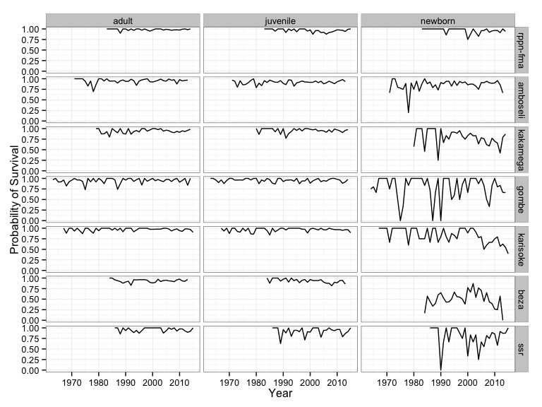

[Back to Respository](https://github.com/camposfa/plhdbR)

Functions for calculating vital rates
=====================================

Prepare workspace and read biography and fertility data
-------------------------------------------------------

``` r
  Sys.setenv(TZ = 'UTC')

  library(plhdbR)
  load_plhdb_packages()

  lh <- read_bio_table("../data/biography_2015_05_20.csv")
  fert <- read_fert_table("../data/fertility_2015_05_20.csv")
  
```

It's a good idea to [error-check](ErrorChecking.md) the data extensively before running the fuctions below.

Median age at first reproduction
--------------------------------

The function `age_first_rep` uses the biography data to calculate the minimum, maximum, and median age at first reproduction for each study species.

``` r
  age_first_rep(lh)
#> Source: local data frame [7 x 8]
#> 
#>   Study.Id median_age_days median_age_years minimum_age_days
#> 1 rppn-fma            3202         8.766598             2542
#> 2 amboseli            2181         5.971253             1735
#> 3 kakamega            2665         7.296372             1678
#> 4    gombe            5544        15.178645             4059
#> 5 karisoke            3611         9.886379             2923
#> 6     beza            2191         5.998631             1081
#> 7      ssr            2375         6.502396             2116
#>   minimum_age_years maximum_age_days maximum_age_years n_first_births
#> 1          6.959617             4513         12.355921             60
#> 2          4.750171             3157          8.643395            193
#> 3          4.594114             4004         10.962355            117
#> 4         11.112936             8452         23.140315             55
#> 5          8.002738             6786         18.579055             57
#> 6          2.959617             4022         11.011636             79
#> 7          5.793292             2901          7.942505             33
```

Stage-specific fertility between censuses
-----------------------------------------

The function `stage_specific_fertility` uses the biography and fertility tables to calculate stage-specific fertility separately for each study species. The function uses pseudo-census dates on January 1 of each year of the study. The life-history stages include (following Morris et al. 2011):

-   Newborns: individuals born between the pseudo-census dates in each interval
-   Juveniles: individuals alive but younger than the median age at first reproduction at the first pseudo-census date in each interval
-   Adults: individuals that are older than the median age at first reproduction at the first pseudo-census date in each interval

The optional logical argument `annual` determines whether fertilities are calculated for each year separately (the default is TRUE).

*Warning: this function takes ~5 minutes to run.*

``` r
  ssf <- stage_specific_fertility(lh, fert, annual = TRUE)
  ssf
#> Source: local data frame [730 x 8]
#> Groups: Study.Id, year_of
#> 
#>    Study.Id year_of age_class n_animals female_years         f trials
#> 1  rppn-fma    1983     adult         7   3.64134155 0.0000000      4
#> 2  rppn-fma    1983  juvenile         6   2.68583162 0.1936799      3
#> 3  rppn-fma    1983   newborn         1   0.41889117 0.0000000      0
#> 4  rppn-fma    1984     adult         7   3.77549624 0.4285714      4
#> 5  rppn-fma    1984  juvenile         8   4.16153320 0.0000000      4
#> 6  rppn-fma    1984   newborn         1   0.07392197 0.0000000      0
#> 7  rppn-fma    1986     adult         8   4.09582478 0.3750000      4
#> 8  rppn-fma    1986  juvenile        11   5.59069131 0.0000000      6
#> 9  rppn-fma    1986   newborn         2   0.81861739 0.0000000      1
#> 10 rppn-fma    1987     adult         8   8.00000000 0.1250000      8
#> ..      ...     ...       ...       ...          ...       ...    ...
#>    successes
#> 1          0
#> 2          1
#> 3          0
#> 4          2
#> 5          0
#> 6          0
#> 7          2
#> 8          0
#> 9          0
#> 10         1
#> ..       ...
```

Stage-specific survival
-----------------------

The function `stage_specific_survival` uses the biography table to calculate stage-specific probability of survival separately for each study species for each year of the study. The function uses pseudo-census dates on January 1 of each year of the study. The life-history stages include (following Morris et al. 2011):

-   Newborns: individuals born between the pseudo-census dates in each interval
-   Juveniles: individuals alive but younger than the median age at first reproduction at the first pseudo-census date in each interval
-   Adults: individuals that are older than the median age at first reproduction at the first pseudo-census date in each interval

*Warning: this function takes ~1 minute to run.*

``` r
  sss <- stage_specific_survival(lh)
  sss
#> Source: local data frame [812 x 9]
#> Groups: Study.Id, year_of
#> 
#>    Study.Id year_of age_class n_animals individual_years s deaths trials
#> 1  rppn-fma    1983     adult        12          6.24230 1      0      6
#> 2  rppn-fma    1983  juvenile        11          5.28679 1      0      5
#> 3  rppn-fma    1983   newborn         1          1.00000 1      0      1
#> 4  rppn-fma    1984     adult        12         12.00000 1      0     12
#> 5  rppn-fma    1984  juvenile        13         12.84873 1      0     13
#> 6  rppn-fma    1984   newborn         1          1.00000 1      0      1
#> 7  rppn-fma    1985     adult        14         14.00000 1      0     14
#> 8  rppn-fma    1985  juvenile        14         12.52293 1      0     13
#> 9  rppn-fma    1985   newborn         1          1.00000 1      0      1
#> 10 rppn-fma    1986     adult        14         14.00000 1      0     14
#> ..      ...     ...       ...       ...              ... .    ...    ...
#>    successes
#> 1          6
#> 2          5
#> 3          1
#> 4         12
#> 5         13
#> 6          1
#> 7         14
#> 8         13
#> 9          1
#> 10        14
#> ..       ...
  
  # Visualize changes over time (not adjusted for sampling effort!!!)
  library(ggplot2)
  
  ggplot(sss, aes(x = year_of, y = s)) +
  geom_line() +
  facet_grid(Study.Id ~ age_class) +
  labs(x = "Year", y = "Probability of Survival") + 
  theme_bw()
```



``` r
  
  # Convert to trials / successes
  surv_trials <- make_survivorship_trials(sss)
  surv_trials
#> Source: local data frame [29,862 x 4]
#> 
#>    Study.Id year_of age_class fate
#> 1  rppn-fma    1983     adult    1
#> 2  rppn-fma    1983     adult    1
#> 3  rppn-fma    1983     adult    1
#> 4  rppn-fma    1983     adult    1
#> 5  rppn-fma    1983     adult    1
#> 6  rppn-fma    1983     adult    1
#> 7  rppn-fma    1984     adult    1
#> 8  rppn-fma    1984     adult    1
#> 9  rppn-fma    1984     adult    1
#> 10 rppn-fma    1984     adult    1
#> ..      ...     ...       ...  ...
```
